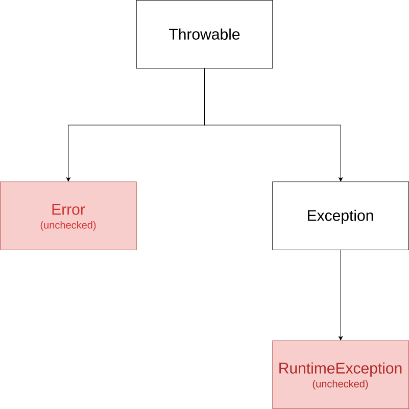

.. _part1:

*****************************************************************
From Python to Java
*****************************************************************

Chapter 1 of this book is intended for students and hobbyists who are already familiar with the basics of Python programming, i.e., they know how to use variables, lists, functions, and plain data objects.
A deeper knowledge of object-oriented programming is not required.

The goal of the following sections is to make you quickly familiar with the important differences between Python and Java and with the basic object oriented mechanisms of Java. More advanced topics, such as interfaces, abstract classes, or lambda functions, will be seen in the subsequent parts of the book.

Your first Java program with IntelliJ
=====================================

.. _jdk:

Installing IntelliJ
-------------------

You might have already used an Integrated Development Environment (IDE) to write Python programs. In this course, we will do the same for programming in Java: we will use the free "Community Edition" of IntelliJ IDEA (simply referred to as "IntelliJ" hereafter). You can download the installer from  `<https://www.jetbrains.com/idea/download/>`_ (scroll down to find the free Community Edition, you don't need the commercial Ultimate Edition). Start the installer and follow the instructions.

The second thing you will need for Java programming is a *Java Development Kit* (JDK). A JDK is a software package that contains the tools that you need to build and run Java programs. The JDK also includes a *very, very  large* library of useful classes for all kinds of programming tasks. You can see the content of the library here: `<https://docs.oracle.com/en/java/javase/21/docs/api/index.html>`_. 

Fortunately, IntelliJ can automatically download the JDK for you when you create a new project, so you don't have to worry about the JDK for now. But if later on you wish to write a Java application on a computer without IntelliJ, you'll have to manually download the JDK from `<https://openjdk.org/>`_ and install it.

Creating a new project
-----------------------

Start IntelliJ. A window will open where you can create a new project. Click on the corresponding button and you should see a window like this one:

.. image:: _static/images/part1/new_project_screen.png
  :width: 90%
  :alt: Starting a new project

To create a new project, you have to enter a project name (in the field ``Name``) and a location on your disk where you want to store the project (in the field ``Location``). Keep the other fields ``Language``, ``Build system``, and ``Add sample code`` as shown in the above picture. But there is something to do for the field ``JDK``: as you can see in the picture, there was already JDK version 21 (and some other JDK versions) installed on my computer. If you have not already installed a JDK on your computer, open the dropdown list and choose ``Download JDK...`` as shown in the picture below:

.. image:: _static/images/part1/select_jdk_screen.svg
  :width: 90%
  :alt: Selecting a JDK

A small window should appear where you can select which JDK version to download and install:

.. image:: _static/images/part1/download_jdk_screen.png
  :alt: Downloading a JDK

Select version 21 from the vendor ``Oracle OpenJDK`` (actually, any version newer than 17 is fine for this book). You can keep the location proposed by IntelliJ. Click the ``Download`` button and complete the JDK installation. Once everything is ready, you can finally create your first Java project. IntelliJ will normally automatically open the new project and show you the main window:

.. image:: _static/images/part1/first_project_screen.png
  :width: 90%
  :alt: The new project

In the left part of the window, you see the project structure. Since we have selected ``Add sample code`` in the project creation window, IntelliJ has already created a ``src`` directory with one file in it: ``Main.java`` (the file ending ``.java`` is not shown). When you double-click the file, its content is shown in the editor in the right part of the window.

Click on the right triangle in the upper right corner to start the program. A new view should appear at the bottom of the window with the output of the program:

.. image:: _static/images/part1/program_output_screen.svg
  :width: 90%
  :alt: Output of the program

.. _java_main:

How do Java programs look like?
-------------------------------

Here is the source code of the example program automatically created by IntelliJ in your project:

..  code-block:: java

    public class Main {
        public static void main(String[] args) {
            System.out.println("Hello world!");
        }
    }

And here is how an equivalent Python program would look like:

..  code-block:: python

    print('Hello world!')

Why does the Java code look more complicated than the Python code? First of all, unlike Python, Java doesn't allow to write a statement like :code:`print('Hello world!')` directly in a source code file. In Java, all statements MUST be inside a method and all methods MUST be inside a class. In our example, the statement :code:`System.out.println("Hello world!")` is in the method ``main()`` and this method is in the class ``Main``. Of course, a class in Java can have more than one method, and a Java program can contain more than one class.

You probably have already learned about classes and methods in Python and you might remember that classes are used to describe objects and methods are used to work with those objects. In our simple Java example, we don't need objects and all the complicated things that come with them (constructors, inheritance, etc.). The word :code:`static` in the line :code:`public static void main(String[] args)` indicates that the method :code:`main()` behaves more like a traditional function in Python and not like a method for objects. In fact, no object is needed to execute a static method like :code:`main()`. We will learn more about this later.

The second thing you might have noticed is the word :code:`public` appearing twice in the first two lines of the code:

..  code-block:: java

    public class Main {
        public static void main(String[] args) {
        
The word :code:`public` in the first line indicates that the class :code:`Main` can be used by others. It is not strictly necessary for this simple program and, in fact, our program will still work if you remove it (try it!). However, there is something important you have to know about public classes: If a class is marked as public, the source file that contains the class must have the same name as the class. That's the reason why the file is called ``Main.java`` and the public class in the file is called ``Main`` (Try to change the name of the class and see what happens!). Apart from that, the name ``Main`` for a class doesn't have any special meaning in Java. Our program would still work if we renamed the class to ``Catweazle`` or ``Cinderella``, as long as we don't forget to rename the file as well. But note that **all class names in Java (public or not) start with an uppercase letter**.

The :code:`public` in the second line is much more important for our example. A Java program can only be executed if it contains a method :code:`main()` that is :code:`public` *and* :code:`static`. Remove the :code:`public` or :code:`static` from the second line and see what happens when you try to run the program.
In general, **a Java program always starts at the public static main method**. If your program contains multiple classes with a main method, you have tell IntelliJ which one you want to start.

With this knowledge, can you guess what the following program prints?

..  code-block:: java

    public class Main {
        static void printHello() {
            System.out.print("How do ");
            System.out.println("you do, ");
        }
    
        public static void main(String[] args) {
            printHello();
            System.out.println("fellow kids?");
        }
    }
    
(By the way, have you noticed the difference between :code:`System.out.print` and :code:`System.out.println`?)

A ``.java`` file can contain more than one class, however only one of these classes can be public. Here is the example from above with two classes:

..  code-block:: java

    class MyOtherClass {
        static void printHello() {
            System.out.print("How do ");
            System.out.println("you do, ");
        }
    }

    public class Main {
        public static void main(String[] args) {
            MyOtherClass.printHello();
            System.out.println("fellow kids?");
        }
    }

You can access the static content of a class from another class by using the name of the class, as demonstrated in the line :code:`MyOtherClass.printHello()` in the example.

Types
-----

You might already know that Python is a *strongly typed* language. That means that all "things" in Python have a specific type. You can see that by entering the following statements in the Python prompt:

..  code-block:: python

    >>> type("hello")
    <class 'str'>
    >>> type(1234)
    <class 'int'>
    >>> type(1234.5)
    <class 'float'>
    >>> type(True)
    <class 'bool'>

Java is a strongly typed language, too. However, there is a big difference to Python: Java is also a *statically typed* language. We will not discuss all the details here, but in Java that means that most of the time you must indicate for *every* variable in your program what type of "things" it can contain.

Here is a simple Python program to calculate and print the area of a square:

..  code-block:: python

    def calculateArea(side):
        return side * side
        
    def printArea(message, side):
        area = calculateArea(side)
        print(message)
        print(area)

    t = 3 + 4
    printArea("Area of square", t)

And here is the equivalent Java program:

..  code-block:: java

    public class Main {
        static int calculateArea(int side) {
            return side * side;
        }
    
        static void printArea(String message, int side) {
            int area = calculateArea(side);
            System.out.println(message);
            System.out.println(area);
        }
    
        public static void main(String[] args) {
            int t = 3 + 4;
            printArea("Area of square", t);
        }
    }

Let's see what's going on with the types in the Java code:

- The line :code:`int calculateArea(int side)` indicates that the method :code:`calculateArea()` has a parameter :code:`side` of type :code:`int`. Furthermore, the :code:`int` at the beginning of :code:`int calculateArea(...` specifies that this method can only return a value of type :code:`int`. This is called the *return type* of the method.
- The line :code:`void printArea(String message, int side)` defines that the method :code:`printArea()` has a parameter :code:`message` of type :code:`String` and a parameter :code:`side` of type :code:`int`. The method does not return anything, therefore it has the special return type :code:`void`.
- Inside the method :code:`printArea()`, we can see in the line :code:`int area = calculateArea(side)` that the variable :code:`area` has the type :code:`int`.
- (Exercise for you: Look at the types that you can see in the :code:`main()` method. We will explain later why that method always has a parameter :code:`args`)

IntelliJ uses a special tool called the *Java compiler* that carefully verifies that there are no *type errors*  in your program, i.e., that you have not made any mistakes in the types of the variables, method parameters, and return types in your program. Unlike Python, this *type checking* is done *before* your program is executed. You cannot even start a Java program that contains type errors!

Here are some examples that contain type errors. Can you find the mistakes?

- :code:`int t = "Hello";`
- :code:`boolean t = calculateArea(3);`
- :code:`printArea(5, "Size of square");` (This example shows why it is easier to find bugs in Java than in Python)

The Java compiler and class files
=================================

In the previous section, we mentioned that a special tool, the *Java compiler*, checks your program for type errors. This check is part of another fundamental difference between Python and Java.
Python is an *interpreted language*. That means that when you start a program written in Python in an IDE or on the command line with

..  code-block:: bash

    > python myprogram.py
    
the Python-Interpreter will do the following things:

1. Load the file ``myprogram.py``,
2. Do some checks to verify that your program doesn't contain syntax errors such as :code:`print('Hello')))))`,
3. Execute your program.

Java, being a *compiled language*, works differently. To execute a Java program, there is another step done before your program can be executed:

1. First, the Java code has to be compiled. This is the job of the Java compiler, a tool that is part of the JDK. The compiler does two things:

   - It verifies that your source code is a well-formed Java program. This verification process includes the type checking described in the previous section.
   - It translates your Java source code into a more compact representation that is easier to process for your computer. This compact representation is called a *class file*. One such file will be created per class in your program. In IntelliJ, you can find the generated class files in the directory ``out`` in your project.
    
2. If the compilation of your code was successful, the *Java Virtual Machine* (JVM) is started. The JVM is a special program that can load and execute class files. The JVM doesn't need the source code (the ``.java`` files) of your program to execute it since the class files contain all the necessary information. When you are developing software for other people, it's usually the class files that you give to them, not the source code.

IntelliJ runs the Java compiler and starts the JVM for you when you press the green start button, but it's perfectly possible to do it by hand on the command line without an IDE:

..  code-block:: bash

    > javac Main.java   # javac is the compiler and part of the JDK.
                        # It will generate the file Main.class
    
    > java Main         # this command starts the JVM with your Main class

Basics
======

Primitive Types
---------------

As explained, Java requires that you specify the type of all variables (including method parameters) and the return types of all methods.
Java differs between *primitive types* and complex types, such as arrays and objects. The primitive types are used for numbers (integers and real numbers), for Boolean values (``true`` and ``false``) and for single characters (``a``, ``b``, etc.). However, there are several different number types. The below table shows all primitive types:

.. raw:: latex 
    \fontsize{5pt}{7pt}\selectfont
============ ========================================================= ========================
Type         Possible values                                           Example
============ ========================================================= ========================
``int``      :math:`-2^{31} .. 2^{31}-1`                               :code:`int a = 3;`
``long``     :math:`-2^{63} .. 2^{63}-1`                               :code:`long a = 3;`
``short``    :math:`-2^{15} .. 2^{15}-1`                               :code:`short a = 3;`
``byte``     :math:`-2^{7} .. 2^{7}-1`                                 :code:`byte a = 3;`
``float``    :math:`1.4*10^{-45}.. 3.4*10^{38}`                        :code:`float a = 3.45f;`
``double``   :math:`4.9*10^{-324}.. 1.7*10^{308}`                      :code:`double a = 3.45;`
``char``     :math:`0 .. 2^{16}-1`                                     :code:`char a = 'X';`
``boolean``  ``true``, ``false``                                       :code:`boolean a = true;`
============ ========================================================= ========================

.. raw:: latex
    \normalsize
As you can see, each primitive type has a limited range of values it can represent. For example, a variable of type :code:`int` can be only used for integer numbers between :math:`-2^{31}` and :math:`2^{31}-1`. If you don't respect the range of a type, very strange things will happen in your program! Try this code in IntelliJ (copy it into the :code:`main()` method of your program):

..  code-block:: java

    int a = 123456789;
    int b = a * 100000;     // This is too large for the int type!
    System.out.println(b);  // What will you get here?

For most examples in this book, it will be sufficient to use :code:`int` (for integer numbers) and :code:`float` (for real numbers). The types :code:`long` and :code:`double` provide a wider value range and more precision, but they are slower and your program will consume more memory when running.

Java supports the usual arithmetic operations with number types, that is :code:`+` (addition), :code:`-` (subtraction), :code:`*` (multiplication), :code:`/` (division), and :code:`%` (modulo). There is also a group of operators that can be used to manipulate integer values on bit level (for example, left shift :code:`<<`  and bitwise and :code:`&`), but we will not discuss them further here.

The :code:`char` type is used to work with individual characters (letters, digits,...):

..  code-block:: java

    char c = 'a';

You might wonder why this type is shown in the above table as a type with values between 0 and 65535. This is because Java represents characters by numbers following a standard called *Unicode*. Consequently, you can do certain simple arithmetic operations with characters:

.. code-block:: java

    char c = 'a';
    c++;
    System.out.println(c);  // prints 'b'

You can find more information about Unicode on `<https://en.wikipedia.org/wiki/Unicode>`_.

Type casting
------------

Java performs automatic conversions between values of different types if the destination type is "big" enough to hold the result. This is called *automatic type casting*. For this reason, these two statements are allowed:

..  code-block:: java

    float a = 34;             // the int value 34 is casted to float 34.0f
    float b = 6 * 4.5f;       // int multiplied by float gives float
    
But this is not allowed:

..  code-block:: java

    int a = 4.5f;             // Error! float is not automatically casted to int
    float b = 4.5f * 6.7;     // Error! float * double gives double

You can force the conversion by doing a *manual type cast*, but the result will be less precise or, in some situations, even wrong:

..  code-block:: java

    int a = (int) 4.5f;             // this will give 4 
    float b = (float) (4.5f * 6.7);

The Java class :code:`Math` provides a large set of methods to work with numbers of different types. It also defines useful constants like :code:`Math.PI`. Here is an example:

..  code-block:: java

    double area = 123.4;
    double radius = Math.sqrt(area / Math.PI);

    System.out.println("Area of disk: " + area);
    System.out.println("Radius of disk: " + radius);

The complete documentation of the :code:`Math` class can be found at `<https://docs.oracle.com/en/java/javase/21/docs/api/java.base/java/lang/Math.html>`_.
 
What is a variable? A mental model
----------------------------------
 
When working with variables of primitive types, you can imagine that every time your program reaches a line in your code where a variable is declared, the JVM will use a small part of the main memory (RAM) of your computer to store the value of the variable.

+-----------------------+-------------------------------------------------+
| Java code             | In memory during execution                      |
+=======================+=================================================+
| .. code-block::  java |        \                                        |
|                       |        \                                        |
|    int a = 3;         |                                                 |
|    int b = 4;         |  .. image:: _static/images/part1/assignment.svg |
|                       |     :width: 10%                                 |
+-----------------------+-------------------------------------------------+

When you assign the content of a variable to another variable, the value is copied:

+-----------------------+-------------------------------------------------+
| Java code             | In memory during execution                      |
+=======================+=================================================+
| .. code::             |           \                                     |
|                       |           \                                     |
|    a = b;             |  .. image:: _static/images/part1/assignment2.svg|
|                       |    :width: 10%                                  |
+-----------------------+-------------------------------------------------+

The same also happens with the parameters of methods; when you call a method with arguments, for example :code:`calculateArea(side)`, the argument values are copied into the parameter variables of the called method. Look at the following program and try to understand what it does:

..  code-block:: java

    public class Main {
        static void f(int x) {
            x = x + 1;
        }

        public static void main(String[] args) {
            int i = 3;
            f(i);
            System.out.println(i);
        }
    }

The above program will print ``3`` because when you call the method :code:`f`, the content of the variable :code:`i` will be copied into the parameter variable :code:`x` of the method. Even if the method changes the value of :code:`x` with :code:`x = x + 1`, the variable :code:`i` will keep its value 3.

Note that it is illegal to use a local variable, i.e., a variable declared inside a method, before you have assigned a value to it:

..  code-block:: java

    public static void main(String[] args) {
        int a = 2;
        int b;
        int c;
           
        int d = a * 3;    // This is okay
        
        b = 3;
        int e = b * 3;    // This is okay
        
        int f = c * 3;    // Error! "c" has not been initialized.
    }

Class variables
----------------

In our examples so far, all variables were either parameter variables or local variables of a method. Such variables are only "alive" when the program is inside the method during execution. 
However, you can also have variables that "live" outside a method. These variables are called *class variables* because they belong to a class, not to a method. Similar to static methods, we mark them with the keyword :code:`static`:

..  code-block:: java

    public class Main {

        static int a = 3;   // this is a class variable

        static void increment() {
            a += 5;         // this is equivalent to  a = a + 5
        }

        public static void main(String[] args) {
            increment();
            System.out.println(a);
        }
    }
  
In contrast to local variables, class variables do not need to be manually initialized. They are automatically initialized to 0 (for number types) or :code:`false` (for the ``boolean`` type). Therefore, this code is accepted by the compiler:

..  code-block:: java

    public class Main {

        static int a;   //  is equivalent to  a = 0

        static void increment() {
            a += 5;
        }

        public static void main(String[] args) {
            increment();
            System.out.println(a);
        }
    }
      
Be careful when you have class variables and parameter or local variables with the same name:

..  code-block:: java

    public class Main {

        static int a = 3;

        static void increment(int a) {
            a += 5;     // this is the parameter variable
        }

        public static void main(String[] args) {
            increment(10);
            System.out.println(a);
        }
    }
  
In the method ``increment``, the statement :code:`a += 5` will change the value of the parameter variable :code:`a`, **not** of the class variable. We say that the parameter variable *shadows* the class variable because they have the same name. Inside the method :code:`increment`, the parameter variable :code:`a` has priority over the class variable :code:`a`. We say that the method is the *scope* of the parameter variable.

In general, you should try to avoid shadowing because it is easy to make mistakes, but if you really need to do it for some reason, you should know that it is still possible to access the class variable from inside the scope of the parameter variable:

..  code-block:: java

    public class Main {

        static int a = 3;

        static void increment(int a) {
            Main.a += 5;   // we want the class variable!
        }

        public static void main(String[] args) {
            increment(10);
            System.out.println(a);
        }
    }
  

Arrays (*fr.* tableaux)
-----------------------

If you need a certain number of variables of the same primitive type, it can be useful to use an array type instead. Arrays are similar to lists in Python. One big difference is that when you create a new array you have to specify its size, i.e., the number of elements in it:

..  code-block:: java

    int[] a = new int[4];  // an array of integers with 4 elements
    
Another big difference is that all the elements of a Java array must have the same type, whereas a Python list can store elements of different types. In the example above, the Java array can only store ``int`` values.

Once the array has been created, you can access its elements :code:`a[0]`, :code:`a[1]`, :code:`a[2]`, :code:`a[3]`. Like class variables, the elements of an array are automatically initialized when the array is created:

..  code-block:: java

    int[] a = new int[4];   // all elements of the array are initialized to 0
    a[2] = 5;
    int b = a[1] + a[2];   
    System.out.println(b);  // prints "5" because a[1] is 0

Note that the size of an array is fixed. Once you have created it, you cannot change the number of elements in it. Unlike Python lists, arrays in Java do not have ``slice()`` or ``append()`` methods to add or remove elements. However, we will see later the more flexible :code:`ArrayList` class.

Mental model for arrays
-----------------------

There is an important difference between array variables and primitive-type variables. An array variable does not directly represent the array elements. Instead, an array variable can be seen as a *reference* to the content of the array. You can imagine it like this:

+-----------------------+------------------------------------------------------------+
| Java code             | In memory during execution                                 |
+=======================+============================================================+
| .. code::             |                           /                                |
|                       |                           /                                |
|  int[] a = new int[4];|      .. image:: _static/images/part1/arrayn.svg            |
|                       |     :width: 50%                                            |
+-----------------------+------------------------------------------------------------+

This difference becomes important when you assign an array variable to another array variable: 

+-----------------------+------------------------------------------------------------+
| Java code             | In memory during execution                                 |
+=======================+============================================================+
| .. code::             |  .. image:: _static/images/part1/array2n.svg               |
|                       |     :width: 50%                                            |
|  int[] a = new int[4];|                                                            |
|  int[] b = a;         |                                                            |
+-----------------------+------------------------------------------------------------+

In that case, **only the reference to the array is copied, not the array itself**. This means that both variables :code:`a` and :code:`b` are now referencing the same array. This can be shown with the following example:

..  code-block:: java

    int[] a = new int[4];
    int[] b = a;              // a and b are now references to the same array
    b[2] = 5;
    System.out.println(a[2]); // prints "5"

This also works when you give an array as an argument to a method:

..  code-block:: java

    public class Main {

        static void five(int[] x) {
            x[2] = 5;
        }

        public static void main(String[] args) {
            int[] a = new int[4];
            five(a);
            System.out.println(a[2]);  // prints "5"
        }
    }

In this example, the method ``five()`` receives a *reference* to the array ``a`` (i.e., not a copy of it), which allows the method to modify the content of the array ``a``.

Initializing an array
---------------------

There is a convenient way to create and initialize an array in one single step:

..  code-block:: java

    int[] a = { 2, 5, 6, -3 };  // an array with four elements

This is equivalent to the longer code:
    
..  code-block:: java

    int[] a = new int[4];  // Creation of the array
    
    // Initialization of the array
    a[0] = 2;
    a[1] = 5;
    a[2] = 6;
    a[3] = -3;

But note that this short form is only allowed when you initialize a newly declared array variable. If you want to create a new array and assign it to an existing array variable, you have to use a different syntax:

..  code-block:: java

    int[] a = { 2, 5, 6, -3 }  
    a = new int[]{ 1, 9, 3, 4 };

Multi-dimensional arrays
------------------------

Arrays can have more than one dimension. For example, two-dimensional arrays are often used to represent matrices in mathematical calculations:

..  code-block:: java

    int[][] a = new int[3][5];  // this array can be used to represent a 3x5 matrix
    a[2][4] = 5;

You can imagine a two-dimensional array as an array where each element is again a reference to an array:

.. image:: _static/images/part1/arrayarrayn.svg
   :width: 40%                            

An :code:`int[3][5]` is therefore an array of three arrays containing five elements each. The following code illustrates this:

..  code-block:: java

    int[][] a = new int[3][5];
    int b[] = a[0];  // b is now a reference to an int array with 5 elements
    b[3] = 7;
    System.out.println(a[0][3]);  // b[3] and a[0][3] are the same element

Again, there is a convenient way to create and initialize multi-dimensional arrays in one step:

..  code-block:: java

    // 3x3 Identity matrix from the Linear Algebra course
    int[][] a = {       
        { 1, 0, 0 },
        { 0, 1, 0 },
        { 0, 0, 1 }
    };
    
Partially initialized arrays
-------------------------------

It is possible to create a "partially initialized" two-dimensional array in Java:
   
..  code-block:: java
   
    int[][] a = new int[3][];
    
Again, this is an array of arrays. However, because we have only specified the size of the first dimension, the elements of this array are initialized to :code:`null`. We can initialize them later:

..  code-block:: java
   
    int[][] a = new int[3][];
    a[0] = new int[5];            // 5 elements
    a[1] = new int[5];            // 5 elements
    a[2] = new int[2];            // 2 elements. That's allowed!
    
As shown in the above example, the elements of a multi-dimensional array are all arrays, but they do not need to have the same size.

Arrays and class variables
--------------------------

Array variables can be class variables (with the :code:`static` keyword), too. If you don't provide an initial value, the array variable will be initialized with the value :code:`null`:

..  code-block:: java

  public class Main {

    static int[] a;   //  automatically initialized to null

    public static void main(String[] args) {
        // this compiles, but it gives an error during execution,
        // because we have not initialized a
        System.out.println(a[2]);
    }
  }

You can think of the value :code:`null` as representing an invalid reference.

"While" loops
-------------
The two most common loop constructs in Java are the :code:`while` loop and the :code:`for` loop.

The :code:`while` loop in Java is very similar to its namesake in Python. It repeats one or more statements (we call them the *body* of the loop) as long a condition is met. Here is an example calculating the sum of the numbers from 0 to 9 (again, the surrounding :code:`main()` method is not shown):

..  code-block:: java

    int sum = 0;
    int i = 0;
    while (i<10) {
        sum += i;    // this is equivalent to sum = sum + i
        System.out.println("Nearly there");
        i++;         // this is equivalent to i = i + 1
    }
    System.out.println("The sum is " + sum);

**Warning:** The two statements inside the :code:`while` loop must be put in curly braces :code:`{...}`. If you forget the braces, only the *first* statement will be executed by the loop, independently of how the line is indented:

..  code-block:: java

    int sum = 0;
    int i = 0;
    while (i<10)                             // oops, we forgot to put a brace '{' here!
        sum += i;                            // this statement is INSIDE the loop
        System.out.println("Nearly there");  // this statement is OUTSIDE the loop!!!
        i++;                                 // this statement is OUTSIDE the loop!!!
    
    System.out.println("The sum is " + sum);

This is also true for other types of loops and for if/else statements.

**To avoid "accidents" like the one shown above, it is highly recommended to always use braces for the body of a loop or if/else statement, even if the body only contains one statement.**

.. _simple_for_loops:

Simple "for" loops
------------------

There are two different ways :code:`for` loops can be used. The simple :code:`for` loop is often used to do something with each element of an array or list (We will learn more about lists later):

..  code-block:: java

    int[] myArray = new int[]{ 2, 5, 6, -3 };
    int sum = 0;
    for (int elem : myArray) {
        sum += elem;
    }
    System.out.println("The sum is " + sum);

The :code:`for` loop will do as many iterations as number of elements in the array, with the variable :code:`elem` successively taking the values of the elements. 

Complex "for" loops
-------------------

There is also a more complex version of the :code:`for` loop. Here is again our example calculating the sum of the numbers from 0 to 9, this time with a :code:`for` loop:

..  code-block:: java

    int sum = 0;
    for (int i = 0; i<10; i++) {
        sum += i;
        System.out.println("Nearly there");
    }
    System.out.println("The sum is " + sum);

The first line of the :code:`for` loop consists of three components:

1. a statement that is executed when the loop starts. In our example: :code:`int i = 0`.
2. an expression evaluated *before* each iteration of the loop. If the expression is :code:`false`, the loop stops. Here: :code:`i<10`.
3. a statement that is executed *after* each iteration of the loop. Here: :code:`i++`.

The complex :code:`for` loop is more flexible than the simple version because it gives you full control over what is happening in each iteration. Here is an example where we calculate the sum of every second element of an array:

..  code-block:: java

        int[] myArray = new int[]{ 2, 5, 6, -3, 4, 1 };
        int sum = 0;
        for (int i = 0; i<myArray.length; i += 2) {
            sum += myArray[i];
        }
        System.out.println("The sum is " + sum);

In this example, we have done two new things. We have used :code:`myArray.length` to get the size of the array :code:`myArray`. And we have used the statement :code:`i+=2` to increase :code:`i` by 2 after each iteration.

Stopping a loop and skipping iterations
---------------------------------------

Like in Python, you can leave any loop with the :code:`break` statement:

..  code-block:: java

    int sum = 0;
    for (int i = 0; i<10; i++) {
        sum += i;
        if (sum>5) {
            break;
        }
    }

And we can immediately go to the next iteration with the :code:`continue` statement:

..  code-block:: java

    int sum = 0;
    for (int i = 0; i<10; i++) {
        if (i==5) {
            continue;
        }
        sum += i;
    }
    
But you should only use :code:`break` and :code:`continue` if they make your program easier to read. In fact, our above example was not a good example because you could just write:

..  code-block:: java

    for (int i = 0; i<10; i++) {
        if (i!=5) {     // easier to understand than using "continue"
            sum += i;
        }
    }

"If/else" statements
--------------------

As you have seen in some of the examples above, Java has an :code:`if` statement that is very similar to the one in Python. Here is an example that counts the number of negative and positive values in an array:

..  code-block:: java

    int[] myArray = new int[]{ 2, -5, 6, 0, -4, 1 };
    int countNegative = 0;
    int countPositive = 0;
    for(int elem : myArray) {
        if(elem<0) {
            countNegative++;
        }
        else if(elem>0) {
            countPositive++;
        }
        else {
            System.out.println("Value zero found");
        }
    }
    System.out.println("The number of negative values is " + countNegative);
    System.out.println("The number of positive values is " + countPositive);

As with loops, be careful not to forget to use curly braces :code:`{...}` if the body of the if/else statement contains more than one statement. **It is highly recommended to always use braces, even if the body contains only one statement.**

Comparison and logical operators
--------------------------------

The :code:`if` statement requires a Boolean expression, i.e., an expression that evaluates to :code:`true` or :code:`false`. There are several operators for Boolean values that are quite similar to the ones you know from Python:

.. code-block:: java

    boolean b1 = 3 < 4;     // we also have <, >, <=, >=, ==, !=
    boolean b2 = !b1;       // "not" in Python
    boolean b3 = b1 && b2;  // "and" in Python
    boolean b4 = b1 || b2;  // "or" in Python

"Switch" statement
------------------

Imagine a program where you test a variable for different values:

..  code-block:: java

    // two integer variables that represent our position on a map
    int x = 0, y = 0;

    // the directions in which we want to go
    char[] directions = new char[]{'N', 'S', 'S', 'E', 'E', 'W'};

    // let's go!
    for (char c : directions) {
        if (c == 'N') {
            y++;            // we go North
        } 
        else if (c == 'S') {
            y--;            // we go South
        } 
        else if (c == 'W') {
            x--;            // we go West
        } 
        else if (c == 'E') {
            x++;            // we go East
        } 
        else {
            System.out.println("Unknown direction");
        }
        System.out.println("The new position is " + x + " , " + y);
    }

Java has a :code:`switch` statement that allows you to write the above program in a clearer, more compact way:

.. code-block:: java

    int x = 0, y = 0;
    
    char[] directions = new char[]{'N', 'S', 'S', 'E', 'E', 'W'};

    for (char c : directions) {
        switch (c) {
            case 'N' -> { y++; }     // we go North
            case 'S' -> { y--; }     // we go South
            case 'W' -> { x--; }     // we go West
            case 'E' -> { x++; }     // we go East
            default -> { System.out.println("Error! Unknown direction"); }
        }
        System.out.println("The new position is " + x + " , " + y);
    }

Note that the above code only works with Java version 14 or newer. In older Java versions, the :code:`switch` statement is a bit more complex as it necessitates to separate the cases using the :code:`break` statement:

.. code-block:: java

    switch (c) {
        case 'N':
            y++;
            break;  // if you forget the "break", very bad things will happen!
        case 'S':
            y--;
            break;
        case 'W':
            x--;
            break;
        case 'E':
            x++;
            break; 
        default:
            System.out.println("Error! Unknown direction");        
    }

Since Java 8 is still widely used, you should familiarize yourself with both versions of the :code:`switch` statement.

 
Strings
-------

Variables holding string values have the type :code:`String`. Strings can be concatenated to other strings with the + operator. This also works for primitive types:

.. code-block:: java

    String s1 = "This is a string";
    String s2 = "This is another string";
    String s3 = s1 + "---" + s2 + 12345;
    System.out.println(s3);
    
The :code:`String` class defines many interesting methods that you can use to work with strings. If you check the documentation at  `<https://docs.oracle.com/en/java/javase/21/docs//api/java.base/java/lang/String.html>`_, you will notice that some methods of the :code:`String` class are static and some are not.
For example, the static method :code:`valueOf` transforms a number value into a string:

.. code-block:: java

    double x = 1.234;
    String s = String.valueOf(x);
    System.out.println(s);

But most methods of the :code:`String` class are not static, i.e., you have to call them on a string value or string variable. Here are some frequently used methods:

.. code-block:: java

    String s = "Hello world";
    int l = s.length();                 // the length of the string
    boolean b = s.isEmpty();            // true if the string has length 0
    char c = s.charAt(3);               // the character in the string at position 3
    boolean b2 = s.startsWith("Hello"); // true if the string starts with "Hello"
    int i = s.indexOf("wo");            // gives the position of "wo" in the string
    String t = s.substring(2);          // the string starting at position 2
    
There are also some methods for strings that are located in other classes. The most useful ones are the methods to convert strings to numbers. For :code:`int` values, there is for example the static method :code:`parseInt` in the :code:`Integer` class:

.. code-block:: java

    int i = Integer.parseInt("1234");
    
Similar methods exist in the classes :code:`Long`, :code:`Float`, :code:`Double`, etc. for the other primitive types. All these classes are defined in the package :code:`java.lang`, for which you can find the documentation at `<https://docs.oracle.com/en/java/javase/21/docs/api/java.base/java/lang/package-summary.html>`_.

Mental model for strings
------------------------

Like array variables, string variables are references to the content of the string:

+-----------------------+-------------------------------------------------+
| Java code             | In memory during execution                      |
+=======================+=================================================+
| .. code::             |                                      /          |
|                       |                                      /          |
|    String a = "Hello";| .. image:: _static/images/part1/stringn.svg     |
|                       |           :width: 60%                           |
+-----------------------+-------------------------------------------------+

Comparing things
----------------

Primitive-type values can be tested for equality with the :code:`==` operator:

.. code-block:: java

    int i = 3;
    if(i == 3) {
        System.out.println("They are the same!");
    }

However, **this will not work for arrays or strings**. Indeed, since array and string variables only contain references, the :code:`==` operator will compare the *references*, not the *content* of the arrays or strings! The following example shows the difference:

.. code-block:: java
    
    int i = 3;
    System.out.println(i == 3);     // true. Primitive type.

    int[] a = {1, 2, 3};
    int[] b = {1, 2, 3};
    System.out.println(a == b);     // false. Two different arrays.

    int[] c = a;
    System.out.println(a == c);     // true. Same reference.

    String s1 = "Hello" + String.valueOf(1234);
    String s2 = "Hello1234";
    System.out.println(s1 == s2);   // false. Two different strings.

**Comparing arrays or strings with == is a very common mistake in Java. Be careful!**

To compare the *content* of two strings, you must use their :code:`equals()` method:

.. code-block:: java

    String s1 = "Hello" + String.valueOf(1234);
    String s2 = "Hello1234";
    System.out.println(s1.equals(s2));   // true

There is also an :code:`equals()` method to compare the content of two arrays, but it is a static method of the class :code:`Arrays` in the package :code:`java.util`. To use this class, you have to import it into your program. Here is the complete code:

.. code-block:: java

    import java.util.Arrays;

    public class Main {
        public static void main(String[] args) {
            int[] a = {1, 2, 3};
            int[] b = {1, 2, 3};
            System.out.println(Arrays.equals(a, b));  // true
        }
    }

The :code:`Arrays` class contains many useful methods to work with arrays, such as methods to set all elements of an array to a certain value, to make copies of arrays, or to transform an array into a string. See the documentation at `<https://docs.oracle.com/en/java/javase/21/docs/api/java.base/java/util/Arrays.html>`_.

You might wonder why we need the line :code:`import java.util.Arrays` but we didn't need to import the classes :code:`Math`, :code:`Integer` or :code:`String` in our other examples. That's because those classes are in the package :code:`java.lang`, which is the only package that is automatically imported by the Java compiler.

.. _enumerations:

Enumerations
------------

Enums in Java are a type that represents a group of constants (unchangeable variables, like final variables). 
They are a powerful mechanism for defining a set of named values, which you can use in a type-safe way. 
Enums are a feature that enhances code readability and maintainability by allowing you to declare collections of constants with their own namespace.

Using a ``switch`` statement is very convenient for reacting according to the value of an enum variable. 
Alternatively, since they are constants and there's only one instance of each enum constant in the JVM, you can use the ``==`` operator to compare them for equality.

We revisit the direction instruction example but using an ``enum`` instead of ``char`` to encode the directions.
Note that this code is safer since it is impossible to have a direction that is not in the list of the ones defined in the enum.
Therefore we don't have to deal with the possibility of an unknown direction in the ``switch`` statement.

.. code-block:: java

    public class DirectionFollower {

        public enum Direction {
            NORTH, EAST, SOUTH, WEST;
        }
        
        /**
         * Computes the final coordinates after applying a series of movements to a starting position.
         *
         * @param start The starting coordinates as an array of size two, where start[0] is the x-coordinate and start[1] is the y-coordinate.
         * @param directions An array of {@code Direction} enums that represent the sequence of movements to apply to the starting coordinates.
         * @return A new array of size two representing the final coordinates.
         * 
         * Example:
         * {@code
         * int[] start = {0, 0};
         * Direction[] directions = {Direction.NORTH, Direction.EAST, Direction.NORTH, Direction.WEST};
         * int[] finalCoordinates = followDirections(start, directions);
         * // This will yield final coordinates of [0, 2]
         * }
         */
         public static int[] followDirections(int[] start, Direction[] directions) {
            int[] result = new int[]{start[0], start[1]};
            
            for (Direction direction : directions) {
                switch (direction) {
                    case NORTH:
                        result[1]++;
                        break;
                    case EAST:
                        result[0]++;
                        break;
                    case SOUTH:
                        result[1]--;
                        break;
                    case WEST:
                        result[0]--;
                        break;
                }
            }
            return result;
        }

        public static void main(String[] args) {
            int[] start = {0, 0};
            Direction[] directions = {
                    Direction.NORTH,
                    Direction.EAST,
                    Direction.EAST,
                    Direction.SOUTH,
                    Direction.WEST,
                    Direction.NORTH,
                    Direction.NORTH
            };

            int[] finalCoordinates = followDirections(start, directions);
            System.out.println("The final coordinates are: [" + finalCoordinates[0] + ", " + finalCoordinates[1] + "]");
        }
    }

..
    TODO - Create a new chapter entitled "Object-oriented programming" at this point?

Exceptions
==========

In Java, there are two ways to exit a method: by using the :code:`return` statement or by *throwing an exception*. You already know the :code:`return` statement, so in the following we explain how exceptions work.

Throwing an exception
---------------------

Exceptions are a mechanism for stopping the execution of a method when an exceptional situation occurs that deviates from how the method is normally used. To do this, the :code:`throw` statement is used. Typically, you give the statement an instance of the class :code:`Exception` (or one of its subclasses) that contains information about why the exception was thrown:

.. code-block:: java

    class Employee {
        Employee boss;

        void setBoss(Employee boss) throws Exception {
            if(this == boss) {
                throw new Exception("An employee cannot be their own boss");
            }
            else {
                this.boss = boss;
            }
        }
    }

In general, a method that can throw an exception must indicate this in the method declaration with the keyword :code:`throws` and the class of the thrown exception object.

When a method calls a method that can throw an exception, it can react to an exception by catching it. To do this, it must put a :code:`try`-:code:`catch` block around the calls of the method.

.. code-block:: java

    public class Main {
        public static void main(String[] args) {
            Employee peter = new Employee();
            Employee anna = new Employee();

            try {
                peter.setBoss(anna);    // this is okay
                peter.setBoss(peter);   // this will throw an exception
            }
            catch(Exception e) {
                System.out.println("An exception happened: " + e.getMessage());
            }
        }
    }

When the :code:`setBoss()` method throws an exception, the execution of the code will directly go to the statement(s) specified inside the :code:`catch` block. We say that the message is "caught". The variable :code:`e` contains a reference to the :code:`Exception` object specified in the :code:`throw` statement.

What makes exceptions interesting is that the caller method can decide to not catch the exception. In that case, the exception will be passed to the method that called the caller method and so on until the exception is caught. This is illustrated in the following example:

.. code-block:: java

    public class Main {
        static void setBossOfTeam(Employee[] team, Employee boss) throws Exception {
            for(Employee employee : team) {
                employee.setBoss(boss);    // setBoss(...) can throw an exception,
                                           // but we don't catch it here
            }
        }

        public static void main(String[] args) {
            Employee peter = new Employee();
            Employee anna = new Employee();

            try {
                // a team with two employees:
                Employee team[] = { peter, anna };
                setBossOfTeam(team, peter);  // this will throw an exception
            }
            catch(Exception e) {
                System.out.println("An exception happened: " + e.getMessage());
            }
        }
    }

In the above example, the :code:`main()` method calls the :code:`setBossOfTeam()` method which then calls the :code:`setBoss()` method. The :code:`setBossOfTeam()` method does not catch any exceptions. This means that if an exception is thrown in :code:`setBoss()`, the exception will be passed to :code:`main()` where it is caught, as shown below:

Using Exception subclasses
--------------------------

By creating subclasses of the :code:`Exception` class, we can help the method that catches the exception to understand why the exception happened:

.. code-block:: java

    class SelfBossException extends Exception {
        SelfBossException(String message) {
            super(message);
        }
    }

    class NoBossException extends Exception {
        NoBossException(String message) {
            super(message);
        }
    }

    class Employee {
        Employee boss;

        void setBoss(Employee boss) throws SelfBossException, NoBossException {
            if (this == boss) {
                throw new SelfBossException("An employee cannot be their own boss");
            } else if (boss == null) {
                throw new NoBossException("You cannot take the boss away from an employee");
            } else {
                this.boss = boss;
            }
        }
    }

    public class Main {
        public static void main(String[] args) {
            Employee peter = new Employee();
            Employee anna = new Employee();

            try {
                peter.setBoss(anna);
                peter.setBoss(null);  // this will throw a NoBossException
            } catch (SelfBossException e) {
                System.out.println("SelfBossException happened: " + e.getMessage());
            } catch (NoBossException e) {
                System.out.println("NoBossException happened: " + e.getMessage());
            }
        }
    }

If we don't want to use separate :code:`catch` blocks for the different :code:`Exception` subclasses, we can write the catch statement also like this:

.. code-block:: java

    public static void main(String[] args) {
        Employee peter = new Employee();
        Employee anna = new Employee();

        try {
            peter.setBoss(anna);
            peter.setBoss(null);  // this will throw a NoBossException
        }
        catch(SelfBossException | NoBossException e) {
            System.out.println("Some exception happened: " + e.getMessage());
        }
    }

And if we want to catch all exceptions (not only :code:`SelfBossException` and :code:`NoBossException`), we can still write: 

.. code-block:: java

    public static void main(String[] args) {
        Employee peter = new Employee();
        Employee anna = new Employee();

        try {
            peter.setBoss(anna);
            peter.setBoss(null);  // this will throw a NoBossException
        }
        catch(Exception e) {
            System.out.println("Some exception happened: " + e.getMessage());
        }
    }

The above code works, because a statement like :code:`catch(XYZ e) { ... }` catches all exceptions of the class :code:`XYZ` **and  of any subclass** of :code:`XYZ` if the try-catch block has no other :code:`catch` statement for a specific subclass of :code:`XYZ`.

Checked vs unchecked exceptions
-------------------------------

The exceptions that we threw in the above examples are all *checked exceptions*. This means that the compiler verifies that the exceptions are correctly declared in the :code:`throws` part of the method declaration if the method does not catch them.

However, there are some exceptions for which the compiler does not perform this verification. Such exceptions are called *unchecked*. A famous unchecked exception is the :code:`NullPointerException` that is thrown by the JVM when a program tries to access a null reference:

.. code-block:: java

    public class Main {
        public static void main(String[] args) {
            Object obj = null;
            String s = obj.toString();   // this will throw a NullPointerException
        }
    }

As you can see in the above example, no :code:`throws` declaration or :code:`try`-:code:`catch` block is required for an unchecked exception, but you can still catch it if you want:

.. code-block:: java

    public class Main {
        public static void main(String[] args) {
            Object obj = null;

            try {
                String s = obj.toString();
            }
            catch(NullPointerException e) {
                System.out.println("A null pointer exception happened!");
            }
        }
    }

Unchecked exceptions are either instances of the class :code:`Error` or of the class :code:`RuntimeException` (or of a subclass of these classes). :code:`RuntimeException` is a subclass of :code:`Exception`, and :code:`Error` and :code:`Exception` are subclasses of the class :code:`Throwable`. All instances of :code:`Throwable` (or of a subclass of that class) can be thrown with a :code:`throw` statement. The class hierarchy for these classes is shown below:

Do we need exceptions?
----------------------

Strictly speaking, you *do not need* exceptions. For our example, our :code:`setBoss` method from above

.. code-block:: java

    class Employee {
        Employee boss;
        
        // throws an exception if there is an error
        void setBoss(Employee boss) throws Exception {
            if(this == boss) {
                throw new Exception("An employee cannot be their own boss");
            }
            else {
                this.boss = boss;
            }
        }
    }

could be written without exceptions:

.. code-block:: java

    class Employee {
        Employee boss;

        // returns false if there is an error
        boolean setBoss(Employee boss) {
            if(this == boss) {
                return false;
            }
            else {
                this.boss = boss;
                return true;
            }
        }
    }
    
Consequently, we would not need to catch the exception when we call the method:

.. code-block:: java

    public class Main {
        public static void main(String[] args) {
            Employee peter = new Employee();
            Employee anna = new Employee();
            
            boolean success = peter.setBoss(anna);
            if(success) {
                success = peter.setBoss(peter);
            }
            if(!success) {
                System.out.println("Something bad happened");
            }
        }
    }

As you can see above, the code becomes more complicated without exceptions since we have to check the result of every call of  :code:`setBoss()`. However, we should also mention here that programs without exceptions are easier to understand. Look at these two lines of code in the version of the main method with exceptions:

.. code-block:: java

    peter.setBoss(anna);
    peter.setBoss(null);

Just by reading these two lines, it is not obvious that the second call to :code:`setBoss` is not executed if the first call detects a problem. In the version without exceptions this is immediately clear:

.. code-block:: java

    boolean success = peter.setBoss(anna);
    if(success) {
        success = peter.setBoss(peter);
    }
    
For this reason, exceptions should only be used sparingly. Fortunately, in many program, you don't need to throw your own exceptions, and often the only place you need to catch an exception is when using the existing I/O classes of the JDK. We will show an example in the next section.

.. _file_reader:

Exceptions and I/O operations
-----------------------------

The JDK provides many classes that help you to work with files and communicate with other computers in the Internet. For example, the package :code:`java.io` contains classes to read data from files, to create new files, to delete files, etc. Many of the methods of these classes throw an instance of the :code:`IOException` class if they encounter a problem. 

The below example reads two characters from a text file:

.. code-block:: java

    import java.io.FileReader;
    import java.io.IOException;

    public class Main {
        public static void main(String[] args) {
            try {
                // open the file "somefile.txt"
                FileReader reader = new FileReader("somefile.txt");
                
                // read two characters from the file
                char c1 = (char) reader.read();
                char c2 = (char) reader.read();
                
                // close the file
                reader.close();
            }
            catch(IOException e) {
                System.out.println(e);
            }
        }
    }

The constructor of the :code:`FileReader` class throws a :code:`FileNotFoundException` if the specified file ``somefile.txt`` does not exist. The :code:`read()` method throws an :code:`IOException` if there was a problem when reading the file, for example because the user was not allowed to read that file. Since :code:`FileNotFoundException` is a subclass of :code:`IOException`, we can catch both exceptions with a single :code:`catch(IOException e) {...}`.

The above code has a weakness: If the :code:`read()` method throws an exception, the line :code:`reader.close()` is not executed and the file is not closed. The following code solves this problem by using a :code:`finally` block:

.. code-block:: java

    import java.io.FileReader;
    import java.io.IOException;

    public class Main {
        public static void main(String[] args) {
            try {
                // open the file "somefile.txt"
                FileReader reader = new FileReader("somefile.txt");

                try {
                    // read two characters from the file
                    char c1 = (char) reader.read();
                    char c2 = (char) reader.read();
                }
                finally {
                    // close the file
                    reader.close();
                }
            }
            catch(IOException e) {
                System.out.println(e);
            }
        }
    }

The JVM *always* executes the statements in a :code:`finally` block after the preceding :code:`try` block, even if an exception happened inside the :code:`try` block or the :code:`try` block contains a return statement. For this reason :code:`finally` blocks are often used in combination with try/catch blocks to "clean up" used resources (e.g., close a file).  

The above situation (opening a file, using it, and then closing it) is very common in Java programs. For this reason, Java has a special compact form of the :code:`try` block that is equivalent to the above program. When we us this special form, the Java compiler automatically adds the :code:`finally` block and the :code:`reader.close()` statement to our program:

.. code-block:: java

    import java.io.FileReader;
    import java.io.IOException;

    public class Main {
        public static void main(String[] args) {
            try(FileReader reader = new FileReader("somefile.txt")) {
                char c1 = (char) reader.read();
                char c2 = (char) reader.read();
            }
            catch(IOException e) {
                System.out.println(e);
            }
        }
    }

..
    Generics
    ========
    Comparator
    ==========
    Passing Arguments
    =================
    IO
    ===

