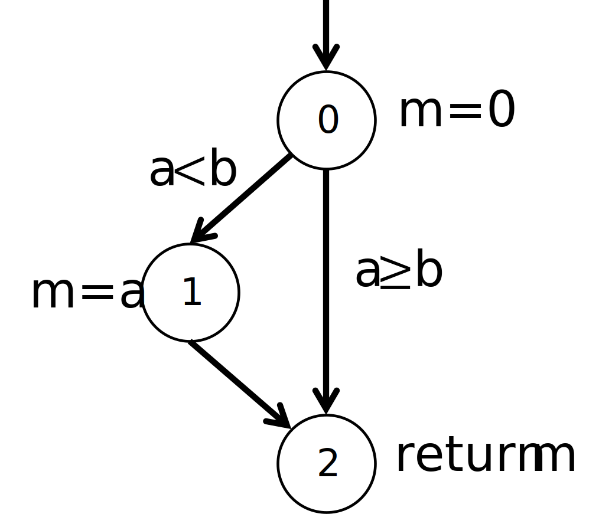

.. _part2:

*****************************************************************
Part 2: Unit testing
*****************************************************************

Software testing
================

.. _software_testing:

What is software testing?
-------------------------

According to the ANSI/IEEE standard 610.12-1990, *testing*  is *"the process of operating a system or component under specified conditions, observing or recording the results and making an evaluation of some aspect of the system or component."* More informally, testing means verifying that software (or hardware) does what we expect it to do.

As an example, let's assume we have written a method to calculate the quotient ``a/b`` of two natural numbers ``a`` and ``b``:

..  code-block:: java

    static int division(int a, int b) { ... }
    
Now, we want to know whether our implementation is correct. We can call the method with arguments 6 and 3 and maybe we get 2 as result. This seems to be correct. Then we call the method with arguments 12 and 3, and we get 4. This looks fine, too. Finally, we call the method with arguments 5 and 2 and we get 3. Is that correct? Or did we expect the result to be 2? And what should be the result if the arguments are 4 and 0?

As the above example shows, tests are only useful if we have defined what our program is supposed to do. There are different ways to specify the expected behavior of software:

1. We could write a formal specification. In our example, this is relatively easy because the method performs a simple operation. Our formal specification could be:

    .. math::

        division(a,b) = \left\{\begin{array}{cl}\lceil\frac{a}{b}\rceil & if b\neq 0\\error\  exception,& otherwise \end{array}\right.

  According to this specification (note the :math:`\lceil\cdot \rceil`), it becomes clear that the method should return 3 when called with arguments 5 and 2, and it should throw an exception if the second argument is 0. 

2. Especially for more complex programs that are difficult to describe in a formal way, the specification is often written in the form of a text document with sentences like *"The method returns the quotient of two natural numbers..."*.

3. Finally, when working with customers, we often have to start with a list of *user requirements*, i.e., a description of what is need (*"The program should calculate a/b"*), and we have to write our own specification from that.

Requirements can come in all kinds of forms. In general, we can distinguish two broad categories of requirements:

- **Functional requirements** describe **what** the final product must be able to do. Examples:

  - "The program should calculate *a/b*"
  - "The program should sort a list"
  - "The program should print the first five prime numbers"
  
- **Non-functional requirements** describe **how** the product should perform. Examples:

  - "The program should be easy to use"
  - "The program should not need more than 10 milliseconds to calculate *a/b*"
  - "The program should be secure"

What can be tested?
-------------------

Tests can be performed at different levels. Our above test of the :code:`division()` method is a *unit test* because methods are the smallest entities in Java that we can independently test. We could also test an entire class or package (this is called a *module test*), several packages (*integration test*), or an entire program (*system test*). In this book, we will only do unit tests.

In general, the larger and the more complex the program you are testing, the more complicated the tests will be, and, more importantly, the more time-consuming it will be to fix a bug. A unit test can be done as soon as we write the method, and if we find a bug we can change the implementation of the method relatively easily. Imagine if we first finished writing the whole program and then, after several months of development, found during a system test that the program violates the specification! In the worst case, this could mean rewriting the whole program.

For this reason, it makes sense to start testing as early as possible in the form of unit tests. However, it should be noted that unit tests do not replace the other tests, because some errors appear only when we combine several methods or classes.

How to plan a unit test
-----------------------

We test software because we want to verify that it produces the correct results (functional requirements) in the right way (non-functional requirements). In general, software like our above :code:`division()` method takes one or more input values and produces one or more result values. Unfortunately, in many cases there are many possible input values and testing our software with all of them would take a lot of time.

In practice, we can only test our software on a few input values and hope that the software also works correctly for other input values. For example, when we call our :code:`division()` method with the arguments 6 and 3 and we get the correct result, we assume that the method also works correctly with the arguments 12 and 6. On the other hand, if the result for 6 and 3 is not correct, we know that our software contains a bug that we have to fix.

Does that mean that we should test our :code:`division()` method with some random numbers? No, we can do something smarter than that:

1. First, we determine the *input domain* of the method, i.e., the set of possible input values. Because the method has two :code:`int` parameters, the input domain is :math:`\{-2^{31}..2^{31}-1\}\times \{-2^{31}..2^{31}-1\}`.

2. Then we split the input domain into interesting sub-domains. For example, we could decide it is interesting to test whether our method works correctly for :math:`b=0`. In that case we would obtain two sub-domains:

    - With :math:`b=0`: :math:`\{-2^{31}..2^{31}-1\}\times \{0\}`
    - With :math:`b\neq 0`: :math:`\{-2^{31}..2^{31}-1\}\times \{-2^{31}..2^{31}-1\} \backslash \{0\}`

3. Instead of testing all possible input values, we choose a few input values from each subdomain for the tests, for example :math:`a=3, b=0` for the first sub-domain, and :math:`a=6, b=3` for the second sub-domain.

This approach also works for more complex methods. Let's take the following one:

..  code-block:: java

   // returns a sorted array with the elements
   // of "a" in ascending order
   static int[] sortArray(int[] a)
   
Clearly, the input domain is very large. It contains all arrays of any length :math:`n\ge 0` containing all possible integer values. Possible sub-domains could be:

1. The empty array (:math:`n=0`)
2. Arrays with one element (:math:`n=1`)
3. Arrays containing random unsorted numbers for :math:`n>1`
4. Arrays containing numbers that have been already sorted, like :code:`{1,2,3,4}`, for :math:`n>1`
5. Arrays containing numbers that have been already sorted in descending order, like :code:`{4,3,2,1}`, for :math:`n>1`

It’s always good to have disjoint sub-domains that cover the entire input domain. Our second sub-domain already covers the case :math:`n=1`, therefore it is not necessary to cover that case again in sub-domains 3 to 5.

Test coverage
=============

Black box vs white box testing
------------------------------

Because the input domain of any non-trivial program is so large, identifying interesting input values for testing is a major challenge. If we do not have access to the source code of the program to test, we can only select the test values based on our experience and the specification. Such a test is called a *black box test* because the program that we want to test is like a opaque black box.

But if we have the source code of the program available, and that is the assumption in this book, we can use it to choose reasonable test values. This is a *white box test*.

Control Flow Graph and node coverage
------------------------------------

The following example shows an implementation of the :code:`min()` method that contains a bug:

..  code-block:: java

    // returns the minimum of "a" and "b"
    static int min(int a, int b) {
        int m;
        if (a<b)
            m = a;
        else
            m = a;    // oops. That should be "m = b"
        return m;
    }
    
If we call the above method with two numbers *a* and *b* where *a<b* (for example, *a=3* and *b=5*), we get always the correct result because the statement that contains the bug is never executed. The obvious truth is that **we can only find a bug in a program if the program reaches the faulty location in the code with our test values**. The conclusion here is that our input values should be chosen such that both branches of the if-else statement are tested.

We can visualize this by the *Control Flow Graph* (CFG) of the above code:

.. image:: _static/images/part1/control_flow_min.svg
  :width: 35%

In the above control flow graph the node 0 represents the beginning of the method, the node 1 and 2 represent the two assignments in the if-else statement, and node 3 represents the :code:`return` statement of the method.

.. admonition:: \ \

    In the Control Flow Graph (CFG), the small circles (called "nodes", French "nœuds") represent the beginning of the method and the statements. The arrows between the circles (called "edges", French "arêtes") represent how the program can go from statement to statement.

If we test the code with test values *a=3* and *b=5*, the program will go through the nodes 0, 1, and 3 of the CFG. To find the bug, we have to use test values where the program goes through node 2, for example *a=5* and *b=3*. With these two tests, we have covered all nodes of the CFG. We call this *100% node coverage*.

Edge coverage
-------------

While 100% node coverage is an important goal in testing, it does not necessarily mean that a program  contains no bugs. Consider the following faulty implementation of the the :code:`min()` method:

..  code-block:: java

    static int min(int a, int b) {
        int m=0;
        if (a<b) {
            m=a;
        }              // oops, we forgot the "else"
        return m;
    }

Here is the CFG of the method:

If we test this method with the test values *a=3* and *b=5*, the program will go through the nodes 0, 1, and 2, and we have achieved 100% node coverage without finding the bug! The bug only becomes visible if we use test values that force the program to go directly from node 0 to 2.

The above example shows that covering 100% of the *nodes* of the CFG with our tests is not enough. We have to choose our test values such that all all *edges* of the CFG are covered, too.

Path coverage
-------------

Unfortunately, 100% edge coverage is still not enough to find all bugs. The following example shows a method with a loop:

..  code-block:: java

    // returns the sum of the values 1 to n
    static int sum(int n) {
        int sum = 0;
        int i = 1;
        while (i<=n){
            sum = i;       // oops, this should be "sum += i"
            i++;
        }
        return sum;
    }

.. image:: _static/images/part1/control_flow_loop.svg
  :width: 50%
  
A test with *n=0* covers the edges :math:`0 \to 1` and :math:`1 \to 3` and we get the correct result 0. A test with *n=1* covers the edges :math:`0 \to 1`, :math:`1 \to 2`, :math:`2 \to 1`, and :math:`1 \to 3` and we get the correct result 1. With these two tests, we have covered all edges, but we have not found the bug.

To be sure that our program is correct, we would have to test all possible *paths* through the code:

- For *n=0*, the program takes the path :math:`0 \to 1 \to 3` through the code.
- For *n=1*, the program takes the path :math:`0 \to 1 \to 2 \to 1 \to 3` through the code.
- For *n=2*, the program takes the path :math:`0 \to 1 \to 2 \to 1 \to 2 \to 1 \to 3` through the code. In this path, the bug becomes visible.
- etc.

In practice, 100% path coverage is not feasible if a program contains loops or recursion because there are too many possible paths. In practice, we are often satisfied with 100% node coverage or 100% edge coverage.

"Hidden" paths
--------------

Be aware that code can sometimes contain execution paths that are not directly visible in the source code. For example, the following statement looks like a simple assignment:

..  code-block:: java

    int r = a/b;
    
However, we know that Java programs can throw exceptions, and in this case, the division will throw an exception if *b=0*. Therefore, the code can be better understood as:

..  code-block:: java

    if (b==0)
        throw new ArithmeticException();
    else
        r = a/b;

Thus, if your goal is a test with 100% coverage, you also have to consider the test case *b=0*.

Coverage test tools
-------------------

JaCoCo is a tool (and library) to perform coverage tests for Java programs: `<https://www.jacoco.org/jacoco/>`_. When you run a program with JaCoCo, it calculates two metrics:

- JVM bytecode instruction coverage: this is similar to node coverage, but JaCoCo counts JVM bytecode instructions, not Java statements. A statement like :code:`a=b+2` corresponds to 4 JVM bytecode instructions.

- Branch coverage: this is similar to edge coverage, but only for the edges of if-else and switch statements.

Similar tools also exist for other programming languages. They help to check whether you have enough test cases.

Automated Unit Testing
======================

Writing tests as a program
---------------------------

Testing is a repetitive task. In unit testing, we have to test every new method we write. And we have to repeat the test every time we changed the code of a method. It is therefore an obvious question whether we cannot let the computer do the testing.

As an example, consider again the :code:`min()` method:

..  code-block:: java

    class Main {
        static int min(int a, int b) {
            ...
        }
    }
    
We can write a test program to call this method and verify that the result is correct. The combination of test input values and the expected result is called a *test case*. In the following test code, we have two test cases:

..  code-block:: java

    // test case 1
    int result1 = min(3,5);
    if (result1!=3) {
        System.out.println("Test 1 failed: Minimum of 3 and 5 should be 3");
    }
    
    // test case 2
    int result2 = min(5,3);
    if (result2!=3) {
        System.out.println("Test 2 failed: Minimum of 5 and 3 should be 3");
    }

The advantage of having a test program is that we can run the test automatically every time we change something in our project. There are even people who say that it is better to write *first* the tests and then the actual program! This practice is called *Test Driven Development* (TDD).

JUnit
-----

Fortunately there are already tools and libraries to write tests. For Java, the most famous one is JUnit. Similar tools also exist for other programming language.

JUnit provides many useful classes and methods to write tests. To write a test you create a new class (for example, :code:`MainTest`) and write a method for each test case. Depending on which version of JUnit you use, your test code will look different. In JUnit version 4, our above two tests of the :code:`min()` method can be written like this:

..  code-block:: java

    import static org.junit.Assert.*;
    
    public class MainTest {
        @org.junit.Test
        public void testFirstNumberLessThanSecondNumber() {
            assertEquals("Minimum of 3 and 5 should be 3", 3, Main.min(3,5));
        }
        
        @org.junit.Test
        public void testFirstNumberGreaterThanSecondNumber() {
            assertEquals("Minimum of 5 and 3 should be 3", 3, Main.min(5,3));
        }
    }

In JUnit version 5, the two tests are written slightly differently:

..  code-block:: java

    import org.junit.jupiter.api.Assertions;
    import org.junit.jupiter.api.Test;

    public class MainTest {
        @Test
        public void testFirstNumberLessThanSecondNumber() {
            Assertions.assertEquals(3, Main.min(3,5), "Minimum of 3 and 5 should be 3");
        }

        @Test
        public void testFirstNumberGreaterThanSecondNumber() {
            Assertions.assertEquals(3, Main.min(5,3), "Minimum of 5 and 3 should be 3");
        }
    }
    
The method :code:`assertEquals()` of the class :code:`Assertions` takes three arguments: the expected value, the actual value produced by your implementation, and an (optional) message that is shown if the test fails, i.e., if the actual value and the expected value are not equal.

The :code:`@Test` written above the two test methods is called an *annotation* and helps JUnit to find the methods that it should call to perform the tests. IntelliJ also uses them to show you the small green triangles that you can click to run individual tests (or all tests):

.. image:: _static/images/part1/intellij_test.png
  :width: 25%

The class :code:`Assertions` has many other methods to compare results, such as :code:`assertArrayEquals()` for arrays, and :code:`assertNotEquals()` to test for inequality. It is important to note that these methods use the :code:`equals()` method when comparing objects. If you want to compare references, you have to use :code:`assertSame()`. Check the documentation at `<https://junit.org/junit5/docs/5.0.1/api/org/junit/jupiter/api/Assertions.html>`_.

Practical aspects of unit testing
---------------------------------

The main idea behind unit testing is that your program is organized in small units that can be individually tested. As already said, in Java, methods can be seen as such units.
However, if a method is very complex or does many different things, it becomes more difficult to test.
As an example, consider the following (incomplete) code:

.. code-block:: java

    class DifficultToTest {
        static int m(int v1) {
            ...something complex using v1 to calculate v2...
            int v2 = ...
            ...something complex using v2 to calculate the result...
            int result = ...
            return result;
        }
    }

As a developer, we would like to know whether the intermediate value :code:`v2` and the result are correctly calculated. To do this with a unit test, it would be better to split the method in two:

.. code-block:: java

    class EasierToTest {
        static int m1(int v1) {
            ...something using v1 to calculate v2...
            int v2 = ...
            return v2;
        }
        
        static int m2(int v2) {
            ...something using v2 to calculate the result...
            int result = ...
            return result;
        }
        
        static int m(int v1) {
            int v2 = m1(v1);
            int result = m2(v2);
            return result;
        }
    }
    
This new code is not only easier to read but also easier to test because you can provide your own values :code:`v1` and :code:`v2` to test the two parts of the calculation independently.

Another practical problem is the testing of non-static methods or methods that need objects as parameters. Consider the following class:

.. code-block:: java

    class Employee {
        private int salary;
        
        public Employee(int s) { salary = s; }
        public void increaseSalary(int s) { salary += s; }
        public int getSalary() { return salary; }
    }

When testing non-static methods like :code:`increaseSalary()`, your test needs to "prepare" an object before the method can be called. In JUnit v5, the test code could look like this:

.. code-block:: java

    public class EmployeeTest {
        @Test
        void testSalaryIncrease() {
            Employee employee = new Employee(1000);
            employee.increaseSalary(500);
            Assertions.assertEquals(1500, employee.getSalary());
        }
    }

Although this test is correctly implemented, it's difficult to see where the bug is located if the test fails. Did :code:`increaseSalary()` not work correctly? Or was the bug in the constructor or in the :code:`getSalary()` method?

There are different ways to address this problem. One is to add more test cases, for example for the construction of the object:

.. code-block:: java

    public class EmployeeTest {
        @Test
        void testConstruction() {
            Employee employee = new Employee(1000);
            Assertions.assertEquals(1000, employee.getSalary());
        }
    
        @Test
        void testSalaryIncrease() {
            Employee employee = new Employee(1000);
            employee.increaseSalary(500);
            Assertions.assertEquals(1500, employee.getSalary());
        }
    }

Alternative, we could do more tests inside one test case:

.. code-block:: java

    public class EmployeeTest {
        @Test
        void testSalaryIncrease() {
            Employee employee = new Employee(1000);
            Assertions.assertEquals(1000, employee.getSalary());
            
            employee.increaseSalary(500);
            Assertions.assertEquals(1500, employee.getSalary());
        }
    }

One can argue about what is the "right" way. Some developers prefer simple test methods, in which exactly one thing is tested. Others don't like too many small trivial tests. We don't want to get involved in this discussion and leave it to you to decide.

..
    TODO : Explain exception testing with JUnit

    Explain why we still talk about JUnit4
