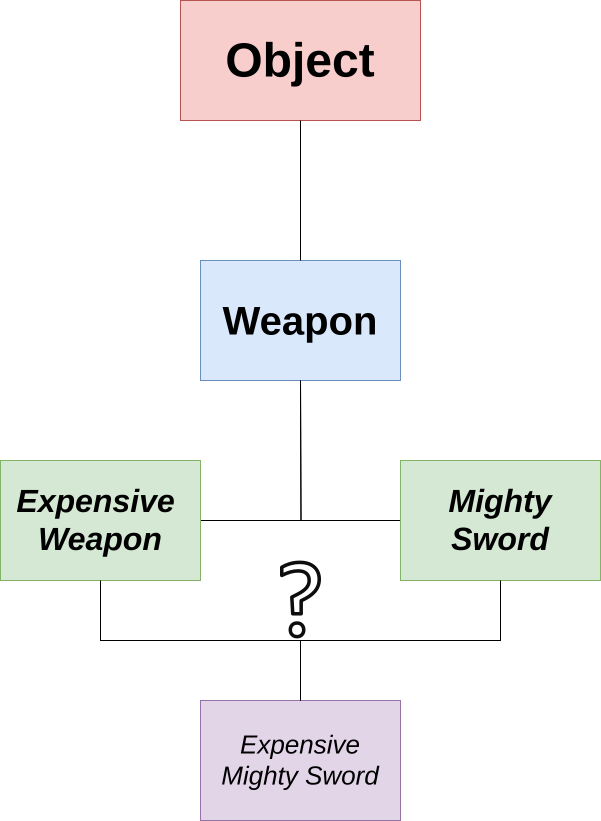

.. _part2:

*****************************************************************
Object-Oriented Programming
*****************************************************************

Basics
===================

Creating your own objects
-------------------------

*Computer programs are about organizing data and working with that data*. In some applications, the primitive types, arrays, and strings are enough, but often you have data that is more complex than that.
For example, imagine a program to manage employees in a company. We can describe the fact that each employee has a name and a salary, by defining a new *class* in our Java program:

.. code-block:: java

    class Employee {
        String name;    // the name of the employee
        int salary;     // the salary of the employee     
    }
    
Classes allow us to create new *objects* from them. In our example, each object of the class :code:`Employee` represents an employee, which makes it easy to organize our data:

.. code-block:: java

    class Employee {
        String name;
        int salary;    
    }

    public class Main {    
        public static void main(String[] args) {
            Employee person1 = new Employee();    // a new object!
            person1.name = "Peter";
            person1.salary = 42000;
            
            Employee person2 = new Employee();    // a new object!
            person2.name = "Anna";
            person2.salary = 45000;

            int salaryDifference = person1.salary - person2.salary;
            System.out.println("The salary difference is " + salaryDifference);
        }
    }

The two objects that we created and put into the local variables :code:`person1` and :code:`person2` are called *instances* of the class :code:`Employee`, and the two variables :code:`name` and :code:`age` are called *instance variables* of the class :code:`Employee`. Since they are not static, they belong to the instances, and each instance has its own :code:`name` and :code:`age`.

Initializing objects
--------------------

In the above example, we first created the object, and then set the values of its instance variables:

.. code-block:: java

    Employee person1 = new Employee();
    person1.name = "Peter";
    person1.salary = 42000;

Like static variables, instance variables are automatically initialized with the value 0 (for number variables), with :code:`false` (for Boolean variables), or with :code:`null` (for all other types). In our example, this is dangerous because we could forget to specify the salary of the employee:

.. code-block:: java

    Employee person1 = new Employee();
    person1.name = "Peter";
    // oops, the salary is 0

There are several ways to avoid this kind of mistake. One way is to initialize the variable in the class definition:

.. code-block:: java

    class Employee {
        String name;
        int salary = 10000;
    }
    
Of course, this is only useful if you want that all employees start with a salary of 10000. The other way is to define a *constructor* in your class. The constructor is a special method that has the same name as the class. It can have parameters but it has no return type:

.. code-block:: java

    class Employee {
        String name;
        int salary;
        
        // the constructor
        Employee(String n, int s) {   
            this.name = n;
            this.salary = s;
        }
    }

If you provide a constructor for your class, the Java compiler will verify that you use it to create new objects:

.. code-block:: java

    Employee person1 = new Employee("Peter", 42000);
    // Okay. We have now a new employee with
    //    person1.name "Peter"
    //    person1.salary 42000
    
    Employee person2 = new Employee();   // not allowed. You must use the constructor!

In our example, the constructor took two parameters :code:`n` and :code:`s` and used them to initialize the instance variables :code:`name` and :code:`salary` of a new :code:`Employee` object. But how does the constructor know which object to initialize? Do we have to tell the constructor that the new object is in the variable :code:`person1`? Fortunately, it's easier than that. The constructor can always access the object being constructed by using the keyword :code:`this`. Therefore, the line

.. code-block:: java

    this.name = n;

means that the instance variable :code:`name` of the new object will be initialized to the value of the parameter variable :code:`n`. We could even use the same names for the parameter variables and for the instance variables:

.. code-block:: java

    class Employee {
        String name;
        int salary;
        
        Employee(String name, int salary) {
            this.name = name;
            this.salary = salary;
        }
    }

Like for class variables, we have to be careful with shadowing. Without :code:`this.` in front of the variable name, the Java compiler will assume that you mean the parameter variable. It's a common mistake to write something like:

.. code-block:: java

    class Employee {
        String name;
        int salary;

        Employee(String name, int salary) {
            name = name;       //  oops, this.name is not changed here!
            salary = salary;   //  oops, this.salary is not changed here!
        }
    }

Mental model
------------

Like array variables and ``String`` variables, object variables contain a reference to the object in your computer's main memory. The object itself contains the instance variables. Note that an instance variable can be again a reference. For our employee ``Peter``, we get the following structure:

+------------------------------------------+-------------------------------------------------+
| Java code                                | In memory during execution                      |
+==========================================+=================================================+
| .. code::                                |      /                                          |
|                                          |                           /                     |
|    Employee person1 =                    |                                                 |
|       new Employee("Peter", 42000);      | .. image:: _static/images/part1/objectn.svg     |
|                                          |          :width: 80%                            |
+------------------------------------------+-------------------------------------------------+

Because of this, what we have already said about array variables and ``String`` variables also holds for object variables: assigning an object variable to another object variable only copies the reference. Comparing two object variables will only compare the references, not the content of the objects:

.. code-block:: java

    Employee person1 = new Employee("Peter", 42000);
    Employee person2 = new Employee("Peter", 42000);
    System.out.println(person1 == person2);      // false. Two different objects.
    
    Employee person3 = person1;
    System.out.println(person1 == person3);      // true. Same object.

Working with objects
--------------------

Many things that you can do with primitive types and strings, you can also do them with objects. For example, you can create arrays of objects. The elements of a new array of objects are automatically initialized to :code:`null`, as shown in this example:

.. code-block:: java

    Employee[] myTeam = new Employee[3];
    myTeam[0] = new Employee("Peter", 42000);
    myTeam[1] = new Employee("Anna", 45000);
    System.out.println(myTeam[0].name);       // is "Peter"
    System.out.println(myTeam[1].name);       // is "Anna"
    System.out.println(myTeam[2].name);       // Error! myTeam[2] is null
    

You can also have class variables and instance variables that are object variables. Again, they will be automatically initialized to :code:`null`, if you don't provide an initial value. In the following example, we have added a new instance variable :code:`boss` to our :code:`Employee`:

.. code-block:: java

    class Employee {
        String name;
        int salary;
        Employee boss;
        
        Employee(String name, int salary, Employee boss) {
            this.name = name;
            this.salary = salary;
            this.boss = boss;
        }
    }

    public class Main {
        public static void main(String[] args) {
            // Anna has no boss
            Employee anna = new Employee("Anna", 45000, null);
        
            // Anna is the boss of Peter        
            Employee peter = new Employee("Peter", 42000, anna);            
        }
    }
    
Exercise for you: Take a sheet of paper and draw the mental model graph for the object representing Peter.

Question: In the above example, what value do we give to the :code:`boss` instance variable of an employee who has no boss?

Methods
-------

In the following example, we define a static method :code:`increaseSalary()` to increase the salary of an employee:

.. code-block:: java

    class Employee {
        String name;
        int salary;

        Employee(String name, int salary) {
            this.name = name;
            this.salary = salary;
        }
    }

    public class Main {
        static void increaseSalary(Employee employee, int raise) {
            // we only raise the salary if the raise is less than 10000
            if (raise < 10000) {
                employee.salary += raise;
            }
        }

        public static void main(String[] args) {
            Employee anna = new Employee("Anna", 45000);
            Employee peter = new Employee("Peter", 45000);

            // Anna and Peter get a salary raise
            increaseSalary(anna, 2000);
            increaseSalary(peter, 3000);

            System.out.println("New salary of Anna is " + anna.salary);
            System.out.println("New salary of Peter is " + peter.salary);
        }
    }

The above code works. But in Object-Oriented Programming (OOP) languages like Java, we generally prefer that all methods that modify instance variables of an object are put inside the class definition. In a large program, this makes it easier to understand who is doing what with an object. To implement this, we replace the static method :code:`increaseSalary()` of the :code:`Main` class by a non-static method in the :code:`Employee` class:

.. code-block:: java

    class Employee {
        String name;
        int salary;
        
        Employee(String name, int salary) {
            this.name = name;
            this.salary = salary;
        }
        
        void increaseSalary(int raise) {
            if (raise < 10000) {
                this.salary += raise;
            }
        }
    }

    public class Main {
        public static void main(String[] args) {
            Employee anna = new Employee("Anna", 45000);
            Employee peter = new Employee("Peter", 45000);
            
            // Anna and Peter get a salary raise
            anna.increaseSalary(2000);
            peter.increaseSalary(3000);
            
            System.out.println("New salary of Anna is "+ anna.salary);
            System.out.println("New salary of Peter is "+ peter.salary);
        }
    }

Because :code:`increaseSalary()` is now a non-static method of :code:`Employee`, we can directly call it on an Employee object. No parameter :code:`employee` is needed because, inside the method, the :code:`this` keyword is a reference to the object on which the method has been called. Therefore, we just write :code:`anna.increaseSalary(2000)` to change the salary of Anna.

Restricting access
------------------

The nice thing about our :code:`increaseSalary()` method is that we can make sure that raises are limited to 10000 Euro :) However, nobody stops the programmer to ignore that method and manually change the salary:

.. code-block:: java

    Employee anna = new Employee("Anna", 45000, null);
    anna.salary += 1500000;   // ha!

This kind of mistake can quickly happen in a large program with hundreds of classes.    
We can prevent this by declaring the instance variable :code:`salary` as :code:`private`:

.. code-block:: java

    class Employee {
        String name;
        private int salary;
        
        Employee(String name, int salary) {
            this.name = name;
            this.salary = salary;
        }
        
        void increaseSalary(int raise) {
            if (raise < 10000) {
                this.salary += raise;
            }
        }
    }

A private instance variable is only accessible *inside* the class. So the access :code:`anna.salary += 150000` in the :code:`Main` class doesn't work anymore. Mission accomplished...

Unfortunately, that's a bit annoying because it also means that we cannot access anymore Anna's salary in :code:`System.out.println("New salary of Anna is "+anna.salary)`. To fix this, we can add a method :code:`getSalary()` whose only purpose is to give us the value of the private :code:`salary` variable. Here is the new version of the code:

.. code-block:: java

    class Employee {
        String name;
        private int salary;
        
        Employee(String name, int salary) {
            this.name = name;
            this.salary = salary;
        }
        
        void increaseSalary(int raise) {
            if (raise < 10000) {
                this.salary += raise;
            }
        }
        
        int getSalary() {
            return this.salary;
        }
    }

    public class Main {
        public static void main(String[] args) {
            Employee anna = new Employee("Anna", 45000);
            
            anna.increaseSalary(2000);
            
            System.out.println("New salary of Anna is "+ anna.getSalary());
        }
    }

.. _inheritance:
    
Inheritance
-----------

Let's say we are writing a computer game, for example an RPG (role-playing game). We implement weapons as objects of the class :code:`Weapon`. The damage that a weapon can inflict depends on its level. The price of a weapon also depends on its level. The code could look like this:

.. code-block:: java

    class Weapon {
        private int level;
        private String name;

        Weapon(String name, int level) {
            this.name = name;
            this.level = level;
        }

        int getPrice() {
            return this.level * 500;
        }

        int getSimpleDamage() {
            return this.level * 10;
        }
        
        int getDoubleDamage() {
            return this.getSimpleDamage() * 2;
        }
    }
    
    public class Main {   
        public static void main(String[] args) {
            Weapon weapon;
            
            weapon = new Weapon("Small dagger", 2);            
            System.out.println("Price is " + weapon.getPrice());
            System.out.println("Simple damage is " + weapon.getSimpleDamage());
            System.out.println("Double damage is " + weapon.getDoubleDamage());
        }
    }
    
**Before you continue, carefully study the above program and make sure that you understand what it does. Run it in IntelliJ. Things are about to get a little more complicated in the following!**
    
In our game, there is also a special weapon type, the *Mighty Swords*. These swords always deal a damage of 1000, independently of their level. In Java, we can implement this new weapon type like this:

.. code-block:: java

    class MightySword extends Weapon {
        MightySword(String name, int level) {
            super(name,level);
        }

        @Override
        int getSimpleDamage() {
            return 1000;
        }
    } 
 
According to the first line of this code, the class :code:`MightySword` *extends* the class :code:`Weapon`. We say that :code:`MightySword` is *a subclass* (or *subtype*) of :code:`Weapon`, or we can say that :code:`Weapon` is a *superclass* of :code:`MightySword`. In practice, this means that everything we can do with objects of the class :code:`Weapon` we can also do with objects of the class :code:`MightySword`:

.. code-block:: java

    public static void main(String[] args) {
        Weapon weapon;

        weapon = new MightySword("Magic sword", 3);
        System.out.println("Price is " + weapon.getPrice());
        System.out.println("Simple damage is " + weapon.getSimpleDamage());
        System.out.println("Double damage is " + weapon.getDoubleDamage());
    }

At first glance, there seems to be a mistake in the above ``main()`` method. Why is the line

.. code-block:: java

    weapon = new MightySword("Magic sword", 3);
    
not a type error? On the left, we have the variable :code:`weapon` of type :code:`Weapon` and on the right we have a new object of :code:`MightySword`. But this is acceptable for the compiler because Java has the following rule:

**Rule 1: A variable of type X can hold a reference to an object of class X or to an object of a subclass of X**.

Because of rule 1, the compiler is perfectly happy with putting a reference to a :code:`MightySword` object in a variable declared as type :code:`Weapon`. For Java, MightySword instances are just special Weapon instances.

.. image:: _static/images/part1/classhierarchyruleone.svg
  :width: 70%

The next line of the ``main()`` method looks strange, too:

.. code-block:: java

    System.out.println("Price is " + weapon.getPrice());

Our class :code:`MightySword` has not defined a method :code:`getPrice` so why can we call :code:`weapon.getPrice()`? This is another rule in Java:

**Rule 2: The subclass inherits the methods of its superclass. Methods defined in a class X can be also used on objects of a subclass of X.**

Let's look at the next line. It is:

.. code-block:: java

    System.out.println("Simple damage is " + weapon.getSimpleDamage());
    
Just by looking at this line and the line :code:`Weapon weapon` at the beginning of the :code:`main()` method, you might expect that :code:`weapon.getSimpleDamage()` calls the :code:`getSimpleDamage()` method of the :code:`Weapon` class. However, if you check the output of the program, you will see that the method :code:`getSimpleDamage()` of the class :code:`MightySword` is called. Why? Because :code:`weapon` contains a reference to a :code:`MightySword` object. The rule is:

**Rule 3: Let x be a variable of type X (where X is a class) and let's assign an object of class Y (where Y is a subclass of X) to x. When you call a method on x and the method is defined in X and in Y, the JVM will execute the method defined in Y.**

For instances of the class :code:`MightySword`, calling :code:`getSimpleDamage()` will always execute the method defined in that class. We say that the method :code:`getSimpleDamage()` in :code:`MightySword`  *overrides* the method definition in the class ``Weapon``. For that reason, we have marked the method in :code:`MightySword` with the so-called :code:`@Override` annotation.

.. image:: _static/images/part1/classhierarchyrule23.svg
  :width: 50%

With the above three rules, can you guess what happens in the next line?

.. code-block:: java

    System.out.println("Double damage is " + weapon.getDoubleDamage());

According to rule 2, the class :code:`MightySword` inherits the method :code:`getDoubleDamage()` of the class :code:`Weapon`. So, let's check how that method was defined in the class :code:`Weapon`:

.. code-block:: java

    int getDoubleDamage() {
        return this.getSimpleDamage() * 2;
    }
    
The method calls :code:`this.getSimpleDamage()`. Which method :code:`getSimpleDamage()` will be called? The one defined in :code:`Weapon` or the one in :code:`MightySword`? To answer this question, you have to remember rule 3! The :code:`this` in :code:`this.getSimpleDamage()` refers to the object on which the method was called. Since our method is an object of the class :code:`MightySword`, the method :code:`getSimpleDamage()` of :code:`MightySword` will be called. The fact that ``getDoubleDamage`` is defined in the class :code:`Weapon` does not change rule 3.

Super
-----

There is one thing left in our :code:`MightySword` class that we have not yet explained. It's the constructor:

.. code-block:: java

    class MightySword extends Weapon {

        MightySword(String name, int level) {
            super(name,level);
        }

        ...
     }
     
In the constructor, the keyword :code:`super` stands for the constructor of the superclass of :code:`MightySword`, that is :code:`Weapon`. Therefore, the line :code:`super(name,level)` simply calls the constructor as defined in :code:`Weapon`.

:code:`super` can also be used in methods. Imagine we want to define a new weapon type *Expensive Weapon* that costs exactly 100 more than a normal weapon. We can implement it as follows:

.. code-block:: java

    class ExpensiveWeapon extends Weapon {

        ExpensiveWeapon(String name, int level) {
            super(name,level);
        }

        @Override
        int getPrice() {
            return super.getPrice() + 100;
        }
    } 

The expression :code:`super.getPrice()` calls the method :code:`getPrice()` as defined in the superclass :code:`Weapon`. That means that the keyword :code:`super` can be used to call methods of the superclass, which would normally not be possible for overridden methods because of rule 3.

The @Override annotation
------------------------

The :code:`@Override` annotation is not strictly necessary in Java (the compiler doesn't need it for itself), but it helps you to avoid mistakes. For example, imagine you made a spelling error when you wrote the name of :code:`getSimpleDamage()`:

.. code-block:: java

    class MightySword extends Weapon {
        MightySword(String name, int level) {
            super(name,level);
        }

        @Override
        int getSimpleDamag() {  //  oops, we forgot the "e" in "getSimpleDamage()"
            return 1000;
        }
    } 

Because of your spelling error, the code above actually does not override anything. It just introduces a new method :code:`getSimpleDamag()`. But thanks to the :code:`@Override` annotation, the Java compiler can warn us that there is a problem.

Extending, extending,...
------------------------

A subclass cannot only override methods of its superclass, it can also add new instance variables and new methods. For example, we can define a new type of Mighty Swords that can do magic damage:

.. code-block:: java

    class MagicSword extends MightySword {
        private int magicLevel;

        MagicSword(String name, int level, int magicLevel) {
            super(name,level);  // call the constructor of MightySword
            this.magicLevel = magicLevel;
        }

        int getMagicDamage() {
            return this.magicLevel * 5;
        }
    } 

As you can see, you can create subclasses of subclasses. Note that the constructor uses again :code:`super` to first call the constructor of the superclass and then initializes the new instance variable :code:`magicLevel`.

How can we call the method :code:`getMagicDamage()`? Can we do this:

.. code-block:: java

    Weapon weapon = new MagicSword("Elven sword", 7, 3);
    System.out.println(weapon.getMagicDamage());
    
The answer is no! Rule 3 is only applied to methods that are defined in the subclass *and* in the superclass. This is not the case for :code:`getMagicDamage()`.
In this situation, the Java compiler will not accept the call :code:`weapon.getMagicDamage()` because, just by looking at the variable declaration :code:`Weapon weapon`, it cannot tell that the object referenced by the variable :code:`weapon` really has a method :code:`getMagicDamage`. You might think that the compiler is a bit stupid here, but remember that this is just a simple example and the programmer could try to do some strange things that are difficult to see for the compiler:

.. code-block:: java

    Weapon weapon = new MagicSword("Elven sword", 7, 3);
    weapon = new Weapon("Dagger", 1);    
    System.out.println(weapon.getMagicDamage());  // does not compile, fortunately!

To be able to call :code:`getMagicDamage()`, you have to convince the compiler that the variable contains a reference to a Magic Sword object. For example, you could change the type of the variable:

.. code-block:: java

    MagicSword weapon = new MagicSword("Elven sword", 7, 3);
    System.out.println(weapon.getMagicDamage());

In this way, it's 100% clear for the compiler that the variable definitely refers to a :code:`MagicSword` object (or to an object of a subclass of :code:`MagicSword`; remember rule 1).

Alternatively, you can do a type cast:

.. code-block:: java

    Weapon weapon = new MagicSword("Elven sword", 7, 3);
    System.out.println(((MagicSword) weapon).getMagicDamage());

However, be careful with type casts. The compiler will accept them but if you do a mistake, you will get an error during program execution:

.. code-block:: java

    Weapon weapon = new Weapon("Dagger", 1);   
    System.out.println(((MagicSword) weapon).getMagicDamage());  // oh oh...

Polymorphism
------------

The three rules make it possible to write code and data structures that can be used with objects of different classes. For example, thanks to rule 1, you can define an array that contains different types of weapons:

.. code-block:: java

    Weapon[] inventory = new Weapon[3];
    inventory[0] = new Weapon("Dagger", 2);
    inventory[1] = new MagicSword("Elven sword", 7, 3);
    inventory[2] = new ExpensiveWeapon("Golden pitchfork", 3);

And thanks to rule 2 and 3, you can write methods that work for different types of weapons:

.. code-block:: java

    int getPriceOfInventory(Weapon[] inventory) {
        int sum = 0;
        for (Weapon weapon : inventory) {
            sum += weapon.getPrice();
        }
        return sum;
    }

Although the above method :code:`getPriceOfInventory()` looks like it is only meant for objects of class :code:`Weapon`, it also works for all subclasses of :code:`Weapon`. This is called *Subtype Polymorphism*. If you have for example an object of class :code:`ExpensiveWeapon` in the array, rule 3 will guarantee that :code:`weapon.getPrice()` will call the method defined in :code:`ExpensiveWeapon`.

The conclusion is that there is a difference between what the compiler sees in the source code and what actually happens when the program is executed. When the compiler sees a method call like :code:`weapon.getPrice()` in your source code, it only checks whether the method exists in the declared type of the variable. But during program execution, what is important is which object is actually referenced by the variable. We say that **type checking by the compiler is static**, but **method calls by the JVM are dynamic**.

The class hierarchy
-------------------

If we take all the different weapon classes that we created in the previous examples, we get a so-called "class hierarchy" that shows the subclass-superclass relationships between them:

.. image:: _static/images/part1/classhierarchyn.svg
   :width: 35%                                 

The class :code:`Object` that is above our :code:`Weapon` class was not defined by us. It is automatically created by Java and is the superclass of *all* non-primitive types in Java, even of arrays and strings! A variable of type :code:`Object` therefore can refer to any non-primitive value:

.. code-block:: java

    Object o;
    o = "Hello";                                // okay
    o = new int[]{1, 2, 3};                       // okay, too
    o = new MagicSword("Elven sword", 7, 3);    // still okay!

The documentation of :code:`Object` can be found at `<https://docs.oracle.com/javase/8/docs/api/java/lang/Object.html>`_.
The class defines several interesting methods that can be used on all objects.
One of them is the :code:`toString()` method. This method is very useful because it is called by frequently used methods like :code:`String.valueOf()` and :code:`System.out.println()` when you call them with an object as parameter. Therefore, if we override this method in our own class, we will get a nice output:

.. code-block:: java

    class Player {
        private String name;
        private int birthYear;

        Player(String name, int birthYear) {
            this.name = name;
            this.birthYear = birthYear;
        }

        @Override
        public String toString() {
            return "Player " + this.name + " born in " + this.birthYear;
        }
    }
    
    public class Main {   
        public static void main(String[] args) {
            Player peter = new Player("Peter", 1993);
            System.out.println(peter);   // this will call toString() of Player
        }
    }

The method :code:`toString()` is declared as :code:`public` in the class :code:`Object` and, therefore, when we override it we have to declare it as public, too. We will talk about the meaning of :code:`public` later.

Another interesting method defined by :code:`Object` is :code:`equals()`. We have already learned that we have to use the method :code:`equals()` when we want to compare the content of two strings because the equality operator :code:`==` only compares references. This is also recommended for your own objects. However, comparing objects is more difficult than comparing strings. For our class :code:`Player` shown above, when are two players equal? The Java language cannot answer this question for us, so we have to provide our own implementation of :code:`equals()`. For example, we could say that two :code:`Player` objects are equal if they have the same name and the same birth year:

.. code-block:: java

    import java.util.Objects;
    
    class Player {
        private String name;
        private int birthYear;

        Player(String name, int birthYear) {
            this.name = name;
            this.birthYear = birthYear;
        }
      
        @Override
        public boolean equals(Object obj) {
            if (this == obj) {
                return true;    // same object!
            }
            else if (obj == null) {
                return false;   // null parameter
            }
            else if (this.getClass() != obj.getClass()) {
                return false;   // different types
            }
            else {
                Player p = (Player) obj;
                return p.name.equals(this.name) && p.birthYear == this.birthYear;
            }
        }
        
        @Override
        public int hashCode() {
            return Objects.hash(this.name, this.birthYear);
        }
    }

    public class Main {   
        public static void main(String[] args) {
            Player peter1 = new Player("Peter", 1993);
            Player peter2 = new Player("Peter", 1993);
            System.out.println(peter1.equals(peter2));    // true
            System.out.println(peter1.equals("Hello"));   // false
            System.out.println(peter1.equals(null));      // false
        }
    }

What's happening in the above code? One difficulty with :code:`equals()` is that it can be called with a :code:`null` argument or with an object that is not an instance of :code:`Player`. 
So, before we can compare the name and the birth year of a :code:`Player` object with another :code:`Player` object, we first have to do some tests. One of them is whether the object on which :code:`equals()` was called (:code:`this`) and the other object (:code:`obj`) have the same type:

.. code-block:: java 

    else if (this.getClass() != obj.getClass()) {
    
If all those tests pass we can finally compare the name and birth year of :code:`this` and the other Player object.

Note that there are some other difficulties with :code:`equals()` that we will not discuss here. They are related to the :code:`hashCode()` method that you have to always override together with :code:`equals()`, as shown above.

ArrayList
---------

Using the class :code:`Object` can be useful in situations where we want to write methods that work with all types of objects. For example, we have seen before that a disadvantage of arrays in Java over lists in Python is that arrays cannot change their size. In the package :code:`java.util`, there is a class :code:`ArrayList` that can do that:

.. code-block:: java

    import java.util.ArrayList;

    public class Main {
        public static void main(String[] args) {
            ArrayList list = new ArrayList();

            // add two elements to the end of the list
            list.add("Hello");
            list.add(new int[]{1, 2, 3});

            System.out.println( list.size() );    // number of elements
            System.out.println( list.get(0) );    // first element    
        }
    }

As you can see in the above example, the method :code:`add()` of :code:`ArrayList` accepts any reference (including to arrays and strings) as argument. Very simplified, you can imagine that the :code:`ArrayList` class looks like this:

.. code-block:: java

    public class ArrayList {
        // the added elements        
        private Object[] elements;
        
        public void add(Object obj) {
            // this method adds "obj" to the array
            // ...
        }
    
        public Object get(int index) {
            // this method returns the object at position "index"
            // ...
        }
    }

For loops on ArrayList
----------------------

:code:`for` loops also work on "ArrayList":

.. code-block:: java

    ArrayList list = new ArrayList();
    list.add("Hello");
    list.add("World");

    // simple for loop
    for (Object obj : list) {
        System.out.println(obj);
    }

    // complex for loop
    for (int i = 0; i < list.size(); i++) {
        System.out.println(list.get(i));
    }

.. _boxing:

Boxing and unboxing
-------------------

Unfortunately, primitive types are not subclasses of :code:`Object`. Therefore, we cannot simple add an :code:`int` value to an ArrayList, at least not without the help of the compiler:

.. code-block:: java

    list.add(3);  // does that work?
        
One way to solve this problem is to write a new class with the only purpose to store the :code:`int` value in an object that we can then add to the list:

.. code-block:: java

    class IntObject {
        int value;
        
        IntObject(value) {
            this.value = value;
        }
    }
    
    public class Main {
        public static void main(String[] args) {
            ArrayList list = new ArrayList();
            
            list.add(new IntObject(3));
        }
    }
    
This trick is called *boxing* because we put the primitive-type value 3 in a small "box" (the :code:`IntObject` object). Fortunately, we actually don't have to write our own class :code:`IntObject`, because the :code:`java.lang` package already contains a class that does exactly that:

.. code-block:: java

    // Integer is a class defined in the java.lang package
    Integer value = Integer.valueOf(3);
    list.add(value);

The :code:`java.lang` package also contains equivalent classes :code:`Long`, :code:`Float`, etc. for the other primitive types.

Note that boxing is quite cumbersome and it is only needed in Java because primitive types are not subclasses of :code:`Object`. However, we get a little bit of help from the compiler. In fact, the compiler can do the boxing for you. This is called **autoboxing**. You can just write:

.. code-block:: java

    list.add(3);  // this automatically calls "Integer.valueOf(3)"

Autoboxing is not limited to the :code:`ArrayList` class. It works for all situations where you assign a primitive-type value to a variable that has a matching class type. The opposite direction, unboxing, is also done automatically by the compiler:

.. code-block:: java

    // autoboxing
    // this is identical to:
    //    Integer value = Integer.valueOf(3);
    Integer value = 3;  
    
    // auto-unboxing
    // this is identical to:
    //    int i = value.intValue();
    int i = value;

.. _generics:
    
ArrayList and Generics
----------------------

The way :code:`ArrayList` uses :code:`Object` to be able to store all kinds of objects has a big disadvantage. Since the :code:`get` method has the return type :code:`Object`, we have to do a type cast if we want again the original type of the object that we added to the list:

.. code-block:: java
    
    ArrayList list = new ArrayList();
    
    list.add("Hello");
    list.add("World");
    
    int len = ((String) list.get(0)).length();
    
Although *we* know that the list only contains strings, the compiler needs the type cast before we can call the method :code:`length()`. This is not only cumbersome, but can also lead to errors that only appear when the program is executed.

Fortunately, Java has a feature called *Generics* that allows us to simplify the above code as follows:

.. code-block:: java

    ArrayList<String> list = new ArrayList<String>();
    
    list.add("Hello");
    list.add("World");
    
    int len = list.get(0).length();

The syntax :code:`ArrayList<String>` tells the compiler that the :code:`add()` method of our list will only accept ``String`` objects as arguments and that the :code:`get()` method will only return ``String`` objects. In that way, the type cast is not needed anymore (actually, the type cast is still done but you don't see it because the compiler automatically adds it in the class file).

You will see more examples of *Generics* later in this book. To give you a first taste, let's see what the :code:`ArrayList` class looks like in reality:

.. code-block:: java

    public class ArrayList<E> {    // type parameter E
        private Object[] elements;
        
        public void add(E obj) {
            // ...
        }
    
        public E get(int index) {
            // ...
        }
    }

The :code:`E` that you can see in the first line and in the method definitions is a *type parameter*. It represents the type of the element that we want to store in the list. By creating our list with

.. code-block:: java

    ArrayList<String> list = new ArrayList<String>();

we are telling the compiler that it should assume that :code:`E = String`, and accordingly the methods :code:`add()` and :code:`get()` will be understood as :code:`void add(String obj)` and :code:`String get(int index)`.

Method overloading with different parameters
-------------------------------------

In Java, it is allowed to have two methods with the same name as long as they have different parameters. This is called *method overloading*. Here is an example:

.. code-block:: java

    class Player {
        private String name;
        private int birthYear;

        Player(String name, int birthYear) {
            this.name = name;
            this.birthYear = birthYear;
        }

        public void set(String name) {
            this.name = name;
        }

        public void set(String name, int birthYear) {
            this.name = name;
            this.birthYear = birthYear;
        }
    }

If we call the :code:`set()` method, the Java compiler knows which of the two methods you wanted to call by looking at the parameters:

.. code-block:: java

    Person person = new Person("Peter", 1993);
    person.set("Pierre", 1993);     // this is the set method with parameters String and int

Overloading with subclass parameters
------------------------------------

You have to be careful when you write overloaded methods where the parameters are classes and subclasses. Here is a minimal example of a :code:`Player` class with such an overloaded method:

.. code-block:: java

    class Weapon {
        // ...
    }

    class MightySword extends Weapon {
        // ...
    }

    class Player {
        Weapon weapon;
        int power;

        void giveWeapon(Weapon weapon) {
            this.weapon = weapon;
            this.power = 0;
        }

        void giveWeapon(MightySword weapon) {
            this.weapon = weapon;
            this.power = 10;   // a Mighty Sword increases the power of the player
        }
    }

    public class Main {
        public static void main(String[] args) {
            Player player = new Player();

            Weapon weapon = new MightySword();
            player.giveWeapon(weapon);
            
            System.out.println(player.power);
        }
    }

What will :code:`System.out.println(player.power)` print after we gave a Mighty Sword to the player?

Surprisingly, it will print ``0``. The method :code:`void giveWeapon(MightySword weapon)` is **not** called although we called :code:`giveWeapon()` with a ``MightySword`` object! The explanation for this is that the Java compiler only looks at the type of the variable *as declared in the source code* when deciding which method to call. In our example, the type of the variable :code:`weapon` is :code:`Weapon`, therefore the method :code:`void giveWeapon(Weapon weapon)` is called. The compiler cannot know that the variable will contain a reference to a ``MightySword`` object during program execution.

Lesson learned: **Method calls in Java are only dynamically decided for the object on which the method is called (remember rule 3!). They are not dynamic for the arguments of the method.**

The correct way to call :code:`giveWeapon()` for Mighty Swords is:

.. code-block:: java

    MightySword weapon = new MightySword();
    player.giveWeapon(weapon);
    
or just:

.. code-block:: java

    player.giveWeapon(new MightySword());

Overloading with closest match
------------------------------

What happens if we call an overloaded method but there is no version of the method that exactly matches the type of the argument? Here is the same example as above, but with a third class :code:`MagicSword` that is a subclass of :code:`MightySword`:

.. code-block:: java

    class Weapon {
        // ...
    }

    class MightySword extends Weapon {
        // ...
    }

    class MagicSword extends MightySword {
        // ...
    }

    class Player {
        Weapon weapon;
        int power;

        void giveWeapon(Weapon weapon) {
            this.weapon = weapon;
            this.power = 0;
        }

        void giveWeapon(MightySword weapon) {
            this.weapon = weapon;
            this.power = 10;
        }
    }

    public class Main {
        public static void main(String[] args) {
            Player player = new Player();

            player.giveWeapon(new MagicSword());

            System.out.println(player.power);
        }
    }

Which one of the two :code:`giveWeapon()` will be called if the argument is a :code:`MagicSword` object? In this situation, the compiler will choose the method with the closest type to :code:`MagicSword`, that is :code:`void giveWeapon(MightySword weapon)`.

.. _multiple_inheritance:

Multiple Inheritance
--------------------

If we look back at our examples with the Weapon subclasses :code:`ExpensiveWeapon` and :code:`MightySword`, we might be tempted to create a new class :code:`ExpensiveMightySword` that inherits from both subclasses:

Unfortunately, inheriting from two (or more) classes is **not allowed** in Java. The reason for this is the *diamond problem* that occurs when a class inherits from two classes that are subclasses of the same class (the problem is named after the diamond shape of the resulting class hierarchy). The following illegal Java program illustrates the problem:

.. code-block:: java

    class Weapon {
        int level;
    
        int getPrice() {
            return 100;
        }
    }

    class ExpensiveWeapon extends Weapon {
        @Override
        int getPrice() {
            return 1000;
        }
    }

    class MightySword extends Weapon {
        @Override
        int getPrice() {
            return 500 * level;
        }
    }

    // Not allowed in Java!
    // You cannot extend TWO classes.
    class ExpensiveMightySword extends ExpensiveWeapon, MightySword {
    }

    public class Main {
        public static void main(String[] args) {
            Weapon weapon = new ExpensiveMightySword();
            System.out.println(weapon.getPrice());        // ???
        }
    }

Which :code:`getPrice` implementation should be called in the :code:`println()` statement? The one from :code:`ExpensiveWeapon` or the one from :code:`MightySword`? Because it is not clear in this situation what the programmer wanted, multiple inheritance is forbidden in Java. Other programming languages allow multiple inheritance under specific circumstances, or have additional rules to decide which method to call. For example, the C# language would require for our example that the :code:`ExpensiveMightySword` class overrides the :code:`getPrice()` method. In Python, the :code:`getPrice()` method of the :code:`ExpensiveWeapon` class would be called because that class appears first in the line

.. code-block:: java

    class ExpensiveMightySword extends ExpensiveWeapon, MightySword {

If you want to know more about how other programming languages handle multiple inheritance and the diamond problem, you can check `<https://en.wikipedia.org/wiki/Multiple_inheritance>`_.

However, Java has another concept, the :code:`interface`, which can be used as a substitute for multiple inheritance in many situations. You will learn more about interfaces later.

.. _final_keyword:

The final keyword
-----------------

Like the :code:`private` keyword, the :code:`final` keyword does not change the behavior of your program. Its job is to prevent you from making mistakes in your code (you will later see other situations where the :code:`final` keyword is important).

Its meaning depends on where you use it.

Final parameter variables
-------------------------

If you declare a parameter variable as ``final``, its value cannot be changed inside the method. This prevents accidents like the following:

.. code-block:: java

     // calculate the sum of the numbers 1 to n
    int calculateSum ( final int n){   // <--- did you see the "final" ?
        int sum = 0;
        for (int i = 1; i < n; i++) {
            n += i;      // oops, I wanted to write sum += i
        }
        return sum;
    }

In the above example, the statement :code:`n+=i` will not be accepted by the compiler because the parameter :code:`n` was declared as ``final``.

Note that if a variable contains a reference to an array or an object, declaring it as ``final`` does not prevent the contents of the array or object from being changed. This is also true for the other usages of :code:`final` explained in the next sections. Here is an example:

.. code-block:: java

    void increment(final int[] a) {
        a[0]++;         // this still works
    }

Final local variables
---------------------

Local variables declared as ``final`` cannot change their value after they have been initialized. The following code will not be accepted by the compiler:

.. code-block:: java

    int calculateSumSquare(int n) {
        final int n2 = n * n;       // <--- did you see the "final" ?
        int sum = 0;
        for (int i = 1; i < n2; i++) {
            n2 += i;      // oops, I wanted to write sum += i
        }
        return sum;
    }

Final methods
-------------

Methods declared as ``final`` cannot be overridden in a subclass. Declaring a method as ``final`` is useful in situations where you think that the method contains important code and you fear that a subclass could break the class by overriding it. The following code will not be accepted by the compiler:

.. code-block:: java

    class Person {
        String name, firstname;

        final String getFullName() {
            return firstname + " " + name;
        }
    }

    class Employee extends Person {
        @Override
        String getFullName() {      // not allowed. Method is "final" in "Person" class
            return "Wolverine";
        }
    }

However, you should think carefully about whether you should declare a method as ``final``, as this would drastically limit the flexibility of subclasses.

Final classes
-------------

Classes declared as ``final`` cannot be subclassed. The motivation to do this is similar to ``final`` methods.
For example, the :code:`String` class is final because all Java programs rely on its specific behavior as described in the documentation. Creating a subclass of it would cause a lot of problems.

Final class variables
---------------------

Like ``final`` local variables, class variables declared as ``final`` cannot be changed after initialization. A typical use case is the declaration of a constant. Here is an example:

.. code-block:: java

    class Physics {
        static final double SPEED_OF_LIGHT = 299792458; //  meters per second
    }

The naming convention in Java recommends writing the names of constants in capital letters.

Final instance variables
------------------------

Instance variables declared as ``final`` cannot be changed after initialization. However, unlike class variables, you will usually initialize them in the constructor. The following code demonstrates this:

.. code-block:: java

    class Person {
        final String socialSecurityNumber;

        Person(String ssn) {
            this.socialSecurityNumber = ssn;
        }
    }

    public class Main {
        public static void main(String[] args) {
            Person person = new Person("123-456-789");
            person.socialSecurityNumber = "12";        // error!
        }
    }

An important reason to declare an instance variable as ``final`` is when it is part of the "identity" of an object, i.e., something that should never change once the object has been created.

Note that a variable that cannot be modified after initialization can be also achieved without declaring it as ``final``. In the above example, we could implement the immutable social security number also like this:

.. code-block:: java

    class Person {
        private String socialSecurityNumber;

        Person(String ssn) {
            this.socialSecurityNumber = ssn;
        }
        
        final String getSSN() {  // "final" prevents overriding
            return this.socialSecurityNumber;
        }
    }

.. _packages:

Packages
-----------------

In all our small examples so far, we have put all classes in one single ``.java`` file. This is not very practical in larger projects consisting of dozens or hundreds of classes.

**The general rule (or recommendation) in Java is that you should put each class in a separate .java file with the same name as the class.**

In addition, Java allows you to group classes into *packages* by writing a package statement in the first line of your ``.java`` file. For example, the following two ``.java`` files define two classes that are in the package :code:`lepl402.week3`:

.. code-block:: java

    // **********************************
    // ****     File Person.java     ****
    // **********************************

    package lepl1402.week3;

    class Person {
        final String socialSecurityNumber;

        Person(String ssn) {
            this.socialSecurityNumber = ssn;
        }
    }
    
    // **********************************
    // ****      File Main.java      ****
    // **********************************
    
    package lepl1402.week3;

    public class Main {
        public static void main(String[] args) {
            Person person = new Person("123-456-789");
        }
    }

If you put your classes into packages, the Java compiler expects that you organize the source code files in your project in a directory structure that corresponds to the package names. In our example with the package :code:`lepl402.week3`, the .java files **must** be put in a directory ``week3`` inside a directory ``lepl402`` in the ``src`` directory of your project. Here is what IntelliJ shows for the above project:

.. image:: _static/images/part1/project_with_packages.png
  :width: 40%

And here is how the directory structure of the project looks like in the file browser of Microsoft Windows:

.. image:: _static/images/part1/package_directories.png
  :width: 60%

If you do not write a :code:`package` statement in your ``.java`` file (that's what we always did so far in our examples), the compiler puts your classes in the *unnamed package*. In that case, you don't need a special directory structure and you can put all your files directly into the ``src`` directory.

How to use multiple packages
----------------------------

In Java, packages are independent of each other. Classes that are in the same package can be used together, as shown in the example in the previous section with the :code:`Person` class and the :code:`Main` class.

However, classes that are in *different* packages do not "see" each other by default. For example, if we put the class :code:`Person` into the package :code:`lepl1402.week3.example` and we keep the class :code:`Main` in the package :code:`lepl402.week3`, we have to change our code:

.. code-block:: java

    // **********************************
    // ****     File Person.java     ****
    // **********************************

    package lepl1402.week3.example;

    public class Person {
        final String socialSecurityNumber;

        public Person(String ssn) {
            this.socialSecurityNumber = ssn;
        }
    }
    
    // **********************************
    // ****      File Main.java      ****
    // **********************************
    
    package lepl1402.week3;
    
    import lepl1402.week3.example.Person;

    public class Main {
        public static void main(String[] args) {
            Person person = new Person("123-456-789");
        }
    } 

In our example, we have made three modifications:

1. We have declared the class :code:`Person` as :code:`public`. Only classes that are public can be used by classes in other packages! If a class is not declared as public, it can only be used by classes of the same package.

2. We have declared the constructor method of :code:`Person` as :code:`public`. Again, only public methods can be used by classes in other packages.

3. We have added an :code:`import` statement to our file ``Main.java`` file. This statement tells the compiler (and the JVM) in which package the class :code:`Person` is located that the :code:`Main class` wants to use. The identifier :code:`lepl1402.week3.example.Person` is called the *fully qualified name* of the class :code:`Person`.

As an alternative to the ``import`` statement, you could directly use the fully qualified name of the :code:`Person` class in the main method, but this makes the code a bit harder to read:

.. code-block:: java

    // **********************************
    // ****      File Main.java      ****
    // **********************************
    
    package lepl1402.week3;

    public class Main {
        public static void main(String[] args) {
            lepl1402.week3.example.Person person
                  = new lepl1402.week3.example.Person("123-456-789");
        }
    }

Why are packages useful?
------------------------

Packages have two advantages. First of all, with the :code:`public` keyword, you can control for each class and each method in your package whether it can be used by classes in other packages. For example, we have already talked several times about the :code:`java.lang` package that contains useful classes such as :code:`String` or :code:`Integer`. Those classes are declared as public, so everybody can use them. However, that package also contains classes like :code:`CharacterData0E` that are only used internally by some classes in :code:`java.lang` and that are therefore *not* declared as public.

The second advantage of packages is that they provide separate *namespaces*. This means that a package X and a package Y can both contain a class named ``ABC``. By using the fully classified names (or an ``import`` statement), we can exactly tell the compiler whether we want to use class :code:`X.ABC` or class :code:`Y.ABC`. This becomes important when you write larger applications and you want to use packages written by other people. Thanks to the different packages, you don't have to worry about classes with identical names.

.. _visibility:

Access control
--------------

First, let's summarize what we have learned about the visibility of classes in packages:

1. Classes that are declared as :code:`public` are visible in all packages.

2. Non-public classes are only visible inside their own package.

For class members (i.e., static and non-static methods, class variables, and instance variables), the rules are more complicated:

1. Members that are declared as :code:`public` are accessible from all packages.

2. Members that are declared as :code:`private` are only accessible inside their class.

3. Members that are declared as :code:`protected` are only accessible inside their class and in subclasses of that class.

4. Members that have no special declaration are accessible inside the class and by all classes in the same package.

.. _abstract_classes:

Abstract classes
================

An abstract class in Java is a class that cannot be instantiated on its own and is intended to be a parent class. 
Abstract classes are used when you want to provide a common base for different subclasses but do not want this base class to be instantiated on its own. 
They can contain both fully implemented (concrete) methods and abstract methods (methods without a body).

Imagine we are designing a geometric drawing program that incorporates scientific computations, such as calculating the area of various shapes. 
In this program, the formula for computing the area will be dependent on the specific shape, but there will also be common functionalities. 
For instance, each shape should have the capability to print information about itself. 
Additionally, the program is designed to allow users to define their own shapes.

Our design objective is to adhere to the crucial "Open/Closed Principle" (OCP) of object-oriented programming. 
This principle advocates that software entities (such as classes, modules, and functions) should be open for extension but closed for modification. 
This approach ensures that our program can grow and adapt over time without necessitating alterations to the existing, stable parts of the code.

Abstract classes become immensely valuable in this context. 
We can encapsulate all the common functionalities for handling the various geometric shapes into an abstract class, thereby avoiding code duplication. 
This abstract class will define methods that are common across all shapes, such as a method to print information about the shape. 
However, for specific functionalities that vary from one shape to another, such as the computation of area, we leave the method abstract.

..  code-block:: java

    public abstract class Shape {
        protected String shapeName; // Instance variable to hold the name of the shape

        public Shape(String name) {
            this.shapeName = name;
        }

        // Abstract method to calculate the area of the shape
        public abstract double calculateArea();

        // A concrete method implemented in the abstract class
        public void displayShapeInfo() {
            System.out.println("The " + shapeName + " has an area of: " + calculateArea());
        }
    }

With this design, introducing new shapes into the program is straightforward and does not require to change the structure of existing code. 
We simply add new subclasses for the new shapes.

..  code-block:: java

    public class Circle extends Shape {
        private double radius;

        public Circle(double radius) {
            super("Circle");
            this.radius = radius;
        }

        @Override
        public double calculateArea() {
            return Math.PI * radius * radius;
        }
    }

    public class Rectangle extends Shape {
        private double length;
        private double width;

        public Rectangle(double length, double width) {
            super("Rectangle");
            this.length = length;
            this.width = width;
        }

        @Override
        public double calculateArea() {
            return length * width;
        }
    }

    public class Triangle extends Shape {
        private double base;
        private double height;

        public Triangle(double base, double height) {
            super("Triangle");
            this.base = base;
            this.height = height;
        }

        @Override
        public double calculateArea() {
            return 0.5 * base * height;
        }
    }

To compute the total area of all shapes in an array, we can create a static method that takes an array of ``Shape`` objects as its parameter. 
This method will iterate on it, invoking the ``calculateArea()`` method on each ``Shape`` object, and accumulate the total area.
This static method remains valid even if you introduce later a new shape in your library.

..  code-block:: java

    class ShapeUtils {

        // Static method to compute the total area of an array of shapes
        public static double calculateTotalArea(Shape[] shapes) {
            double totalArea = 0.0;

            for (Shape shape : shapes) {
                totalArea += shape.calculateArea();
            }

            return totalArea;
        }

        public static void main(String[] args) {
            Shape[] shapes = {new Circle(5), new Rectangle(4, 5), new Triangle(3, 4)};
            double totalArea = calculateTotalArea(shapes);
            System.out.println("Total Area: " + totalArea);
        }
    }

.. _interfaces:

Interfaces
==========

An interface in Java is a class that is completely abstract. In other words, none of its methods has a concrete implementation. Interfaces are used to group related methods with empty bodies. 
Interfaces specify what a class must do, but not how it does it.

One advantage of interfaces over abstract classes is the ability of a class to implement multiple interfaces. 
Remember that Java doesn't allow to :ref:`extend multiple classes <multiple_inheritance>`.

.. TODO - Not sure to understand the end of the following sentence

Therefore interfaces promote a higher degree of flexibility and modularity in software design than abstract classes, but they don't often the same facility in terms of factorization of the code.

..  code-block:: java

    public interface Camera {
        void takePhoto();
        void recordVideo();
    }

    public interface MediaPlayer {
        void playAudio();
        void playVideo();
    }

..  code-block:: java

    public class Smartphone implements Camera, MediaPlayer {

        @Override
        public void takePhoto() {
            System.out.println("Taking a photo");
        }

        @Override
        public void recordVideo() {
            System.out.println("Recording video");
        }

        @Override
        public void playAudio() {
            System.out.println("Playing audio");
        }

        @Override
        public void playVideo() {
            System.out.println("Playing video");
        }
    }

.. _delegation_comparator:

Delegation 
===========

Let us consider the ``Book`` class below:

..  code-block:: java
    

	public class Book {
	    private String title;
	    private String author;
	    private int publicationYear;

	    public Book(String title, String author, int year) {
	        this.title = title;
	        this.author = author;
	        this.publicationYear = year;
	    }

	    // ... getters, setters, and other methods ...
	}

We aim to sort a collection of ``Book`` objects based on their titles in lexicographic order. 
This can be done by implementing the ``Comparable`` interface that requires to define the ``compareTo()`` method.
The ``compareTo()`` method, when implemented within the ``Book`` class, leverages the inherent ``compareTo()`` method of the ``String`` class.

..  code-block:: java

    import java.util.ArrayList;
    import java.util.Collections;
    import java.util.List;

	public class Book implements Comparable<Book> {
	    final String title;
	    final String author;
	    final int publicationYear;

	    public Book(String title, String author, int year) {
	        this.title = title;
	        this.author = author;
	        this.publicationYear = year;
	    }

	    @Override
	    public int compareTo(Book other) {
	        return this.title.compareTo(other.title);
	    }

	    public static void main(String[] args) {
	        List<Book> books = new ArrayList<>();
	        books.add(new Book("The Great Gatsby", "F. Scott Fitzgerald", 1925));
	        books.add(new Book("Moby Dick", "Herman Melville", 1851));
	        books.add(new Book("1984", "George Orwell", 1949));

	        Collections.sort(books);  // Sorts by title due to the implemented Comparable

	        for (Book book : books) {
	            System.out.println(book.getTitle());
	        }
	    }
	}

Imagine that the books are displayed on a website, allowing visitors to browse through an extensive catalog. 
To enhance user experience, the website provides a feature to sort the books not just by their titles, but also by other attributes: the author's name or the publication year.

Now, the challenge arises: Our current ``Book`` class design uses the ``Comparable`` interface to determine the natural ordering of books based solely on their titles. While this design works perfectly for sorting by title, it becomes restrictive when we want to provide multiple sorting criteria (for instance, sorting by author or publication year). Since the ``Comparable`` interface mandates a single ``compareTo()`` method, it implies that there's only one "natural" way to sort the objects of a class. This design decision binds us to sorting by title and makes it less straightforward to introduce additional sorting methods for other attributes.

A general important principle of object-oriented design is the :ref:`Open/Closed Principle (OCP) <abstract_classes>`: A software module (like a class or method) should be open for extension but closed for modification:

1. Open for Extension: This means that the behavior of the module can be extended or changed as the requirements of the application evolve or new functionalities are introduced.
2. Closed for Modification: Once the module is developed, it should not be modified to add new behavior or features. Any new functionality should be added by extending the module, not by making modifications to the existing code.

The so-called *Delegate Design Pattern* can help us improve our design and is a nice example of the OCP.
In the example of ``Book``, delegation occurs when the sorting algorithm (within ``Collections.sort()``) calls the ``compare()`` method of the provided ``Comparator`` object. 
The responsibility of defining how two ``Book`` objects compare is delegated to the ``Comparator`` object, allowing for flexibility in sorting criteria without modifying the ``Book`` class or the sorting algorithm itself.

This delegation approach with ``Comparator`` has a clear advantage over inheritance because you can define countless sorting criteria without needing to modify or subclass the original ``Book`` class.

Here are the three ``Comparator`` classes, one for each sorting criterion:

..  code-block:: java

	import java.util.Comparator;

	public class TitleComparator implements Comparator<Book> {
	    @Override
	    public int compare(Book b1, Book b2) {
	        return b1.getTitle().compareTo(b2.getTitle());
	    }
	}

	public class AuthorComparator implements Comparator<Book> {
	    @Override
	    public int compare(Book b1, Book b2) {
	        return b1.getAuthor().compareTo(b2.getAuthor());
	    }
	}

	public class YearComparator implements Comparator<Book> {
	    @Override
	    public int compare(Book b1, Book b2) {
	        return Integer.compare(b1.getPublicationYear(), b2.getPublicationYear());
	    }
	}

As next example shows, we can now sort by title, author or publication year by just providing the corresponding comparator to the sorting algorithm.

..  code-block:: java

	import java.util.ArrayList;
	import java.util.Collections;
	import java.util.List;

	public class Main {
	    public static void main(String[] args) {
	        List<Book> books = new ArrayList<>();
	        books.add(new Book("The Great Gatsby", "F. Scott Fitzgerald", 1925));
	        books.add(new Book("Moby Dick", "Herman Melville", 1851));
	        books.add(new Book("1984", "George Orwell", 1949));

	        Collections.sort(books, new TitleComparator());  // Sort by title
	        Collections.sort(books, new AuthorComparator()); // Sort by author
	        Collections.sort(books, new YearComparator());   // Sort by publication year
	    }
	}

.. admonition:: Exercise
   :class: note

    You are developing a document management system. As part of the system, you have a ``Document`` class that contains content. 
    You want to provide a printing capability for the ``Document``.

    Instead of embedding the printing logic directly within the ``Document`` class, you decide to use the delegate design pattern. 
    This will allow the ``Document`` class to delegate the responsibility of printing to another class, thus adhering to the single responsibility principle.

    Complete the code below.

    ..  code-block:: java

    	// The Printer interface
    	interface Printer {
    	    void print(String content);
    	}

    	// TODO: Implement the Printer interface for InkjetPrinter
    	class InkjetPrinter ... {
    	    ...
    	}

    	// TODO: Implement the Printer interface for LaserPrinter
    	class LaserPrinter ... {
    	    ...
    	}

    	// Document class
    	class Document {
    	    private String content;
    	    private Printer printerDelegate;

    	    public Document(String content) {
    	        this.content = content;
    	    }

    	    // TODO: Set the printer delegate
    	    public void setPrinterDelegate(...) {
    	        ...
    	    }

    	    // TODO: Print the document using the delegate
    	    public void printDocument() {
    	        ...
    	    }
    	}

    	// Demo
    	public class DelegateDemo {
    	    public static void main(String[] args) {
    	        Document doc = new Document("This is a sample document content.");

    	        // TODO: Set the delegate to InkjetPrinter and print
    	        ...

    	        // TODO: Set the delegate to LaserPrinter and print
    	        ...
    	    }
    	}

Observer
==========

In computer science, it is considered as a good practice to have a loose coupling between objects (the opposite is generally referred to as a "spaghetti code").
Loose coupling allows for more modular and maintainable code.

The *Observer Design Pattern* is a pattern that we can use to have a loose coupling between objects.

We will first show how to use observers in the context of GUI development (Graphical User Interface), then will show how to implement observers.

.. _awt_swing:

Observer pattern on GUI components
------------------------------------

In Java, the ``swing`` and ``awt`` packages facilitate the creation of Graphical User Interfaces (GUIs). 
Swing in Java uses a system based on the observer pattern to handle events, such as mouse clicks. 

On the next example we have a solitary button that, when clicked, responds with the message "Thank you" to the user.

..  code-block:: java

	import javax.swing.JButton;
	import javax.swing.JFrame;
	import javax.swing.JOptionPane;
	import java.awt.event.ActionEvent;
	import java.awt.event.ActionListener;

	class ButtonActionListener implements ActionListener {
	    @Override
	    public void actionPerformed(ActionEvent e) {
	        JOptionPane.showMessageDialog(null,"Thank you!");
	    }
	}

	public class AppWithActionListener {
        public static void main(String[] args) {
            JFrame frame = new JFrame("Hello");
            frame.setSize(400, 200);
            frame.setDefaultCloseOperation(JFrame.DISPOSE_ON_CLOSE);

            JButton button = new JButton("Press me!");
            button.addActionListener(new ButtonActionListener());
            frame.add(button);

            frame.setVisible(true);
        }
    }

The ``ActionListener`` is an interface within Java that contains a single method: ``actionPerformed()``.
In our application, this interface is implemented by the ``ButtonActionListener`` concrete class. 
When invoked, it displays a dialog with the message "Thank you!" to the user. 
However, this setup remains inactive until we associate an instance of our ``ButtonActionListener`` to a button using the ``addActionListener()`` method. This ensures that every time the button is pressed, the ``actionPerformed()`` method of our listener gets triggered.

It is worth noting that the inner workings of how the button manages this relationship or stores the listener are abstracted away. 
What is crucial for developers to understand is the contract: The listener's method will be invoked whenever the button is clicked. 
This process is often referred to as "attaching a callback" to the button, or as "registering an event handler" to the button.
This concept echoes a well-known programming principle sometimes dubbed the Hollywood principle: "Don't call us, we will call you."

Although we have registered only one listener to the button, this is not a limitation.
Buttons can accommodate multiple listeners. For example, a second listener could be added to track the total number of times the button has been clicked.

This setup exemplifies the observer design pattern from the perspective of end users, using the JButton as an illustration. 
Let's now delve into how to implement this pattern for custom classes.

Implementing the Observer pattern
------------------------------------

Imagine a scenario where there's a bank account that multiple people, say family members, can deposit into. Each family member possesses a smartphone and wishes to be alerted whenever a deposit occurs. For the sake of simplicity, these notifications will be printed to the console.
The complete source code is given next.

..  code-block:: java

	public interface AccountObserver {
	    public void accountHasChanged(int newValue);
	}

	class MyObserver implements AccountObserver {
	    @Override
	    public void accountHasChanged(int newValue) {
	        System.out.println("The account has changed. New value: "+newValue);
	    }
	}

	public class ObservableAccount {
	    private int value ;
	    private List<AccountObserver> observers = new LinkedList();

	    public void deposit(int d) {
	        value += d;
	        for (AccountObserver o: observers) {
	            o.accountHasChanged(value);
	        }
	    }

	    public void addObserver(AccountObserver o) {
	        observers.add(o);
	    }

	    public static void main(String [] args) {
	        ObservableAccount account = new ObservableAccount();
	        MyObserver observerFather = new MyObserver();
	        MyObserver observerMother = new MyObserver();
	        MyObserver observerGirl = new MyObserver();
	        MyObserver observerBoy = new MyObserver();

	        account.addObserver(observerFather);
	        account.addObserver(observerMother);
	        account.addObserver(observerGirl);
	        account.addObserver(observerBoy);

	        account.deposit(100); // prints 4X "The account has changed. New Value: 100"
	        account.deposit(50);  // prints 4X "The account has changed. New Value: 150"
	    }
	}

In this context, our bank account is the subject being observed. 
In our code, this will be modeled by the ``ObservableAccount`` class. 
This account maintains a balance, which can be incremented through a deposit function.

We require a mechanism to register observers (note: the wordings "observer" and "listener" are synonyms that can be used interchangeably) who wish to be informed about deposits. The ``LinkedList`` data structure is an excellent choice for this purpose: It offers constant-time addition and seamlessly supports iterators since it implements the ``Iterable`` interface. 
To add an ``AccountObserver``, one would simply append it to this list. 
We have chosen not to check for duplicate observers in the list, believing that ensuring uniqueness is the user's responsibility.

Whenever a deposit occurs, the account balance is updated, and subsequently, each registered observer is notified by invoking its ``accountHasChangedMethod()``, which shares the updated balance.

It is important to note that in this specific implementation, the order of notification is determined by the sequence of registrations because we are using a list. However, from a user's standpoint, the caller should never make the hypothesis that this order is always used. Indeed, one could replace the ``LinkedList`` by another collection, for instance a set, which would not guarantee the same order while iterating over the observers.

.. admonition:: Exercise
   :class: note

    In this exercise, you will use the Observer pattern in conjunction with the Java Swing framework. 
    The application ``MessageApp`` provides a simple GUI (Graphical User Interface) where users can type a message and submit it. 
    This message, once submitted, goes through a spell checker and then is meant to be displayed to observers.

    Your task is to make it work as expected: when a message is submitted, it is corrected by the spell checker and it is appended in the text area of the app (use ``textArea.append(String text)``).

    .. figure:: _static/images/gui_exercise.png
       :scale: 100 %
       :alt: GUI Exercise

    It is imperative that your design allows for seamless swapping of the spell checker without necessitating changes to the ``MessageApp`` class. Additionally, the ``MessageSubject`` class should remain decoupled from the ``MessageApp``. 
    It must not depend on it and should not even be aware that it exists.

    Use the observer pattern in your design. You'll have to add instance variables and additional arguments to some existing constructors.
    When possible, always prefer to depend on interfaces rather than on concrete classes when declaring your parameters.
    With the advances of Deep Learning, we anticipate that we will soon have to replace the existing ``StupidSpellChecker`` by a more advanced one.
    Make this planned change as simple as possible, without having to change your classes.

    ..  code-block:: java

    	import javax.swing.*;
    	import java.awt.event.*;

    	import java.util.ArrayList;
    	import java.util.List;

    	public class MessageApp {
    	    private JFrame frame;
    	    private JTextField textField;
    	    private JTextArea textArea;
    	    private JButton submitButton;

    	    public MessageApp() {

    	        frame = new JFrame("Observer Pattern with Swing");
    	        textField = new JTextField(16);
    	        textArea = new JTextArea(5, 20);
    	        submitButton = new JButton("Submit");

    	        frame.setLayout(new java.awt.FlowLayout());

    	        frame.add(textField);
    	        frame.add(submitButton);
    	        frame.add(new JScrollPane(textArea));

    	        // Hint: add an actionListner to the submitButon
    	        // Hint: use textField.getText() to retrieve the text

    	        frame.setDefaultCloseOperation(JFrame.EXIT_ON_CLOSE);
    	        frame.pack();
    	        frame.setVisible(true);
    	    }

    	    public static void main(String[] args) {
    	        SwingUtilities.invokeLater(new Runnable() {
    	            public void run() {
    	                new MessageApp();
    	            }
    	        });
    	    }
    	}

    	interface SpellChecker {
        	String correct(String sentence);
    	}

    	class StupidSpellChecker implements SpellChecker {
        	public String correct(String sentence) {
            	return sentence;
       	 	}
    	}

    	interface MessageObserver {
    	    void updateMessage(String message);
    	}

    	class MessageSubject {

    	    private List<MessageObserver> observers = new ArrayList<>();
    	    private String message;

    	    public void addObserver(MessageObserver observer) {
    	        observers.add(observer);
    	    }

    	    public void setMessage(String message) {
    	        this.message = message;
    	        notifyAllObservers();
    	    }

    	    private void notifyAllObservers() {
    	        for (MessageObserver observer : observers) {
    	            observer.updateMessage(message);
    	        }
    	    }
    	}

