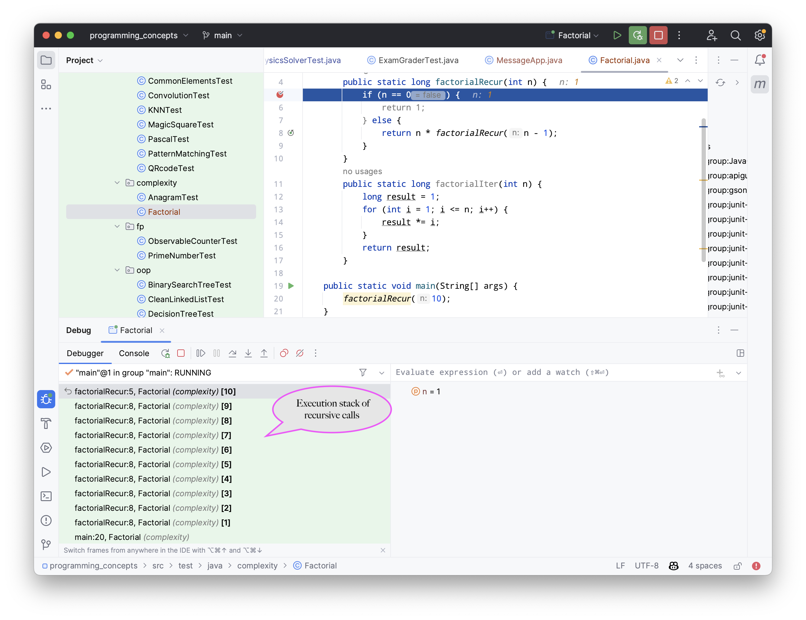

.. _part3:

*****************************************************************
Part 3: Data-Structures and Algorithms
*****************************************************************

Time Complexity
===================

In the rapidly evolving world of computer science, the efficiency of an algorithm is paramount. 
As we strive to tackle increasingly complex problems and manage growing volumes of data, 
understanding how our algorithms perform becomes more important than ever. 

This is where the concept of *time complexity* comes into play.

Time complexity provides a theoretical estimation of the time an algorithm requires to run relative to the size of the input data. 
In other words, it allows us to predict the efficiency of our code before we even run it. 
It's like having a magic crystal ball that tells us how our algorithm will behave in the wild!

Let's delve into the intricacies of time complexity and uncover the beauty and elegance of efficient code by studying first a very simple `sum` mehtod that calculates the total sum of all the elements in an integer array provided in argument.

.. _sum:

..  code-block:: java
    :caption: The sum method
    :name: Sum Algorithm

	public class Main {
	    public static int sum(int [] values) {
	        int total = 0;
	        for (int i = 0; i < values.length; i++) {
	            total += values[i];
	        }
	        return total;
	    }
	}

One can measure the time it takes using `System.currentTimeMillis()` method
that returns the current time in milliseconds since the Unix Epoch (January 1, 1970 00:00:00 UTC). 
It is typically used to get a timestamp representing the current point in time.
Here is an example of how to use it to measure the time of one call to the `sum` method.  

..  code-block:: java
    :caption: Measuring the time of sum with currentTimeMillis
    :name: Sum Algorithm with Time Measurement

	public class Main {
	    public static void main(String[] args) {
	        int[] values = {1, 2, 3, 4, 5};
	        long startTime = System.currentTimeMillis();
	        int totalSum = sum(values);
	        long endTime = System.currentTimeMillis()
	        long duration = (endTime - startTime);  // duration in milliseconds
	    }
	}

Now, if one makes vary the size of values one can observe the evolution of execution time
in function of the size of the input array given in argument to `sum` and plot it.
Here is what we obtain on a standard laptop.

.. figure:: _static/images/sum_complexity.png
   :scale: 25 %
   :alt: Sum time

   Evolution of time measures taken by `sum` on arrays of increasing size.

Undoubtedly, the absolute time is heavily reliant on the specifications of the machine the code is executed on. The same code running on a different laptop could produce different timing results. However, it is noteworthy that the time evolution appears to be linear with respect to the array size, as illustrated by the trend line. A crucial question arises: could this have been foreseen without even running the code? The answer is affirmative! :cite:t:`1965:hartmanis` layd down the foundations for such theoretical analyses from the source-code without (or pseudo-code, as the algorithm itself is of greater significance) even without requiring running the code and measure time.
This great invention is explained next, but first things first, we need a simple computation model.

The Random Access Machine (RAM) model of computation
-----------------------------------------------------

The RAM, or Random Access Machine, model of computation is a theoretical model of a computer that provides a mathematical abstraction for algorithm analysis. 
In the RAM model, each 'simple' operation (such as addition, subtraction, multiplication, division, comparison, bitwise operations, following a reference, or direct addressing of memory) can be done in a single unit of time. 
It assumes that memory accesses (like accessing an element in an array: `value[i]` obove) take constant time, regardless of the memory location. 
This is where it gets the name "random access", since any memory location can be accessed in the same amount of time.

This abstraction is quite realistic for many practical purposes, and closely models real computers (a bit like Newton laws is a good approximation of general relativity).

Of course we can't assume a loop is a 'simple' operation in the RAM model. 
One need to count the number of times its body will be executed.
The next code add comments on the number of steps required to execute the sum algorithm.

..  code-block:: java
    :caption: The sum method with step annotations
    :name: Sum Algorithm with Step Annotations

    public static int sum(int [] values) {         // n = values.length
        int total = 0;                             // 1 step
        for (int i = 0; i < values.length; i++) {  
            total += values[i];                    // 2* n steps (one memory access and one addition executed n times)
        }
        return total;                              // 1 step
    }                                              // TOTAL: 2n + 2 steps

In practice, it is difficult to translate one step into a concrete time since it depends on many factors (machine, language, compiler, etc).
It is also not true that every operation takes exactly the same amount of time.
Remember that it is just an approximation. 
We'll further simplify our step-counting approach by utilizing classes of functions that easily interpretable for practitioners like us.

Let us first realize in the next section that even for a consistent input size, the execution time of an algorithm can vary significantly.

The Best-Case, worst case execution of an algorithm
----------------------------------------------------------

Different inputs of the same size may cause an algorithm to take more or fewer steps to arrive at a result.

To illustrate this, consider the `linearSearch` method looking if an array contains a specific target value and returning the first index having this value, or -1 if this value is not present in the array.
It achieves this by iterating through the array and returning the index of the first occurrence of the target value. If the target value isn't present, it returns -1.

.. _linear_search:

..  code-block:: java
    :caption: Linear Search algorithm
    :name: Linear Search Algortithm

    /**
     * This method performs a linear search on an array.
     *
     * @param arr The input array.
     * @param x   The target value to search for in the array.
     * @return The index of the target value in the array if found, 
     *          or -1 if the target value is not in the array.
     */
    public static int linearSearch(int[] arr, int x) {
        for (int i = 0; i < arr.length; i++) {
            if (arr[i] == x) {
                return i;
            }
        }
        return -1;
    }

In this case, the number of steps the 'linearSearch' method takes to complete is heavily dependent on the position of the target value within the array. If the target value is near the beginning of the array, the 'linearSearch' method completes quickly.
We call this the *best-case scenario*.

Conversely, if the target value is at the end of the array or not present at all, the method must iterate through the entire array, which naturally takes more steps.
We call this, the *worst-case scenario*.

For other algorithms, the number of operations required is primarily determined by the input size rather than the input content. 
This characteristic is exemplified by the 'sum' method we previously analyzed.

The notation we are about to introduce for characterizing an algorithm's execution time should allow us to represent both the best and worst-case scenarios.

The Big-O, Big-Omega and Big-Theta Clases of Functions
----------------------------------------------------------

Let us assume that the number of steps an algorithm requires can be represented by the function :math:`T(n)` where :math:`n` refers to the size of the input, such as the number of elements in an array. While this function might encapsulate intricate details about the algorithm's execution, calculating it with high precision can be a substantial undertaking, and often, not worth the effort.

For sufficiently large inputs, the influence of multiplicative constants and lower-order terms within the exact runtime is overshadowed by the impact of the input size itself. This leads us to the concept of asymptotic efficiency, which is particularly concerned with how an algorithm's running time escalates with an increase in input size, especially as the size of the input grows unboundedly.

Typically, an algorithm that is asymptotically more efficient will be the superior choice for all but the smallest of inputs. 
This section introduces standard methods and notations used to simplify the asymptotic analysis of algorithms, thereby making this complex task more manageable.
We shall see asymptotic notations that are well suited to characterizing running times no matter what the input.

Those so-called Big-Oh notations are sets or classes of functions.
We have classes of function asymtotically bounded by above, below or both:

* :math:`f(n)\in \mathcal{O}(g(n)) \Longleftrightarrow` :math:`\exists c \in \mathbb{R}^+,n_0 \in \mathbb{N}: f(n) \leq c\cdot g(n)\ \forall n \geq n_0` (upper bound)
* :math:`f(n)\in \Omega(g(n)) \Longleftrightarrow` :math:`\exists c \in \mathbb{R}^+,n_0 \in \mathbb{N}: f(n) \geq c\cdot g(n)\ \forall n \geq n_0` (lower bound)
*  :math:`f(n)\in \Theta(g(n)) \Longleftrightarrow`:math:`\exists c_1, c_2 \in \mathbb{R}^+,n_0 \in \mathbb{N}: c_1\cdot g(n) \leq f(n) \leq c_2\cdot g(n)\ \forall n \geq n_0` (exact bound)

What is common in the definitions of these classes of function is that we are not concerned about small constant.
Instead we care about the big-picture that is when :math:`n` becomes really large (say 10,000 or 1,000,000). The intuition for those classes of function notations are illustrated next.

.. figure:: _static/images/bigo.png
   :scale: 25 %
   :alt: bigo

One big advantage of Big-Oh notations is the capacity to simplify  notations by only keeping the fastest growing term and taking out the numerical coefficients.
Let us consider an example of simplification: :math:`f(n)=c \cdot n^a + d\cdot n^b\quad` with :math:`a \geq b \geq 0` and :math:`c, d \geq 0`.
Then we have :math:`f(n) \in \Theta(n^a)`. 
This is even true if :math:`c` is very small and :math:`d` very big!

The simplication principle that we have applied are the following:
:math:`\mathcal{O}(c \cdot f(n)) = \mathcal{O}(f(n))` (for :math:`c>0`) and :math:`\mathcal{O}(f(n) + g(n)) \subseteq \mathcal{O}(\max(f(n), g(n))))`.
You can also use these inclusion relations to simplify:
:math:`\mathcal{O}(1) \subseteq \mathcal{O}(\log n) \subseteq \mathcal{O}(n) \subseteq \mathcal{O}(n^2) \subseteq \mathcal{O}(n^3) \subseteq \mathcal{O}(c^n) \subseteq \mathcal{O}(n!)`

As a general rule of thumb, when speaking about the time complexity of an algorithm using Big-Oh notations, you must simplify if possible to get rid of numerical coefficients.

Recursive Algorithms
----------------------

Say something about recurence equation + Graphical Method.

Practical examples of different algorithms 
-------------------------------------------

To grasp a theoretical concept such as time complexity and Big O notation, concrete examples are invaluable. 
For each of the common complexities, we present an algorithmic example and then break down the reasons behind its specific time complexity.
The following table provides an overview of the most prevalent complexity classes, accompanied by algorithm examples we explain after.

+-------------------------------------------------+---------------------------------------------------------------+
| Complexity (name)                               | Algorithm                                                     |
+=================================================+===============================================================+
| :math:`\mathcal{O}(1)` (constant)               | Sum of two integers                                           |
+-------------------------------------------------+---------------------------------------------------------------+
| :math:`\mathcal{O}(\log n)` (logarithmic )      | Find an entry in a sorted array (binary search)               |
+-------------------------------------------------+---------------------------------------------------------------+
| :math:`\mathcal{O}(n)` (linear)                 | Sum elements or find an entry in a not sorted array           |
+-------------------------------------------------+---------------------------------------------------------------+
| :math:`\mathcal{O}(n \log n)` (linearithmic)    | Sorting efficiently an array (merge sort)                     |
+-------------------------------------------------+---------------------------------------------------------------+
| :math:`\mathcal{O}(n^2)` (quadratic)            | Sorting inefficiently an array (insertion sort)               |
+-------------------------------------------------+---------------------------------------------------------------+
| :math:`\mathcal{O}(n^3)` (cubic)                | Enumerating tripples in an array                              |
+-------------------------------------------------+---------------------------------------------------------------+
| :math:`\mathcal{O}(2^n)` (exponential)          | Finding elements in an array summing to zero (Subset-sum)     |
+-------------------------------------------------+---------------------------------------------------------------+
| :math:`\mathcal{O}(n!)` (factorial)             | Visiting all cities in a country minimizing the distance      |
+-------------------------------------------------+---------------------------------------------------------------+

Binary Search
""""""""""""""""""""

The Binary search, also known as dichotomic search, is a search algorithm that finds the position of a target value within a sorted array. 
It works by halving the number of elements to be searched each time, which makes it incredibly efficient even for large arrays.

Here's how the binary search algorithm works:

1. You start with the middle element of the sorted array.
2. If the target value is equal to this middle element, then you've found the target and the algorithm ends.
3. If the target value is less than the middle element, then you repeat the search with the left half of the array.
4. If the target value is greater than the middle element, then you repeat the search with the right half of the array.
5. You keep repeating this process until you either find the target value or exhaust all elements.

The execution of this search is illustrated on next schema searching for value 7 repeating 4 times the process until finding it.
On this array of 16 entries, the search will never require more than four trials so this is a worst-case scenario.

.. figure:: _static/images/binary_search.png
   :scale: 25 %
   :alt: binarysearch

This algorithm has a time complexity of :math:`\mathcal{O}(\log n)` because each time through the loop, the number of elements to be searched is halved and in the worst case, this process is repeated :math:`\log n` times.
On the other hand, if one is lucky, the search immediatly find the element at the first iteration. 
Therefore the best-case time complexity is :math:`\Omega(1)`.

The Java code is a direct translation of the explanation of the algorithm.

.. _binary_search:

..  code-block:: java
    :caption: Binary Search Algorithm
    :name: Binary Search Algortithm

	/**
	 * This method performs a binary search on a sorted array.
	 * The array remains unchanged during the execution of the function.
	 *
	 * @param arr The input array, which must be sorted in ascending order.
	 * @param x   The target value to search for in the array.
	 * @return The index of the target value in the array if found, 
     *          or -1 if the target value is not in the array.
	 */
    public static int binarySearch(int arr[], int x) {
        int left = 0, right = arr.length - 1;
        while (left <= right) {
            int mid = left + (right - left) / 2;
  
            // Check if x is present at mid
            if (arr[mid] == x)
                return mid;
  
            // If x greater, ignore left half
            if (arr[mid] < x)
                left = mid + 1;
  
            // If x is smaller, ignore right half
            else
                right = mid - 1;
        }
  
        // If we reach here, then element was not present
        return -1;
    }

.. tip::
    Notice that the expression `left + (right - left) / 2` is preferred over the somewhat simpler `(left + right) / 2` to calculate the middle index in a binary search. At first glance, they seem to do the same thing, and indeed, they usually do give the same result. 
    The main advantage of using `left + (right - left) / 2` over `(left + right) / 2` comes into play when you are dealing with large numbers. 
    The problem with `(left + right) / 2` is that the sum of `left` and `right` could exceed the maximum limit of the integer in the Java language that is is :math:`2^{31}-1`, causing an integer overflow, which can lead to unexpected results or errors.
    The one used `left + (right - left) / 2` does not have this overflow risk problem.

.. tip::
    Keep in mind that when dealing with objects (as opposed to primitive types), we would want to use the `equals` method instead of `==`. 
    This is because equals tests for logical equality, meaning it checks whether two objects are logically equivalent (even if they are different instances). On the other hand, `==` tests for reference equality, which checks whether two references point to the exact same object instance. For objects where logical equality is more meaningful than reference equality, like `Strings` or custom objects, using `equals` is the appropriate choice.

Linear Search
"""""""""""""""""

We already have seen the :ref:`sum` algorithm and its :math:`\Theta(n)` time complexity.
Another example of a linear time complexity algorithm is the :ref:`linear_search`.
The time complexity of the linear search algorithm is :math:`\mathcal{O}(n)`, where `n` is the size of the array, because in the worst-case scenario (the target value is not in the array or is the last element in the array), the algorithm has to examine every element in the array once.
In the best-case scenario for the linear search algorithm, the target value is the very first element of the array.
Therefore, in the best-case scenario, the time complexity of the linear search algorithm is :math:`\mathcal{O}(1)` or we can simply say that the algorithm is also in :math:`\Omega (1)`.

Merge Sort
""""""""""""""

Merge sort is a *divide-and-conquer* algorithm for sorting lists or arrays of items using pair-wise comparisons. 
It works by dividing the unsorted list into :math:`n sublists, each containing one element (a list of one element is considered sorted), and then repeatedly merging sublists to produce newly sorted sublists until there is only one sublist remaining.

Here's the basic idea behind merge sort:

* Divide: If the list is of length 0 or 1, then it is already sorted. Otherwise, divide the unsorted list into two sublists of about half the size.
* Conquer: Sort each sublist recursively by re-applying the merge sort.
* Combine: Merge the two sublists back into one sorted list.

Here is a simple implementation of Merge Sort in Java:

.. _merge_sort_better:

..  code-block:: java
    :caption: Merge Sort Algorithm
    :name: Merge Sort Algortithm

    private static void merge(int[] left, int [] right, int result[]) {
        assert(result.length == left.length + right.length);
        int index = 0, leftIndex = 0 , rightIndex = 0;
        while (leftIndex != left.length || rightIndex != right.length) {
            if (rightIndex == right.length || 
                (leftIndex != left.length && left[leftIndex] < right[rightIndex])) {
                result[index] = left[leftIndex];
                leftIndex++;
            }
            else {
                result[index] = right[rightIndex];
                rightIndex++;
            }
            index++;
        }
    }

    /**
     * Sort the values increasingly
     */
    public static void mergeSort(int[] values) {
        if(values.length == 1) // list of size 1, already sorted
            return;

        int mid = values.length/2;

        int[] left = new int[mid];
        int[] right = new int[values.length-mid];

        // copy values[0..mid-1] to left
        System.arraycopy(values, 0, left, 0, mid);
        // copy values[mid..values.length-1] to right
        System.arraycopy(values, mid, right, 0, values.length-mid);

        // sort left and right
        mergeSort(left);
        mergeSort(right);

        // merge left and right back into values
        merge(left, right, values);
    }

The Merge sort is a divide and conquer algorithm.
It breaks the array into two subarrays, sort them, and then merges these sorted subarrays to produce a final sorted array.
All the operations and the data-flow of execution is best undersood with a small visual example.

.. figure:: _static/images/merge_sort_complexity.png
   :scale: 25 %
   :alt: Sum time

There are :math:`\Theta(\log n)` layers of split and merge operations. 
Each requires :math:`\Theta(n)` operations by summing all the split/merge operations at one level.
In the end, the time complexity of the merge sort algorithm is the product of the time complexities of these two operations that is :math:`\Theta(n \log n)`.

Insertion Sort
"""""""""""""""""

The insertion sort algorithm is probably the one you use when sorting a hand of playing cards. 
You start with one card in your hand (the sorted portion). 
For each new card, you insert it in the correct position in your hand by moving over any cards that should come after it.

The Java code is given next.

.. _insertion_sort:

..  code-block:: java
    :caption: Insertion Sort Algorithm
    :name: Insertion Sort Algortithm

    /**
     * This method sort the array using Insertion Sort algorithm.
     *
     * @param arr The input array.
     */
    public static void insertionSort(int[] arr) {
        for (int i = 1; i < arr.length; i++) {
            int key = arr[i];
            int j = i - 1;
            // Move elements of arr[0..i-1], that are greater than key, 
            // to one position ahead of their current position
            while (j >= 0 && arr[j] > key) {
                arr[j + 1] = arr[j];
                j = j - 1;
            }
            arr[j + 1] = key;
        }
    }

For each element (except the first), it finds the appropriate position among the already sorted elements (all elements before the current one), and inserts it there by moving larger elements up.
Moving the larger elements up is the goal of the inner `while` loop.

The time complexity of insertion sort is :math:`\mathcal{O}(n^2)` in the worst-case scenario, because each of the `n` elements could potentially need to be compared with each of the `n` already sorted elements. 
However, in the best-case scenario (when the input array is already sorted), the time complexity is :math:`\mathcal{O}(n)`, because each element only needs to be compared once with the already sorted elements.
Alternatively, we can simply say that the insertion sort algorithm runs in :math:`\Omega(n)` and :math:`\mathcal{O}(n^2)`.

Triple Sum
"""""""""""""""""

We consider a algorithm that checks if there exists at leat one combination of three elements in an array that sum up to zero. 
Here an implementation in Java:

.. _triple_sum:

..  code-block:: java
    :caption: Triple Sum algorithm
    :name: Trimple Sum Algortithm

    /**
     * This method checks if there are any three numbers in the array that sum up to zero.
     *
     * @param arr The input array.
     * @return True if such a triple exists, false otherwise.
     */
    public static boolean checkTripleSum(int[] arr) {
        int n = arr.length;

        for (int i = 0; i < n - 2; i++) {
            for (int j = i + 1; j < n - 1; j++) {
                for (int k = j + 1; k < n; k++) {
                    if (arr[i] + arr[j] + arr[k] == 0) {
                        return true;
                    }
                }
            }
        }

        return false;
    }

In this program, `checkTripleSum` goes through each possible combination of three elements in the input array. 
If it finds a triple that sums up to zero, it immediately returns true. If no such triple is found after checking all combinations, it returns false. Since there are :math:`n*(n-1)*(n-2)/6` possible combinations of three elements in an array of length :math:`n`, and we're checking each combination once, the time complexity of this method is :math:`\mathcal{O}(n^3)` and :math:`\Omega(1)`.
The best case scenario occurs if the first three elements in the array sum to zero so that each loop is in its first iteration when the `return` instruction occurs.

Subset-Sum
"""""""""""""""

The subset sum problem is a classic problem in computer science: given a set of integers, is there a subset of the integers that sums to zero?
This is a generalization of the `checkTripleSum` problem we have seen before.

The algorithm we will use for solving the problem is a *brute-force* approach that will enumerate all subsets to solve this problem.
A common approach to enumerate all the subsets is to use recursion. 
We can consider each number in the set and make a recursive call for two cases: one where we exclude the number in the subset, and one where we include it.

The Java code is given next. It calls an auxiliary method with an additional argument `sum` that is the sum of the elements
up to index `i` already included.

.. _subset_sum:

..  code-block:: java
    :caption: An algorithm for solving the Subset Sum problem
    :name: Subset Sum Algorithm

    /**
     * This method checks if there is a subset of the array that sums up to zero.
     *
     * @param arr   The input array.
     * @return True if there is such a subset, false otherwise.
     */
    public static boolean isSubsetSumZero(int[] arr) {
    	return isSubsetSum(arr, 0, 0) || ;
    }

    private static boolean isSubsetSum(int[] arr, int i, int sum) {
        // Base cases
        if (i == arr.length) { // did not find it
            return false;
        }
        if (sum + arr[i] == 0) { // found it
        	return true;
        } else {
        	// Check if sum can be obtained by excluding / including the next
        	return isSubsetSumZero(arr, i + 1, sum) || 
        	       isSubsetSumZero(arr, i + 1, sum + arr[i]);
        }
    }

The time complexity of this algorithm is :math:`\mathcal{O}(2^n)`, because in the worst case it generates all possible subsets of the array, and there are :math:`2^n` possible subsets for an array of n elements. The worst-case is obtained when there is no solution and that false is returned.
The best time complexity is :math:`\Omega(1)` obtained when the first element in the array is zero so that the algorithm immediatly returns true.

Note that this algorithm has an exponential time complexity (so far the algorithm we have studied were polynomial e.g., :math:`\mathcal{O}(n^3)`). Therefore, although this approach will work fine for small arrays, it will be quite slow for larger ones.

.. tip::
    The question that arises is: Can we find an efficient algorithm to solve this problem more efficiently? By "efficient", we mean an algorithm that doesn't take an exponential time to compute as the size of the input grows.
    The answer is, maybe but we don't know.
    Researchers stumbled upon a category of problems discovered in the early 1970's, that share a common trait: they all seem hard to solve efficiently, but if you're handed a potential solution, you can at least verify its correctness quickly. 
    The subset-sum problem belongs to this class.
    This category is called *NP* (Nondeterministic Polynomial time).
    Now, within NP, there's a special class of problems dubbed *NP-complete*. 
    What is so special about them? Well, if you can find an efficient solution for one *NP-complete* problem, you've essentially found efficient solutions for all of them! 
    The subset-sum problem is one of these NP-complete problems. Like its NP-complete siblings, we don't have efficient solutions for it yet. 
    But remember, this doesn't mean no efficient solution exists; we just haven't found one and it was also not yet proven that such an algorithm does not exist.
    This also doesn't mean that there are not faster algorithms for the subset sum problem that the one we have shown.
    For instance a *dynamic programming* algorithm (out of scope of this introduction to algorithms) for subset-sum could avoid redundant work but it still has a worst-case exponential time complexity.

.. admonition:: Exercise
   :class: note

   What is the time complexity of next algorithm? 
   Characterize the best and worst case.

    ..  code-block:: java
        :caption: BitCount 
        :name: Bitcount

        /**
         * Counts the minimum number of bits in the binary representation 
         * of a positive input number. Example: 9 requires 4 bits (1001).
         * It halves it until it becomes zero counting the number of iterations.
         *
         * @param n The input number, which must be a positive integer.
         * @return The number of bits in the binary representation of the input number.
         */
        public static int bitCount(int n) {
            int bitCount = 0;

            while (n > 0) {
                bitCount++;
                n = n >> 1;  // bitwise shift to the right, equivalent to dividing by 2
            }

            return bitCount;
        }

Space Complexity
===================

Aside from the time, the memory is also a scarce resource that is worse analyzing for an algorithm.
The *space complexity* of an algorithm quantifies the amount of space or memory taken by an algorithm to run as a function of the length of the input. 
Since this notion of space is subject to interpretation, let us separate it in two less ambiguous definitions.
* The *auxiliary space* is the extra space or the temporary space used by the algorithm during its execution.
* The *input space* is the space taken by the argument of the algorithm or the instance variables if any.

The definition of space complexity includes both: space complexity = auxiliary space complexity + input space complexity.

Space Complexity of recursive algorithms
-------------------------------------------

Notice that the extra space may also take into account the stack space in the case of a recursive algorithm.
In such a situation, when the recursive call happens, the current local variables are pushed onto the system stack, where they wait for the call the return
and unstack the local variables.
More exactly, If a function A() calls function B() (which can be A in case of recursion) inside it, then all the variables still in the scope of the function A() will get stored on the system stack temporarily, while the function B() is called and executed inside the function A().

Let us compare the space and time complexity of an iterative and a recursive computation of the factorial of a number expressed in function of :math:`n`, the value of the number for which we want to compute the factorial.

    ..  code-block:: java
        :caption: Factorial 
        :name: Recursive

        public class Factorial {
            public static long factorialRecur(int n) {
                if (n == 0) {
                    return 1;
                } else {
                    return n * factorialRecur(n - 1);
                }
            }
            public static long factorialIter(int n) {
                long result = 1;
                for (int i = 1; i <= n; i++) {
                    result *= i;
                }
                return result;
            }
        }

Both have a time complexity of :math:`\Theta (n)` but the space complexity of the iterative version is :math:`O(1)` while the one of the recursive version is :math:`\Theta (n)`. You may be a bit surprised by this result since not array of size :math:`n` is ever created in the recursive version.
True! but a stack is created of size `n`. A tack ? Yes a stack, but it is not visible and it is created by the JVM. 
As explained before, every recursive call requires to store the local context or *frame* so that when the recursion returns, the multiplication can be performed. It means that our execution stack for computing 10! will look like [10*[9*[8*[7*[6*[5*[4*[3*[2*[1]]]]]]]]]].
This stack can be visualized by using the debugger and adding a break point in the method. 
The call stack is show at the bottom left in IntelliJ and you can see what the local context is by clicking on each *frame*.

.. tip::
    It is quite frequent to have time complexity larger than the space complexity for an algorithm but the opposite is not true, at least for the auxiliary space complexity.
    The time complexity is necessarily at least the one of the auxiliary space complexity since you always need the same order as elementary steps as the one of the consumed memory.

.. tip::
    When an uncatched exception occurs, you can also visualize the output, the execution stack of the successive calls from the main method up to the line of code that caused the exception to be thrown.

Improving the space complexity of merge sort
""""""""""""""""""""""""""""""""""""""""""""""""

In the :ref:`Merge Sort <merge_sort>` implementation, new arrays are created at each level of recursion.
The overall space complexity is thus of :math:`\mathcal{O}(n \log n)`, where :math:`n` is the number of elements in the input array. 
This is because, at each level of the recursion, new arrays are created, adding up to :math:`n` elements per level, and the recursion goes :math:`\log n` levels deep.

The time complexity required by our merge sort algorithm can be lowered to :math:`\mathcal{O}(n)` for the auxiliary space.
We can indeed create a single temporary array of size :math:`n` once and reusing it in every merge operation. 
This temporary array requires :math:`n` units of space, which is independent of the depth of the recursion. 
As such, the space complexity of this version of the merge sort algorithm is :math:`\mathcal{O}(n)`, which is an improvement over the original version.

..  code-block:: java
    :caption: Merge Sort Algortithm with Temporary Shared Array
    :name: Merge Sort Algortithm with Temporary Shared Array

	public class MergeSort {

	    private void merge(int[] arr, int[] temp, int leftStart, int mid, int rightEnd) {
	        int leftEnd = mid;
	        int rightStart = mid + 1;
	        int size = rightEnd - leftStart + 1;

	        int left = leftStart;
	        int right = rightStart;
	        int index = leftStart;

	        while (left <= leftEnd && right <= rightEnd) {
	            if (arr[left] <= arr[right]) {
	                temp[index] = arr[left];
	                left++;
	            } else {
	                temp[index] = arr[right];
	                right++;
	            }
	            index++;
	        }

	        System.arraycopy(arr, left, temp, index, leftEnd - left + 1);
	        System.arraycopy(arr, right, temp, index, rightEnd - right + 1);
	        System.arraycopy(temp, leftStart, arr, leftStart, size);
	    }

	    public void sort(int[] arr) {
	        int[] temp = new int[arr.length];
	        sort(arr, temp, 0, arr.length - 1);
	    }

	    private void sort(int[] arr, int[] temp, int leftStart, int rightEnd) {
	        if (leftStart >= rightEnd) {
	            return;
	        }
	        int mid = leftStart + (rightEnd - leftStart) / 2;
	        sort(arr, temp, leftStart, mid);
	        sort(arr, temp, mid + 1, rightEnd);
	        merge(arr, temp, leftStart, mid, rightEnd);
	    }

	    public static void main(String[] args) {
	        MergeSort mergeSort = new MergeSort();
	        int[] arr = {38, 27, 43, 3, 9, 82, 10};
	        mergeSort.sort(arr);
	        for (int i : arr) {
	            System.out.print(i + " ");
	        }
	    }
	}

It is worth noting that in both versions of the algorithm, the time complexity remains the same: :math:`\mathcal{O}(n \log n)`. 
This is because the time complexity of merge sort is determined by the number of elements being sorted (n) and the number of levels in the recursion tree (:math:`\log n`), not by the amount of space used.

Algorithm Correctness
=========================

A loop invariant is a condition or property that holds before and after each iteration of a loop. 
It is used as a technique for proving formally the correctness of an iterative algorithm. 
The loop invariant must be true:

1. Before the loop begins (Initialization).
2. Before each iteration (Maintenance).
3. After the loop terminates (Termination). This often helps prove something important about the output.

The code fragment :ref:`max_invariant_while` illustrates a simple loop invariant for
a method searching for the maximum of an array. 

..  code-block:: java
    :caption: Maximum of an array with loop invariant 
    :name: max_invariant_while

    /**
     * Finds the maximum value in the provided array.
     *
     * @param a The array of integers.
     * @return The maximum integer value in the array using while loop
     */
    public static int max(int[] a) {
        int m = a[0];
        int i = 1;
        // inv: m is equal to the maximum value on a[0..0]
        while (i != a.length) {
            // inv: m is equal to the maximum value on a[0..i-1]
            
            if (m < a[i]) {
                m = a[i];
            }
            // m is qual to the maximum value on a[0..i]
            i++;
            // inv: m is equal to the maximum value on a[0..i-1]
        } 
        // m is equal to the maximum value in the entire array a[0..a.length-1]
        return m;
    }

The correctness of the `max` algorithm is a consequence of the correctness of the invariant.
When for loops are used instead of while loops, one generally only expresses the invariant before each iteration as shown next. 

..  code-block:: java
    :caption: Maximum of an array with loop invariant using for loop 
    :name: max_invariant_for

    public static int max(int[] a) {
        int m = a[0];
        int i = 1;
        // inv: m is equal to the maximum value on a[0..0]
        for (int i = 1; i < a.length; i++) {
            // inv: m is equal to the maximum value on a[0..i-1]
            if (m < a[i]) {
                m = a[i];
            }
            // m is qual to the maximum value on a[0..i]
        } 
        // m is equal to the maximum value in the entire array a[0..a.length-1]
        return m;
    }

In order to be complete, we also need to prove that invariant itself is correctly maintained:

* Initialization: When entering the loop, `i = 1`. The invariant is thus that
 `m should contain the maximum of subarray with only the first element. Since the maximum of a single element is the element itself, the invariant
holds when entering the loop.
* Maintenance: If `m` is the maximum value in `a[0..i-1]` at the start of the loop, the current maximum either remains `m` or it becomes `a[i]` during the iteration, ensuring it is the maximum of `a[0..i]` by the end of the iteration. So, the invariant holds for the next iteration as well.
* Termination: At the end of the loop, `i = a.length`, and based on our invariant, `m` holds the maximum value of `a[0..a.length-1]`, which means `m` is the maximum of the entire array, proving the correctness of our algorithm.

Let us now rewrite the max algorithm in a recursive form.

..  code-block:: java
    :caption: Maximum of an array, recursive version
    :name: max_invariant_recur

    /**
     * Finds the maximum value in the provided array.
     *
     * @param a The array of integers.
     * @return The maximum integer value in the array using while loop
     */
    public static int max(int[] a) {
        return maxRecur(a, a.length-1);
    }

    /**
     * Finds the maximum value in the subarray.
     *
     * @param a The array of integers.
     * @param i The index, a value in [0..a.length-1].
     * @return The maximum value in the sub-array a[0..i]
     */
    private static int maxRecur(int[] a, int i) {
        if (i == 0) 
           return a[i];
        else 
           return Math.max(maxRecur(a,i-1),a[i]);
    }    

The correctenss of a recursive algorihtm is done by induction.
We do it on the inductive parameter `i`.

* Base case: proof that the algorithm is correct when the algorithm is not recursing (when `i == 0` here). When `i == 0` we have `max(a[0]) = a[0]`.

* Induction: Assuming the algorithm is correct for :math:`i-1`, we prove that the algorithm is correct for :math:`i`. 
  We have that max(a[0],…a[i-1],a[i]) = max(max(a[0],...,a[i-1]),max(a[i])) (by associativity of max operation).
  Then we have max(max(a[0],…a[i-1]),max(a[i])) = max(max(a[0],...,a[i-1]),a[i]). 
  Assuming the first part is correct (this is our induction hypothesis), this expression is precisely the one we compute.

.. admonition:: Exercise
   :class: note

    Find an invariant for the loop of the bubble :ref:`maxsum` algorithm.
    Prove that the invariant is correctly maintained.
    Hint: your invariant should express a property on the variables `maxCurrent` and `maxGlobal` with respect to index `i`.
    A good exercise is to write a recursive version of this algorithm and write the specification of it.

    ..  code-block:: java
        :caption: MaxSum Subarray 
        :name: maxsum

        public class MaxSubArray {

            /**
             * Computes the sum of the maximum contiguous subarray.
             * Example:
             *   int[] nums = {-2, 1, -3, 4, -1, 2, 1, -5, 4};
             *   maxSubArray(nums);  // Returns 6, corresponding to the subarray [4, -1, 2, 1].
             *
             * @param nums An array of integers.
             * @return The sum of the maximum subarray.
             *
             */
            public static int maxSubArray(int[] nums) {
                
                int maxCurrent = nums[0];
                int maxGlobal = nums[0];

                for (int i = 1; i < nums.length; i++) {
                    // invariant
                    maxCurrent = Math.max(nums[i], maxCurrent + nums[i]);
                    maxGlobal = Math.max(maxGlobal, maxCurrent);
                }

                return maxGlobal;
            }

            public static void main(String[] args) {
                int[] nums = {-2, 1, -3, 4, -1, 2, 1, -5, 4};
                System.out.println(maxSubArray(nums));  // Outputs 6
            }
        }

.. admonition:: Exercise
   :class: note

    Find an invariant for the outer loop of the bubble :ref:`bubble_loop` sort algorithm.
    Prove that the invariant is correctly maintained.
    Hint: Your invariant should express a property on the array with respect to index `i`.
          A subpart of the array is already sorted? What values are they?

    .. // Loop invariant: 
       //  - the largest i elements are in their correct, final positions at the end of the array.
       //  - the array contains the same set of values as the input array

    ..  code-block:: java
        :caption: Bubble Sort with Loop Invariant
        :name: bubble_loop

    	 public class Main {
    	    public static void main(String[] args) {
    	        int[] numbers = {5, 1, 12, -5, 16};
    	        bubbleSort(numbers);
    	        
    	        for (int i = 0; i < numbers.length; i++) {
    	            System.out.print(numbers[i] + " ");
    	        }
    	    }

    	    public static void bubbleSort(int[] array) {
    	        int n = array.length;
    	        for (int i = 0; i < n-1; i++) {
                    // invariant
    	            for (int j = 0; j < n-i-1; j++) {
    	                if (array[j] > array[j+1]) {
    	                    // swap array[j] and array[j+1]
    	                    int temp = array[j];
    	                    array[j] = array[j+1];
    	                    array[j+1] = temp;
    	                }
    	            }
    	        }
    	    }
    	}

