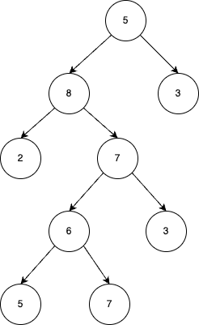
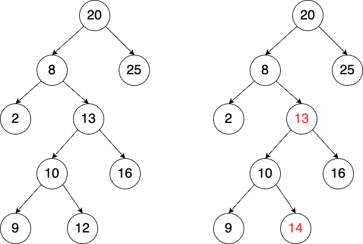
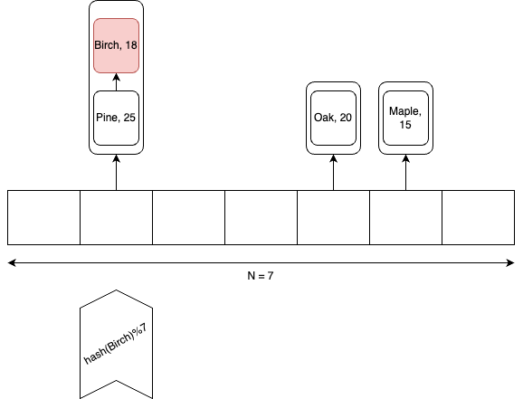

.. _part4:

*****************************************************************
Algorithms and Data Structures
*****************************************************************

Time Complexity
===================

In the rapidly evolving world of computer science, the efficiency of an algorithm is paramount. 
As we strive to tackle increasingly complex problems and manage growing volumes of data, 
understanding how our algorithms perform becomes more important than ever. 

This is where the concept of *time complexity* comes into play.

Time complexity provides a theoretical estimation of the time an algorithm requires to run relative to the size of the input data. 
In other words, it allows us to predict the efficiency of our code before we even run it. 
It's like having a magic crystal ball that tells us how our algorithm will behave in the wild!

Let's delve into the intricacies of time complexity and uncover the beauty and elegance of efficient code by studying first a very simple ``sum()`` method that calculates the total sum of all the elements in an integer array provided as argument.

.. _sum:

..  code-block:: java

	public class Main {
	    public static int sum(int [] values) {
	        int total = 0;
	        for (int i = 0; i < values.length; i++) {
	            total += values[i];
	        }
	        return total;
	    }
	}

One can measure the time it takes using ``System.currentTimeMillis()`` method
that returns the current time in milliseconds since the Unix Epoch (January 1, 1970 00:00:00 UTC). 
It is typically used to get a timestamp representing the current point in time.
Here is an example of how to use it to measure the time of one call to the ``sum()`` method.  

..  code-block:: java

	public class Main {
	    public static void main(String[] args) {
	        int[] values = {1, 2, 3, 4, 5};
	        long startTime = System.currentTimeMillis();
	        int totalSum = sum(values);
	        long endTime = System.currentTimeMillis()
	        long duration = (endTime - startTime);  // duration in milliseconds
	    }
	}

Now, if one makes vary the size of values one can observe the evolution of execution time
in function of the size of the input array given in argument to ``sum()`` and plot it.
Here is what we obtain on a standard laptop.

.. figure:: _static/images/sum_complexity.png
   :scale: 25 %
   :alt: Sum time

   Evolution of time measures taken by `sum` on arrays of increasing size.

Undoubtedly, the absolute time is heavily reliant on the specifications of the machine the code is executed on. The same code running on a different laptop could produce different timing results. However, it is noteworthy that the time evolution appears to be linear with respect to the array size, as illustrated by the trend line.

A crucial question arises: could this have been foreseen without even running the code? The answer is affirmative! :cite:t:`1965:hartmanis` laid down the foundations for such theoretical analyses from the source-code without (or pseudo-code, as the algorithm itself is of greater significance), even without requiring running the code and measure time.
This great invention is explained next, but first things first, we need a simple computation model.

The Random Access Machine (RAM) model of computation
-----------------------------------------------------

The RAM, or Random Access Machine, model of computation is a theoretical model of a computer that provides a mathematical abstraction for algorithm analysis. 
In the RAM model, each "simple" operation (such as addition, subtraction, multiplication, division, comparison, bitwise operations, following a reference, or direct addressing of memory) can be done in a single unit of time. 
It assumes that memory accesses (like accessing an element in an array: ``value[i]`` above) take constant time, regardless of the memory location. 
This is where the name "random access" comes from, since any memory location can be accessed in the same amount of time.

This abstraction is quite realistic for many practical purposes, and closely models real computers (a bit like Newton laws is a good approximation of general relativity).

Of course we can't assume a loop is a "simple" operation in the RAM model. 
One need to count the number of times its body will be executed.
The next code add comments on the number of steps required to execute the sum algorithm.

..  code-block:: java

    public static int sum(int [] values) {         // n = values.length
        int total = 0;                             // 1 step
        for (int i = 0; i < values.length; i++) {  
            total += values[i];                    // 2* n steps (one memory access and one addition executed n times)
        }
        return total;                              // 1 step
    }                                              // TOTAL: 2n + 2 steps

In practice, it is difficult to translate one step into a concrete time since it depends on many factors (machine, language, compiler, etc.).
It is also not true that every operation takes exactly the same amount of time.
Remember that it is just an approximation. 
We'll further simplify our step-counting approach by utilizing classes of functions that easily interpretable for practitioners like us.

Let us first realize in the next section that even for a consistent input size, the execution time of an algorithm can vary significantly.

Best-case and worst-case scenarios of an algorithm
----------------------------------------------------------

Different inputs of the same size may cause an algorithm to take more or fewer steps to arrive at a result.

To illustrate this, consider the ``linearSearch()`` method that looks whether an array contains a specific target value and that returns the first index having this value, or ``-1`` if this value is not present in the array.

.. _linear_search:

..  code-block:: java

    /**
     * This method performs a linear search on an array.
     *
     * @param arr The input array.
     * @param x   The target value to search for in the array.
     * @return The index of the target value in the array if found, 
     *          or -1 if the target value is not in the array.
     */
    public static int linearSearch(int[] arr, int x) {
        for (int i = 0; i < arr.length; i++) {
            if (arr[i] == x) {
                return i;
            }
        }
        return -1;
    }

This method achieves its goal by iterating through the array and returning the index of the first occurrence of the target value. If the target value isn't present, it returns ``-1``.

In this case, the number of steps the ``linearSearch()`` method takes to complete is heavily dependent on the position of the target value within the array. If the target value is near the beginning of the array, the ``linearSearch()`` method completes quickly.
We call this the *best-case scenario*.

Conversely, if the target value is at the end of the array or not present at all, the method must iterate through the entire array, which naturally takes more steps.
We call this, the *worst-case scenario*.

The execution of ``linearSearch()`` can thus greatly vary depending not only on the *size* of the input array, but also on the *content* of the input array. Other categories of algorithms will have a execution that is mostly determined by the input size, rather than the input content. 
This characteristic is exemplified by the ``sum()`` method we previously analyzed.

The notation we are about to introduce for characterizing the execution time of an algorithm will allow us to represent both the best and worst-case scenarios.

The Big-O, Big-Omega and Big-Theta classes of functions
----------------------------------------------------------

Let us assume that the number of steps an algorithm requires can be represented by the function :math:`T(n)` where :math:`n` refers to the size of the input, such as the number of elements in an array. While this function might encapsulate intricate details about the algorithm's execution, calculating it with high precision can be a substantial undertaking, and often, not worth the effort.

For sufficiently large inputs, the influence of multiplicative constants and lower-order terms within the exact runtime is overshadowed by the impact of the input size itself. This leads us to the concept of asymptotic efficiency, which is particularly concerned with how an algorithm's running time escalates with an increase in input size, especially as the size of the input grows unboundedly.

Typically, an algorithm that is asymptotically more efficient will be the superior choice for all but the smallest of inputs. 
This section introduces standard methods and notations used to simplify the asymptotic analysis of algorithms, thereby making this complex task more manageable.
We shall see asymptotic notations that are well suited to characterizing running times no matter what the input.

Those so-called Big-Oh notations are sets or classes of functions.
We have classes of function asymptotically bounded by above, below or both:

* :math:`f(n)\in \mathcal{O}(g(n)) \Longleftrightarrow` :math:`\exists c \in \mathbb{R}^+,n_0 \in \mathbb{N}: f(n) \leq c\cdot g(n)\ \forall n \geq n_0` (upper bound)
* :math:`f(n)\in \Omega(g(n)) \Longleftrightarrow` :math:`\exists c \in \mathbb{R}^+,n_0 \in \mathbb{N}: f(n) \geq c\cdot g(n)\ \forall n \geq n_0` (lower bound)
*  :math:`f(n)\in \Theta(g(n)) \Longleftrightarrow`:math:`\exists c_1, c_2 \in \mathbb{R}^+,n_0 \in \mathbb{N}: c_1\cdot g(n) \leq f(n) \leq c_2\cdot g(n)\ \forall n \geq n_0` (exact bound)

What is common in the definitions of these classes of function is that we are not concerned about small constant.
Instead we care about the big-picture that is when :math:`n` becomes really large (say 10,000 or 1,000,000). The intuition for those classes of function notations are illustrated next.

.. figure:: _static/images/bigo.png
   :scale: 25 %
   :alt: bigo

One big advantage of Big-Oh notations is the capacity to simplify  notations by only keeping the fastest growing term and taking out the numerical coefficients.
Let us consider an example of simplification: :math:`f(n)=c \cdot n^a + d\cdot n^b\quad` with :math:`a \geq b \geq 0` and :math:`c, d \geq 0`.
Then we have :math:`f(n) \in \Theta(n^a)`. 
This is even true if :math:`c` is very small and :math:`d` very big!

The simplification principle that we have applied are the following:
:math:`\mathcal{O}(c \cdot f(n)) = \mathcal{O}(f(n))` (for :math:`c>0`) and :math:`\mathcal{O}(f(n) + g(n)) \subseteq \mathcal{O}(\max(f(n), g(n))))`.
You can also use these inclusion relations to simplify:
:math:`\mathcal{O}(1) \subseteq \mathcal{O}(\log n) \subseteq \mathcal{O}(n) \subseteq \mathcal{O}(n^2) \subseteq \mathcal{O}(n^3) \subseteq \mathcal{O}(c^n) \subseteq \mathcal{O}(n!)`

As a general rule of thumb, when speaking about the time complexity of an algorithm using Big-Oh notations, you must simplify if possible to get rid of numerical coefficients.

.. _recursivity:

..Recursive Algorithms
.. ----------------------

.. TODO

.. Say something about recurrence equation + Graphical Method.

Practical examples of different algorithms 
-------------------------------------------

To grasp a theoretical concept such as time complexity and Big O notation, concrete examples are invaluable. 
For each of the common complexities, we present an algorithmic example and then break down the reasons behind its specific time complexity.
The following table provides an overview of the most prevalent complexity classes, accompanied by algorithm examples we explain after.

+-------------------------------------------------+---------------------------------------------------------------+
| Complexity (name)                               | Algorithm                                                     |
+=================================================+===============================================================+
| :math:`\mathcal{O}(1)` (constant)               | Sum of two integers                                           |
+-------------------------------------------------+---------------------------------------------------------------+
| :math:`\mathcal{O}(\log n)` (logarithmic)       | Find an entry in a sorted array (binary search)               |
+-------------------------------------------------+---------------------------------------------------------------+
| :math:`\mathcal{O}(n)` (linear)                 | Sum elements or find an entry in a not sorted array           |
+-------------------------------------------------+---------------------------------------------------------------+
| :math:`\mathcal{O}(n \log n)` (linearithmic)    | Sorting efficiently an array (merge sort)                     |
+-------------------------------------------------+---------------------------------------------------------------+
| :math:`\mathcal{O}(n^2)` (quadratic)            | Sorting inefficiently an array (insertion sort)               |
+-------------------------------------------------+---------------------------------------------------------------+
| :math:`\mathcal{O}(n^3)` (cubic)                | Enumerating all possible triples taken from an array          |
+-------------------------------------------------+---------------------------------------------------------------+
| :math:`\mathcal{O}(2^n)` (exponential)          | Finding elements in an array summing to zero (Subset-sum)     |
+-------------------------------------------------+---------------------------------------------------------------+
| :math:`\mathcal{O}(n!)` (factorial)             | Visiting all cities in a country by minimizing the distance   |
+-------------------------------------------------+---------------------------------------------------------------+

Binary Search
""""""""""""""""""""

The Binary search, also known as dichotomic search, is a search algorithm that finds the position of a target value within a sorted array. 
It works by halving the number of elements to be searched each time, which makes it incredibly efficient even for large arrays.

Here's how the binary search algorithm works:

1. You start with the middle element of the sorted array.
2. If the target value is equal to this middle element, then you've found the target and the algorithm ends.
3. If the target value is less than the middle element, then you repeat the search with the left half of the array.
4. If the target value is greater than the middle element, then you repeat the search with the right half of the array.
5. You keep repeating this process until you either find the target value or exhaust all elements.

The execution of this search is illustrated on next schema searching for value 7 repeating 4 times the process until finding it.
On this array of 16 entries, the search will never require more than four trials, so this is the worst-case scenario.

.. figure:: _static/images/binary_search.png
   :scale: 25 %
   :alt: binarysearch

This algorithm has a time complexity of :math:`\mathcal{O}(\log n)` because each time we go through the loop, the number of elements to be searched is halved and in the worst case, this process is repeated :math:`\log n` times.
On the other hand, if we are lucky, the search immediately find the element at the first iteration. 
Therefore the best-case time complexity is :math:`\Omega(1)`.

The Java code is a direct translation of the explanation of the algorithm.

.. _binary_search:

..  code-block:: java

	/**
	 * This method performs a binary search on a sorted array.
	 * The array remains unchanged during the execution of the function.
	 *
	 * @param arr The input array, which must be sorted in ascending order.
	 * @param x   The target value to search for in the array.
	 * @return The index of the target value in the array if found, 
     *          or -1 if the target value is not in the array.
	 */
    public static int binarySearch(int arr[], int x) {
        int left = 0, right = arr.length - 1;
        while (left <= right) {
            int mid = left + (right - left) / 2;
  
            // Check if x is present at mid
            if (arr[mid] == x)
                return mid;
  
            // If x greater, ignore left half
            if (arr[mid] < x)
                left = mid + 1;
  
            // If x is smaller, ignore right half
            else
                right = mid - 1;
        }
  
        // If we reach here, then element was not present
        return -1;
    }

.. tip::
    Notice that the expression ``left + (right - left) / 2`` is preferred over the somewhat simpler ``(left + right) / 2`` to calculate the middle index in a binary search. At first glance, they seem to do the same thing, and indeed, they usually do give the same result. 
    The main advantage of using ``left + (right - left) / 2`` over ``(left + right) / 2`` comes into play when you are dealing with large numbers. 
    The problem with ``(left + right) / 2`` is that the sum of ``left`` and ``right`` could exceed the maximum limit of the integer in the Java language that is is :math:`2^{31}-1`, causing an integer overflow, which can lead to unexpected results or errors.
    The one used ``left + (right - left) / 2`` does not have this overflow risk problem.

.. tip::
    Keep in mind that when dealing with objects (as opposed to primitive types), we would want to use the ``equals()`` method instead of ``==``. 
    This is because ``equals()`` tests for logical equality, meaning it checks whether two objects are logically equivalent (even if they are different instances). On the other hand, ``==`` tests for reference equality, which checks whether two references point to the exact same object instance. For objects where logical equality is more meaningful than reference equality, like ``String`` or custom objects, using ``equals()`` is the appropriate choice.

Linear Search
"""""""""""""""""

We already have seen the :ref:`sum` algorithm and its :math:`\Theta(n)` time complexity.
Another example of a linear time complexity algorithm is the :ref:`linear_search`.
The time complexity of the linear search algorithm is :math:`\mathcal{O}(n)`, where `n` is the size of the array, because in the worst-case scenario (the target value is not in the array or is the last element in the array), the algorithm has to examine every element in the array once.
In the best-case scenario for the linear search algorithm, the target value is the very first element of the array.
Therefore, in the best-case scenario, the time complexity of the linear search algorithm is :math:`\mathcal{O}(1)` or we can simply say that the algorithm is also in :math:`\Omega (1)`.

Merge Sort
""""""""""""""

Merge sort is a *divide-and-conquer* algorithm for sorting lists or arrays of items using pair-wise comparisons. 
It works by dividing the unsorted list into :math:`n` sublists, each containing one element (a list of one element is considered sorted), and then repeatedly merging sublists to produce newly sorted sublists until there is only one sublist remaining.

Here's the basic idea behind merge sort:

* Divide: If the list is of length 0 or 1, then it is already sorted. Otherwise, divide the unsorted list into two sublists of about half the size.
* Conquer: Sort each sublist recursively by re-applying the merge sort.
* Combine: Merge the two sublists back into one sorted list.

Here is a simple implementation of Merge Sort in Java:

.. _merge_sort_implem:

..  code-block:: java

    private static void merge(int[] left, int [] right, int result[]) {
        assert(result.length == left.length + right.length);
        int index = 0, leftIndex = 0 , rightIndex = 0;
        while (leftIndex != left.length || rightIndex != right.length) {
            if (rightIndex == right.length || 
                (leftIndex != left.length && left[leftIndex] < right[rightIndex])) {
                result[index] = left[leftIndex];
                leftIndex++;
            }
            else {
                result[index] = right[rightIndex];
                rightIndex++;
            }
            index++;
        }
    }

    /**
     * Sort the values increasingly
     */
    public static void mergeSort(int[] values) {
        if(values.length == 1) // list of size 1, already sorted
            return;

        int mid = values.length/2;

        int[] left = new int[mid];
        int[] right = new int[values.length-mid];

        // copy values[0..mid-1] to left
        System.arraycopy(values, 0, left, 0, mid);
        // copy values[mid..values.length-1] to right
        System.arraycopy(values, mid, right, 0, values.length-mid);

        // sort left and right
        mergeSort(left);
        mergeSort(right);

        // merge left and right back into values
        merge(left, right, values);
    }

The Merge sort is a divide and conquer algorithm.
It breaks the array into two subarrays, sort them, and then merges these sorted subarrays to produce a final sorted array.
All the operations and the data-flow of execution is best understood with a small visual example.

.. figure:: _static/images/merge_sort_complexity.png
   :scale: 25 %
   :alt: Sum time

There are :math:`\Theta(\log n)` layers of split and merge operations. 
Each layer requires :math:`\Theta(n)` operations by summing all the split/merge operations at one level.
In the end, the time complexity of the merge sort algorithm is the product of the time complexities of these two operations that is :math:`\Theta(n \log n)`.

Insertion Sort
"""""""""""""""""

The insertion sort algorithm is probably the one you use when sorting a hand of playing cards. 
You start with one card in your hand (the sorted portion). 
For each new card, you insert it in the correct position in your hand by moving over any cards that should come after it.

The Java code is given next.

.. _insertion_sort:

..  code-block:: java

    /**
     * This method sort the array using Insertion Sort algorithm.
     *
     * @param arr The input array.
     */
    public static void insertionSort(int[] arr) {
        for (int i = 1; i < arr.length; i++) {
            int key = arr[i];
            int j = i - 1;
            // Move elements of arr[0..i-1], that are greater than key, 
            // to one position ahead of their current position
            while (j >= 0 && arr[j] > key) {
                arr[j + 1] = arr[j];
                j = j - 1;
            }
            arr[j + 1] = key;
        }
    }

For each element (except the first), it finds the appropriate position among the already sorted elements (all elements before the current one), and inserts it there by moving larger elements up.
Moving the larger elements up is the goal of the inner ``while`` loop.

The time complexity of insertion sort is :math:`\mathcal{O}(n^2)` in the worst-case scenario, because each of the ``n`` elements could potentially need to be compared with each of the ``n`` already sorted elements. 
However, in the best-case scenario (when the input array is already sorted), the time complexity is :math:`\mathcal{O}(n)`, because each element only needs to be compared once with the already sorted elements.
Alternatively, we can simply say that the insertion sort algorithm runs in :math:`\Omega(n)` and :math:`\mathcal{O}(n^2)`.

Triple Sum
"""""""""""""""""

We consider a algorithm that checks if there exists at least one combination of three elements in an array that sum up to zero. 
Here an implementation in Java:

.. _triple_sum:

..  code-block:: java

    /**
     * This method checks if there are any three numbers in the array that sum up to zero.
     *
     * @param arr The input array.
     * @return True if such a triple exists, false otherwise.
     */
    public static boolean checkTripleSum(int[] arr) {
        int n = arr.length;

        for (int i = 0; i < n - 2; i++) {
            for (int j = i + 1; j < n - 1; j++) {
                for (int k = j + 1; k < n; k++) {
                    if (arr[i] + arr[j] + arr[k] == 0) {
                        return true;
                    }
                }
            }
        }

        return false;
    }

In this program, ``checkTripleSum()`` goes through each possible combination of three elements in the input array. 
If it finds a triple that sums up to zero, it immediately returns ``true``. If no such triple is found after checking all combinations, it returns ``false``. Since there are :math:`n*(n-1)*(n-2)/6` possible combinations of three elements in an array of length :math:`n`, and we're checking each combination once, the time complexity of this method is :math:`\mathcal{O}(n^3)` and :math:`\Omega(1)`.
The best-case scenario occurs if the first three elements in the array sum to zero so that each loop is in its first iteration when the ``return`` instruction occurs.

Subset-Sum
"""""""""""""""

The subset-sum problem is a classic problem in computer science: Given a set of integers, is there a subset of the integers that sums to zero?
This is a generalization of the ``checkTripleSum()`` problem we have seen before, in which the allowed subsets must not contain exactly 3 elements.

The algorithm we will use for solving the problem is a *brute-force* approach that will enumerate all the possible subsets.
A common approach to enumerate all the subsets is to use recursion. 
We can consider each number in the set and make a recursive call for two cases: one where we exclude the number in the subset, and one where we include it.

The Java code is given next. It calls an auxiliary method with an additional argument ``sum()`` that is the sum of the elements
up to index ``i`` already included.

.. _subset_sum:

..  code-block:: java

    /**
     * This method checks if there is a subset of the array that sums up to zero.
     *
     * @param arr   The input array.
     * @return True if there is such a subset, false otherwise.
     */
    public static boolean isSubsetSumZero(int[] arr) {
    	return isSubsetSum(arr, 0, 0) || ;
    }

    private static boolean isSubsetSum(int[] arr, int i, int sum) {
        // Base cases
        if (i == arr.length) { // did not find it
            return false;
        }
        if (sum + arr[i] == 0) { // found it
        	return true;
        } else {
        	// Check if sum can be obtained by excluding / including the next
        	return isSubsetSum(arr, i + 1, sum) || 
        	       isSubsetSum(arr, i + 1, sum + arr[i]);
        }
    }

The time complexity of this algorithm is :math:`\mathcal{O}(2^n)`, because in the worst case it generates all possible subsets of the array, and there are :math:`2^n` possible subsets for an array of n elements. The worst case is obtained when there is no solution and that ``false`` is returned.
The best-case complexity is :math:`\Omega(1)` and is obtained when the first element in the array is zero so that the algorithm immediately returns ``true``.

Note that this algorithm has an exponential time complexity (so far the algorithm we have studied were polynomial e.g., :math:`\mathcal{O}(n^3)`). Therefore, although this approach will work fine for small arrays, it will be unbearably slow for larger ones.

.. tip::
    The question that arises is: Can we find an efficient algorithm to solve this problem more efficiently? By "efficient", we mean an algorithm that doesn't take an exponential time to compute as the size of the input grows.
    The answer is, maybe but we don't know yet.
    Researchers stumbled upon a category of problems discovered in the early 1970's, that share a common trait: They all seem to be impossible to solve efficiently, but if you're handed a potential solution, you can at least verify its correctness quickly. 
    The subset-sum problem belongs to this class.
    This category is called *NP* (Nondeterministic Polynomial time).
    
    Now, within NP, there's a special class of problems dubbed *NP-complete*. 
    What is so special about them? Well, if you can find an efficient solution for one *NP-complete* problem, you've essentially found efficient solutions for all of them! 
    The subset-sum problem is one of these NP-complete problems. Like its NP-complete siblings, we don't have efficient solutions for it yet. 
    But remember, this doesn't mean that no efficient solution exists; we just haven't found one and it was also not yet proven that such an algorithm does not exist.
    This also doesn't mean that there are no faster algorithms for the subset-sum problem that the one we have shown.
    For instance a *dynamic programming* algorithm (out of scope of this introduction to algorithms) for subset-sum can avoid redundant work, but still has a worst-case exponential time complexity.

Visiting all cities in a country minimizing the distance 
"""""""""""""""""""""""""""""""""""""""""""""""""""""""""

The Traveling Salesman Problem (TSP) is a classic NP-hard problem in the field of computer science and operations research. The problem is simple to state: Given a list of cities and the distances between them, find the shortest possible route that visits each city exactly once and returns to the starting city.

This problem, as well as its decision version (i.e., does there exist a circuit with a total length shorter than a given value?), is proven to be NP-complete.
We suggest a straightforward brute-force approach to address this challenge. This method involves enumerating all possible permutations of the cities and maintaining a record of the permutation that yields the shortest distance.
The time complexity of this strategy is :math:`O(n!)` (factorial) because it necessitates generating all the permutations and computing the total length for each one.

When the number of cities exceeds 12, the brute-force method becomes increasingly impractical. 
Even with high-speed modern computers, attempting to solve the TSP for, say, 20 cities using brute-force would involve evaluating 
:math:`20! \sim 2.43 * 10^{18}` routes—a task that would take many years.

.. tip::
    In contrast, more sophisticated algorithms have been developed for the TSP. 
    Techniques such as branch and bound can effectively solve TSP instances with thousands of cities, making them vastly more scalable than the brute-force approach.

..  code-block:: java

    public class TSPBruteForce {

        public static void main(String[] args) {
            int[][] distanceMatrix = {
                    {0, 10, 15, 20},
                    {10, 0, 35, 25},
                    {15, 35, 0, 30},
                    {20, 25, 30, 0}
            };

            Result bestTour = findBestTour(distanceMatrix);

            System.out.println("Shortest Tour: " + bestTour.tour);
            System.out.println("Distance: " + bestTour.distance);
        }

        /**
         * Calculates the shortest tour that visits all cities.
         * @param distanceMatrix the distance matrix
         * @return the shortest tour
         */
        public static Result findBestTour(int [][] distanceMatrix) {
            boolean[] visited = new boolean[distanceMatrix.length];
            // already fix 0 as the starting city
            visited[0] = true;
            List<Integer> currentTour = new ArrayList<>();
            currentTour.add(0);
            Result bestTour = findBestTour(visited, currentTour, 0, distanceMatrix);

            return bestTour;
        }

        private static Result findBestTour(boolean[] visited, List<Integer> currentTour, int currentLength, int[][] distanceMatrix) {
            int lastCity = currentTour.get(currentTour.size() - 1);

            if (currentTour.size() == visited.length - 1) {
                currentLength += distanceMatrix[lastCity][0];  // return to city 0
                return new Result(new ArrayList<>(currentTour), currentLength);
            }

            Result bestResult = new Result(null, Integer.MAX_VALUE);

            for (int i = 1; i < visited.length; i++) {
                if (!visited[i]) {
                    visited[i] = true;
                    currentTour.add(i);
                    int newLength = currentLength + distanceMatrix[lastCity][i];
                    Result currentResult = findBestTour(visited, currentTour, newLength, distanceMatrix);
                    if (currentResult.distance < bestResult.distance) {
                        bestResult = currentResult;
                    }
                    currentTour.remove(currentTour.size() - 1);
                    visited[i] = false;
                }
            }

            return bestResult;
        }

        static class Result {
            List<Integer> tour;
            int distance;

            Result(List<Integer> tour, int distance) {
                this.tour = tour;
                this.distance = distance;
            }
        }

    }

.. admonition:: Exercise
   :class: note

   What is the time complexity of following algorithm? 
   Characterize the best and worst case.

    ..  code-block:: java

        /**
         * Counts the minimum number of bits in the binary representation 
         * of a positive input number. Example: 9 requires 4 bits (1001).
         * It halves it until it becomes zero counting the number of iterations.
         *
         * @param n The input number, which must be a positive integer.
         * @return The number of bits in the binary representation of the input number.
         */
        public static int bitCount(int n) {
            int bitCount = 0;

            while (n > 0) {
                bitCount++;
                n = n >> 1;  // bitwise shift to the right, equivalent to dividing by 2
            }

            return bitCount;
        }

Space complexity
===================

Aside from the time, the memory is also a scarce resource that is worth analyzing for an algorithm.
The *space complexity* of an algorithm quantifies the amount of space or memory taken by an algorithm to run, expressed as a function of the length of the input. 
Since this notion of "space" is subject to interpretation, let us separate it into two less ambiguous definitions.

* The *auxiliary space* is the extra space or the temporary space used by the algorithm during its execution.
* The *input space* is the space taken by the argument of the algorithm or the instance variables if any.

The definition of space complexity includes both: *space complexity* = *auxiliary space complexity* + *input space complexity*.

The next `sum` method computing the sum of the elements in an array uses :math:`\mathcal{O}O(1)` auxiliary space, but :math:`\Theta(n)` input space where :math:`n` is the lenght of the input array. Its space complexity is thus :math:`Theta(n)`.

    ..  code-block:: java

	public static int sum(int[] array) {
	    int sum = 0;  // O(1) space for the sum variable
	    for (int i = 0; i < array.length; i++) {
		sum += array[i];
	    }
	    return sum;
	}

On the other hand, the method `range` uses :math:`\Theta(n)`  auxiliary space where :math:`n`  is the absolute value of the input parameter, but it consumes only :math:`\mathcal{O}(1)`  input space since an integer has a fixed size encoding of 32 bits in Java.

    ..  code-block:: java

	public static int[] range(int n) {
	    int[] result = new int[n];
	    for(int i = 0; i < n; i++)
		result[i] = i;
	    return result;
	}}

Notice that we have chosen to express the space complexity in terms of the absolute value of the number. We could also have chosen to express it in terms of the input size.
The input size is 32 bits here, but in binary form, it could encode a number as large as :math:`2^{31}-1` . 
Therefore, if :math:`k`  is the number of bits required to encode the value :math:`n` , the auxiliary space complexity is :math:`\mathcal{O}(2^k)`  (exponential thus).
This illustrates the importance of clearly specifying what the parameters in a complexity expression represent when describing complexity.

Space complexity of recursive algorithms
-------------------------------------------

Notice that the extra space may also take into account the space of the system stack in the case of a recursive algorithm.
In such a situation, when the recursive call happens, the current local variables are pushed onto the system stack, where they wait for the call the return and unstack the local variables.

More exactly, If a method ``A()`` calls method ``B()`` (which can possibly be ``A()`` in case of recursion) inside it, then all the variables still in the scope of the method ``A()`` will get stored on the system stack temporarily, while the method ``B()`` is called and executed inside the method ``A()``.

Let us compare the space and time complexity of an iterative and a recursive computation of the factorial of a number expressed in function of :math:`n`, the value of the number for which we want to compute the factorial.

    ..  code-block:: java

        public class Factorial {
            // Recursive implementation
            public static long factorialRecur(int n) {
                if (n == 0) {
                    return 1;
                } else {
                    return n * factorialRecur(n - 1);
                }
            }
            
            // Iterative implementation
            public static long factorialIter(int n) {
                long result = 1;
                for (int i = 1; i <= n; i++) {
                    result *= i;
                }
                return result;
            }
        }

Both implementations have a time complexity of :math:`\Theta (n)`. However, the space complexity of the iterative version is :math:`O(1)`, while the one of the recursive version is :math:`\Theta (n)`.

You may be a bit surprised by this result since no array of size :math:`n` is ever created in the recursive version.
True! But a stack of size ``n`` is created. A stack? Yes, a stack, but it is not visible and it is created by the JVM. 

Indeed, as explained before, every recursive call requires to store the local context or *frame* so that when the recursion returns, the multiplication can be performed. The sucessive frames are stored in a system stack that is transparently managed by the JVM, and that is part of the auxiliary space. The system stack for computing the factorial of 10 will look like ``[10*[9*[8*[7*[6*[5*[4*[3*[2*[1]]]]]]]]]]``.
This system stack can be visualized using the IntelliJ debugger by adding a breakpoint in the method. 
The call stack is shown at the bottom left of IntelliJ and you can see what the local context is by clicking on each *frame*.

.. figure:: _static/images/stack_factorial.png
   :scale: 25 %
   :alt: Sum time

.. tip::
    It is quite frequent to have time complexity that is larger than the space complexity for an algorithm. But the opposite is not true, at least for the auxiliary space complexity.
    The time complexity is necessarily at least the one of the auxiliary space complexity, because you always need the same order as elementary steps as the one of the consumed memory.

.. tip::
    When an uncaught exception occurs, you can also visualize the output, the execution stack of the successive calls from the main method up to the line of code that caused the exception to be thrown.

Improving the space complexity of merge sort
""""""""""""""""""""""""""""""""""""""""""""""""

In the :ref:`merge_sort_implem` implementation, new arrays are created at each level of recursion.
The overall space complexity is thus of :math:`\mathcal{O}(n \log n)`, where :math:`n` is the number of elements in the input array. 
This is because, at each level of the recursion, new arrays are created in the current frame, adding up to :math:`n` elements per level, and the recursion goes :math:`\log n` levels deep.

The time complexity required by our merge sort algorithm can be lowered to :math:`\mathcal{O}(n)` for the auxiliary space.
We can indeed create a single temporary array of size :math:`n` once and reusing it in every merge operation. 
This temporary array requires :math:`n` units of space, which is independent of the depth of the recursion. 
As such, the space complexity of this version of the merge sort algorithm is :math:`\mathcal{O}(n)`, which is an improvement over the original version.

.. _merge_sort_better:

..  code-block:: java

	public class MergeSort {

	    private void merge(int[] arr, int[] temp, int leftStart, int mid, int rightEnd) {
	        int leftEnd = mid;
	        int rightStart = mid + 1;
	        int size = rightEnd - leftStart + 1;

	        int left = leftStart;
	        int right = rightStart;
	        int index = leftStart;

	        while (left <= leftEnd && right <= rightEnd) {
	            if (arr[left] <= arr[right]) {
	                temp[index] = arr[left];
	                left++;
	            } else {
	                temp[index] = arr[right];
	                right++;
	            }
	            index++;
	        }
            // copy rest of left side
            System.arraycopy(arr, left, temp, index, leftEnd - left + 1);
            // copy rest of right side
            System.arraycopy(arr, right, temp, index, rightEnd - right + 1);
            // copy temp back to original array
            System.arraycopy(temp, leftStart, arr, leftStart, size); 
	    }

	    public void sort(int[] arr) {
	        int[] temp = new int[arr.length];
	        sort(arr, temp, 0, arr.length - 1);
	    }

	    private void sort(int[] arr, int[] temp, int leftStart, int rightEnd) {
	        if (leftStart >= rightEnd) {
	            return;
	        }
	        int mid = leftStart + (rightEnd - leftStart) / 2;
	        sort(arr, temp, leftStart, mid);
	        sort(arr, temp, mid + 1, rightEnd);
	        merge(arr, temp, leftStart, mid, rightEnd);
	    }

	    public static void main(String[] args) {
	        MergeSort mergeSort = new MergeSort();
	        int[] arr = {38, 27, 43, 3, 9, 82, 10};
	        mergeSort.sort(arr);
	        for (int i : arr) {
	            System.out.print(i + " ");
	        }
	    }
	}

It is worth noting that in both versions of the algorithm, the time complexity remains the same: :math:`\mathcal{O}(n \log n)`. 
This is because the time complexity of merge sort is determined by the number of elements being sorted (:math:`n`) and the number of levels in the recursion tree (:math:`\log n`), not by the amount of space used.

Algorithm correctness
=========================

A loop invariant is a condition or property that holds before and after each iteration of a loop. 
It is used as a technique for proving formally the correctness of an iterative algorithm. 
The loop invariant must be true:

1. Before the loop begins (Initialization).
2. Before each iteration (Maintenance).
3. After the loop terminates (Termination).

The loop invariant often helps to prove something important about the output of the algorithm.

The code fragment :ref:`max_invariant_while` illustrates a simple loop invariant for
a method searching for the maximum of an array. 

..  code-block:: java

    /**
     * Finds the maximum value in the provided array.
     *
     * @param a The array of integers.
     * @return The maximum integer value in the array using while loop
     */
    public static int max(int[] a) {
        int m = a[0];
        int i = 1;
        // inv: m is equal to the maximum value on a[0..0]
        while (i != a.length) {
            // inv: m is equal to the maximum value on a[0..i-1]
            
            if (m < a[i]) {
                m = a[i];
            }
            // m is equal to the maximum value on a[0..i]
            i++;
            // inv: m is equal to the maximum value on a[0..i-1]
        } 
        // m is equal to the maximum value in the entire array a[0..a.length-1]
        return m;
    }

The correctness of the ``max()`` algorithm is a consequence of the correctness of the invariant.
When ``for`` loops are used instead of ``while`` loops, one generally only expresses the invariant before each iteration as shown next. 

..  code-block:: java

    public static int max(int[] a) {
        int m = a[0];
        int i = 1;
        // inv: m is equal to the maximum value on a[0..0]
        for (int i = 1; i < a.length; i++) {
            // inv: m is equal to the maximum value on a[0..i-1]
            if (m < a[i]) {
                m = a[i];
            }
            // m is equal to the maximum value on a[0..i]
        } 
        // m is equal to the maximum value in the entire array a[0..a.length-1]
        return m;
    }

In order to be complete, we also need to prove that invariant itself is correctly maintained:

* Initialization: When entering the loop, ``i == 1``. The invariant is thus that ``m`` should contain the maximum of subarray with only the first element. Since the maximum of a single element is the element itself, the invariant holds when entering the loop.
* Maintenance: If ``m`` is the maximum value in ``a[0..i-1]`` at the start of the loop, the current maximum either remains ``m`` or it becomes ``a[i]`` during the iteration, ensuring it is the maximum of ``a[0..i]`` by the end of the iteration. So, the invariant holds for the next iteration as well.
* Termination: At the end of the loop, ``i == a.length``, and based on our invariant, ``m`` holds the maximum value of ``a[0..a.length-1]``, which means ``m`` is the maximum of the entire array, which proves the correctness of our algorithm.

Let us now rewrite the ``max()`` algorithm in a recursive form.

..  code-block:: java

    /**
     * Finds the maximum value in the provided array.
     *
     * @param a The array of integers.
     * @return The maximum integer value in the array using while loop
     */
    public static int max(int[] a) {
        return maxRecur(a, a.length-1);
    }

    /**
     * Finds the maximum value in the subarray.
     *
     * @param a The array of integers.
     * @param i The index, a value in [0..a.length-1].
     * @return The maximum value in the sub-array a[0..i]
     */
    private static int maxRecur(int[] a, int i) {
        if (i == 0) 
           return a[i];
        else 
           return Math.max(maxRecur(a,i-1),a[i]);
    }    

The correctness of a recursive algorithm is done by induction.
We do it on the inductive parameter ``i``.

* Base case: proof that the algorithm is correct when the algorithm is not recursing (when ``i == 0`` here). When ``i == 0`` we have ``max(a[0]) == a[0]``.

* Induction: Assuming the algorithm is correct for :math:`i-1`, we prove that the algorithm is correct for :math:`i`. 
  We have that ``max(a[0],...,a[i-1],a[i]) == max(max(a[0],...,a[i-1]),max(a[i]))`` (by associativity of ``max`` operation).
  Then we have ``max(max(a[0],...,a[i-1]),max(a[i])) == max(max(a[0],...,a[i-1]),a[i])``.
  Assuming the first part is correct (this is our induction hypothesis), this expression is precisely the one we compute.

.. admonition:: Exercise
   :class: note

    Find an invariant for the loop of the bubble :ref:`maxsum` algorithm.
    Prove that the invariant is correctly maintained.
    Hint: Your invariant should express a property on the variables ``maxCurrent`` and ``maxGlobal`` with respect to index ``i``.
    A good exercise is to write a recursive version of this algorithm and to write the specification of it.

    ..  code-block:: java

        public class MaxSubArray {

            /**
             * Computes the sum of the maximum contiguous subarray.
             * Example:
             *   int[] nums = {-2, 1, -3, 4, -1, 2, 1, -5, 4};
             *   maxSubArray(nums);  // Returns 6, for subarray [4, -1, 2, 1].
             *
             * @param nums An array of integers.
             * @return The sum of the maximum subarray.
             *
             */
            public static int maxSubArray(int[] nums) {
                
                int maxCurrent = nums[0];
                int maxGlobal = nums[0];

                for (int i = 1; i < nums.length; i++) {
                    // invariant
                    maxCurrent = Math.max(nums[i], maxCurrent + nums[i]);
                    maxGlobal = Math.max(maxGlobal, maxCurrent);
                }

                return maxGlobal;
            }

            public static void main(String[] args) {
                int[] nums = {-2, 1, -3, 4, -1, 2, 1, -5, 4};
                System.out.println(maxSubArray(nums));  // Outputs 6
            }
        }

.. admonition:: Exercise
   :class: note

    Find an invariant for the outer loop of the bubble :ref:`bubble_loop` sort algorithm.
    Prove that the invariant is correctly maintained.
    Hint: Your invariant should express a property on the array with respect to index ``i``.
    A subpart of the array is already sorted? What values are they?

    ..  code-block:: java

    	public class Main {
    	    public static void main(String[] args) {
    	        int[] numbers = {5, 1, 12, -5, 16};
    	        bubbleSort(numbers);
    	        
    	        for (int i = 0; i < numbers.length; i++) {
    	            System.out.print(numbers[i] + " ");
    	        }
    	    }

    	    public static void bubbleSort(int[] array) {
    	        int n = array.length;
    	        for (int i = 0; i < n-1; i++) {
                    // invariant
    	            for (int j = 0; j < n-i-1; j++) {
    	                if (array[j] > array[j+1]) {
    	                    // swap array[j] and array[j+1]
    	                    int temp = array[j];
    	                    array[j] = array[j+1];
    	                    array[j+1] = temp;
    	                }
    	            }
    	        }
    	    }
    	}

.. // Loop invariant:
   //  - the largest i elements are in their correct, final positions at the end of the array.
   //  - the array contains the same set of values as the input array       

Abstract Data Types (ADT)
==========================================

In the context of data collection, an Abstract Data Type (ADT) is a high-level description of a collection of data and of the operations that can be performed on this data.

An ADT can best be described by an interface in Java. This interface specifies what operations can be done on the data, but without prescribing how these operations will be implemented. 
Implementation details are abstracted away.

It means that the underlying implementation of an ADT can change without affecting how the users of the ADT interact with it.

Abstract Data Types are present in the Java Collections Framework. 
Let's consider the `List <https://docs.oracle.com/javase/8/docs/api/java/util/List.html>`_  interface that belongs to the standard ``java.util`` namespace.
This is one of the most frequently used Abstract Data Types.
It defines an ordered collection of elements, with duplicates allowed. 
``List`` is an ADT because it specifies a set of operations (e.g., ``add(E e)``, ``get(int index)``, ``remove(int index)``, ``size()``) that you can perform on a list without specifying how these operations are concretely implemented.

To get a concrete implementation of a ``List``, you must use one of the concrete classes that implement this interface, 
for instance `ArrayList <https://docs.oracle.com/javase/8/docs/api/java/util/ArrayList.html>`_ or `LinkedList <https://docs.oracle.com/javase/8/docs/api/java/util/LinkedList.html>`_.
Whatever the one you choose the high level contract described at the interface level remain the same, although depending on the instanciation you might have different behaviors in terms of speed for example.

One example of the ``List`` ADT is given next.

..  code-block:: java

    import java.util.LinkedList;
    import java.util.List;

    public class LinkedListExample {

        public static void main(String[] args) {
            
            List<String> fruits; // declaring a List ADT reference

            fruits = new LinkedList<>(); // Initializing it using LinkedList
            // fruits = new ArrayList<>(); This would also work using ArrayList instead

            // Adding elements
            fruits.add("Apple");
            fruits.add("Banana");
            fruits.add("Cherry");

            // Removing an element
            fruits.remove("Banana");
        }
    }

In the example above, you see the special notation ``<>`` that is associated with :ref:`generics <generics>` in Java.
Generics correspond to the concept of type parameters, allowing you to write code that is parameterized by one or more types.
The core idea is to allow type (classes and interfaces) to be parameters when defining classes, interfaces, and methods.

This enables you to create generic algorithms that can work on collections of different types, classes, interfaces, and methods that operate on a parameterized type.
Generics offer a way to define and enforce strong type-checks at compile-time without committing to a specific data type. 

Java introduced support for generics in 2004, as a part of Java 5 (formally referred to as J2SE 5.0). In earlier versions of Java generics did not exit.
You could add any type of object to collections, which was prone to runtime type-casting errors, as illustrated in this example:

..  code-block:: java

    import java.util.LinkedList;
    import java.util.List;

    List list = new ArrayList();
    list.add("hello");
    list.add(1); // This is fine without generics
    String s = (String) list.get(1); // ClassCastException at runtime

With generics, the type of elements you can add is restricted at compile-time, eliminating the potential for ``ClassCastException`` at runtime. In the example above, you would have used the ``List<String>`` and ``ArrayList<String>`` parametrized classes instead of the ``List`` and ``ArrayList`` plain classes. Consequently, the call to ``list.add(1)`` would have resulted in a compilation error, because ``1`` is not a ``String``.

Generics enable you to write generalized algorithms and classes based on parameterized types, making it possible to reuse the same method, class, or interface for different data types.

Stack ADT
------------

Let us now study in-depth an ADT called ``Stack`` that is also frequently used by programmers.
A stack is a collection that operates on a Last-In-First-Out (LIFO) principle. 
The primary operations of a ``Stack`` are ``push()``, ``pop()``, and ``peek()``, as described in the next interface:

..  code-block:: java

    public interface StackADT<T> {
        // Pushes an item onto the top of this stack.
        void push(T item);
        
        // Removes and returns the top item from this stack.
        T pop();
        
        // Returns the top item from this stack without removing it.
        T peek();
        
        // Returns true if this stack is empty.
        boolean isEmpty();

        // Returns the number of items in this stack.
        public int size();
    }

Let us now see some possible concrete implementations of this interface.

.. _linked_stack_adt:

Implementing a Stack With a Linked Structure
""""""""""""""""""""""""""""""""""""""""""""

The ``LinkedStack`` is an implementation of the ``Stack`` ADT that uses a linked list structure to store its elements. 
Each element in the stack is stored in a node, and each node has a reference to the next node (like individual wagons are connected in a train). 
The top of the stack is maintained as a reference to the first node (head) of the linked list.

..  code-block:: java

    public class LinkedStack<T> implements Stack<T> {
        private Node<T> top;
        private int size;

        private static class Node<T> {
            T item;
            Node<T> next;

            Node(T item, Node<T> next) {
                this.item = item;
                this.next = next;
            }
        }

        @Override
        public void push(T item) {
            top = new Node<>(item, top);
            size++;
        }

        @Override
        public T pop() {
            if (isEmpty()) {
                throw new RuntimeException("Stack is empty");
            }
            T item = top.item;
            top = top.next;
            size--;
            return item;
        }

        @Override
        public T peek() {
            if (isEmpty()) {
                throw new RuntimeException("Stack is empty");
            }
            return top.item;
        }

        @Override
        public boolean isEmpty() {
            return top == null;
        }

        @Override
        public int size() {
            return size;
        }
    }

The state of the linked stack after pushing 1, 5 and 3 in this order is illustrated on the next figure.

.. figure:: _static/images/list.png
   :scale: 100 %
   :alt: LinkedStack

Implementing a Stack With an Array
""""""""""""""""""""""""""""""""""""

Another method for implementing the ``Stack`` ADT is by utilizing an internal array to hold the elements.
An implementation is given in the next code fragment:

..  code-block:: java

    public class DynamicArrayStack<T> implements Stack<T> {
        private T[] array;
        private int top;

        @SuppressWarnings("unchecked")
        public DynamicArrayStack(int initialCapacity) {
            array = (T[]) new Object[initialCapacity];
            top = -1;
        }

        @Override
        public void push(T item) {
            if (top == array.length - 1) {
                resize(2 * array.length); // double the size
            }
            array[++top] = item;
        }

        @Override
        public T pop() {
            if (isEmpty()) {
                throw new RuntimeException("Stack is empty");
            }
            T item = array[top];
            array[top--] = null; // to prevent memory leak

            // shrink the size if necessary
            if (top > 0 && top == array.length / 4) {
                resize(array.length / 2);
            }
            return item;
        }

        @Override
        public T peek() {
            if (isEmpty()) {
                throw new RuntimeException("Stack is empty");
            }
            return array[top];
        }

        @Override
        public boolean isEmpty() {
            return top == -1;
        }

        @Override
        public int size() {
            return top + 1;
        }

        @SuppressWarnings("unchecked")
        private void resize(int newCapacity) {
            T[] newArray = (T[]) new Object[newCapacity];
            for (int i = 0; i <= top; i++) {
                newArray[i] = array[i];
            }
            array = newArray;
        }
    }

The internal array is initialized with a size larger than the expected number of elements in the stack to prevent frequent resizing.

An integer variable, often termed ``top`` or ``size``, represents the current position in the stack. When pushing a new element onto the stack, it is added at the position indicated by this integer. Subsequently, the integer is incremented. The ``pop()`` operation reverses this process: The element at the current position is retrieved, and the integer is decremented. Both the ``push()`` and ``pop()`` operations have constant time complexity: :math:`O(1)`.

However, there's an inherent limitation when using arrays in Java: Their size is fixed upon creation. Thus, if the stack's size grows to match the internal array's size, any further push operation risks an ``ArrayIndexOutOfBoundsException``.

To counteract this limitation, when the internal array is detected to be full, its size is doubled. This is achieved by creating a new array whose capacity is doubled with respect to the current array, then copying the contents of the current array to the new one. Although this resizing operation has a linear time complexity of :math:`O(n)`, where 
:math:`n` is the number of elements, it doesn't happen often.

In addition, to avoid inefficiencies in terms of memory usage, if the size of the stack drops to one-quarter of the internal array's capacity, the array size is halved. This prevents the array from being overly sparse and consuming unnecessary memory.

Although resizing (either increasing or decreasing the size) requires :math:`O(n)` time in the worst case, this cost is distributed over many operations, making the average cost constant. This is known as amortized analysis. Thus, when analyzed in an amortized sense, the average cost per operation over 
:math:`n` operations is :math:`O(1)`.

Evaluating Arithmetic Expressions with a Stack
"""""""""""""""""""""""""""""""""""""""""""""""

A typical use of stacks is to evaluate arithmetic expressions, as demonstrated in the next algorithm:

..  code-block:: java

    public class ArithmeticExpression {
        public static void main(String[] args) {
            System.out.println(evaluate("( ( 2 * ( 3 + 5 ) ) / 4 )");
        }

        public static double evaluate(String expression) {

            Stack<String> ops  = new LinkedStack<String>();
            Stack<Double> vals = new LinkedStack<Double>();

            for (String s: expression.split(" ")) {
                // INVARIANT
                if      (s.equals("("))               ;
                else if (s.equals("+"))    ops.push(s);
                else if (s.equals("-"))    ops.push(s);
                else if (s.equals("*"))    ops.push(s);
                else if (s.equals("/"))    ops.push(s);
                else if (s.equals(")")) {
                    String op = ops.pop();
                    double v = vals.pop();
                    if      (op.equals("+"))    v = vals.pop() + v;
                    else if (op.equals("-"))    v = vals.pop() - v;
                    else if (op.equals("*"))    v = vals.pop() * v;
                    else if (op.equals("/"))    v = vals.pop() / v;
                    vals.push(v);
                }
                else vals.push(Double.parseDouble(s));
            }
            return vals.pop();

        }  
    }

The time complexity of the algorithm is clearly :math:`O(n)` where :math:`n` is the size of the input string:

* Each token (whether it is a number, operator, or parenthesis) in the expression is read and processed exactly once.
* Pushing and popping elements from a stack take constant time, :math:`O(1)`.
* Arithmetic operations (addition, subtraction, multiplication, and division) are performed in constant time, :math:`O(1)`.

To understand and convince one-self about the correctness of the algorithm, we should try to discover an invariant.
As can be seen, a fully parenthesized expression can be represented as a binary tree where the parenthesis are not necessary:

.. figure:: _static/images/expression.png
   :scale: 100 %
   :alt: Arithmetic Expression

The internal nodes are the operator and the leaf nodes are the values.
The algorithm uses two stacks. One stack (``ops``) is for operators and the other (``vals``) is for (reduced) values.
The program splits the input string ``args[0]`` by spaces to process each token of the expression individually.

We will not formalize completely the invariant here but give some intuition about what it is.

At any point during the processing of the expression:

1. The ``vals`` stack contains the results of all fully evaluated sub-expressions (reduced subtrees) encountered so far.
2. The ``ops`` stack contains operators that are awaiting their right-hand operands to form a complete sub-expression (subtree) that can be reduced.
3. For every operator in the ``ops`` stack, its corresponding left-hand operand is already in the ``vals`` stack, awaiting the completion of its subtree for reduction.

The figure displays the status of the stacks at three distinct stages for our brief example.

When we encounter an operand, it is like encountering a leaf of this tree, and we immediately know its value, so it is pushed onto the ``vals`` stack.

When we encounter an operator, it is pushed onto the ``ops`` stack. This operator is awaiting its right-hand operand to form a complete subtree. Its left-hand operand is already on the ``vals`` stack.

When a closing parenthesis ``)`` is encountered, it indicates the end of a fully parenthesized sub-expression, corresponding to an entire subtree of the expression. This subtree is "reduced" or "evaluated" in the following manner:

1. The operator for this subtree is popped from the ``ops`` stack.
2. The right-hand operand (the value of the right subtree) is popped from the ``vals`` stack.
3. The left-hand operand (the value of the left subtree) is popped from the ``vals`` stack.
4. The operator is applied to the two operands, and the result (the value of the entire subtree) is pushed back onto the ``vals`` stack.

This invariant captures the essence of the algorithm's approach to the problem: It traverses the expression tree in a sort of depth-first manner, evaluating each subtree as it is fully identified by its closing parenthesis.

This algorithm taking a ``String`` as its input is a an example of an interpreter.
Interpreted programming languages (like Python) do similarly but accept constructs that a slightly more complex that parenthesized arithmetic expressions.

.. admonition:: Exercise
   :class: note

   Write an recursive algorithm for evaluation arithmetic expressions. 
   This program will not use explicit stacks but rely on the call stack instead.

Trees
------------

In many applications, there is a need to store and manage hierarchically organized data. Examples include representing family trees (genealogy), structuring the way files are stored on your computer, or representing arithmetic expressions.

Consider the following example where we represent data using a tree structure. 

   BinaryTree

A tree is often represented with the root node at the top (in this case, the node with the value 5) and the leaf nodes (the ones without children) at the bottom. 

The `LinkedBinaryTree` class shown below is an implementation for representing such a tree data-structure. 
In this class, each node contains a value and references to its left and right children. 
This structure is similar to the nodes used in linked lists, with the key difference being that we store two references (one for each child) instead of just one.
This class facilitates the creation of leaf nodes and includes a static helper method called `combine`, 
which allows us to merge two trees by creating a new root node, thus forming a larger binary tree.

..  code-block:: java

    public class LinkedBinaryTree {

            private Node root;

            class Node {
                public int val;
                public Node left;
                public Node right;

                public Node(int val) {
                    this.val = val;
                }
            }

            public static LinkedBinaryTree leaf(int val) {
                LinkedBinaryTree tree = new LinkedBinaryTree();
                tree.root = tree.new Node(val);
                return tree;
            }

            public static LinkedBinaryTree combine(int val, LinkedBinaryTree left, LinkedBinaryTree right) {
                LinkedBinaryTree tree = new LinkedBinaryTree();
                tree.root = tree.new Node(val);
                tree.root.left = left.root;
                tree.root.right = right.root;
                return tree;
            }
    }

.. _binary-tree:

..  code-block:: java

    public static void main(String[] args) {
        LinkedBinaryTree tree = combine(5,
                                   combine(8,
                                           leaf(2),
                                           combine(7,
                                                   combine(6,
                                                           leaf(5),
                                                           leaf(7)),
                                                   leaf(3))),
                                   leaf(3));
    }

Tree Traversals
"""""""""""""""""""""""""""""""""""""""""""""""

Tree traversal strategies are methods used to visit all the nodes in a tree, such as a binary tree. 
The three common traversal strategies are pre-order, in-order, and post-order. 
Here's a brief explanation of each:

* Pre-order traversal visits the current node, then traverse the left subtree, and finally, traverse the right subtree.
* In-order traversal traverses the left subtree, visit the current node, and then traverse the right subtree.
* Post-order Traversal traverses the left subtree, then the right subtree, and finally visit the current node.

The code for each traversal is given next.

..  code-block:: java

        public void preOrderPrint() {
            preOrderPrint(root);
        }

        private void preOrderPrint(Node current) {
            if (current == null) {
                return;
            }
            System.out.print(current.val + " ");
            preOrderPrint(current.left);
            preOrderPrint(current.right);
        }

        public void inOrderPrint() {
            inOrderPrint(root);
        }

        private void inOrderPrint(Node current) {
            if (current == null) {
                return;
            }
            inOrderPrint(current.left);
            System.out.print(current.val + " ");
            inOrderPrint(current.right);
        }

        public void postOrderPrint() {
            postOrderPrint(root);
        }

        private void postOrderPrint(Node current) {
            if (current == null) {
                return;
            }
            postOrderPrint(current.left);
            postOrderPrint(current.right);
            System.out.print(current.val + " ");
        }

Here is the output order obtained on the binary represented :ref:`binary-tree` for each traversals:

* Pre-Order: 5, 8, 2, 7, 6, 5, 7, 3, 3
* In-Order: 2, 8, 5, 6, 7, 7, 3, 5, 3
* Post-Order: 2, 5, 7, 6, 3, 7, 8, 3, 5

Visiting a binary tree with ``n`` nodes takes :math:`\Theta(n)` (assuming the visit of one node takes a constant time),
since each node is visited exactly once.

.. admonition:: Exercise
   :class: note
   
   Write an iterative algorithm (not recursive) for implementing each of these traversals.
   You will need to use an explicit stack.

We show next two practical examples using binary trees data-structures.

.. _arithmetic_expression:

Representing an arithmetic Expression with Tree
"""""""""""""""""""""""""""""""""""""""""""""""""""""

.. NOTE:

   "Terminology: Nested classes are divided into two categories:
   non-static and static. Non-static nested classes are called inner
   classes. Nested classes that are declared static are called static
   nested classes."

   From the official Oracle tutorial on Java:
   https://docs.oracle.com/javase/tutorial/java/javaOO/nested.html

   In this section, "OperatorExpressionTree" are
   "ValueExpressionTree", are static nested classes. So SJO replaced
   "inner class" by "static nested class" for uniformity with part 6.

The ``BinaryExpressionTree`` class in the provided code is an abstract representation of a binary expression tree, 
a data structure commonly used in computer science for representing expressions with binary operators (like ``+, -, *, /``).

The set of expression methods (``mul()``, ``div()``, ``plus()``, ``minus()``) allows to build easily expressions from other expressions.
These methods return a new ``OperatorExpressionTree`` object, which is a subclass of ``BinaryExpressionTree``. 
Each method takes another ``BinaryExpressionTree`` as an operand to the right of the operator.
The private static nested class ``OperatorExpressionTree`` represents an operator node in the tree with left and right children, which are also BinaryExpressionTree instances.
The private static nested class ``ValueExpressionTree``  represents a leaf node in the tree that contains a value.
A convenience static method ``value()`` allows creating a ``ValueExpressionTree`` with a given integer value.
An example is provided in the main method for creating tree representation of the expression ``(2 * ((5+7)-3)) / 3``.

..  code-block:: java

    public abstract class BinaryExpressionTree {

        public BinaryExpressionTree mul(BinaryExpressionTree right) {
            return new OperatorExpressionTree(this, right, '*');
        }

        public BinaryExpressionTree div(BinaryExpressionTree right) {
            return new OperatorExpressionTree(this, right, '/');
        }

        public BinaryExpressionTree plus(BinaryExpressionTree right) {
            return new OperatorExpressionTree(this, right, '+');
        }

        public BinaryExpressionTree minus(BinaryExpressionTree right) {
            return new OperatorExpressionTree(this, right, '-');
        }

        private static class OperatorExpressionTree extends BinaryExpressionTree {
            private final BinaryExpressionTree left;
            private final BinaryExpressionTree right;
            private final char operator;

            public OperatorExpressionTree(BinaryExpressionTree left, BinaryExpressionTree right, char operator) {
                this.left = left;
                this.right = right;
                this.operator = operator;
            }

        }

        private static class ValueExpressionTree extends BinaryExpressionTree {

            private final int value;

            public ValueExpressionTree(int value) {
                this.value = value;
            }
        }

        public static BinaryExpressionTree value(int value) {
            return new ValueExpressionTree(value);
        }

        public static void main(String[] args) {
            BinaryExpressionTree expr = value(2).mul(value(5).plus(value(7)).minus(value(3)).div(value(3))); // (2 * ((5+7)-3)) / 3
        }

    }

We now enrich this class with two functionalities:

* ``evaluate()`` is a method for evaluating the expression represented by the tree. This method performs a post-order traversal of the tree. The evaluation of the left sub-expression (left traversal) and the right subexpression (right traversal) must be first evaluated prior to applying the node operator (visit of the node).
* ``prettyPrint()`` is a method for printing the expression as full parenthesized representation. It corresponds to an infix traversal. The left subexpression is printed (left traversal) before printing the node operator (visit of the node) and then printing the right subexpression (right traversal).

..  code-block:: java

    public abstract class BinaryExpressionTree {

        // evaluate the expression
        abstract int evaluate(); 

        // print a fully parenthesized representation of the expression
        abstract String prettyPrint();

        // mul , div, plus, minus not represented

        private static class OperatorExpressionTree extends BinaryExpressionTree {
            private final BinaryExpressionTree left;
            private final BinaryExpressionTree right;
            private final char operator;

            // constructor not represented

            @Override
            public String prettyPrint() {
                return "(" + left.prettyPrint() + operator + right.prettyPrint() + ")";
            }

            @Override
            int evaluate() {
                int leftRes = left.evaluate();
                int rightRes = right.evaluate();
                switch (operator) {
                    case '+':
                        return leftRes + rightRes;
                    case '-':
                        return leftRes - rightRes;
                    case '/':
                        return leftRes / rightRes;
                    case '*':
                        return leftRes * rightRes;
                    default:
                        throw new IllegalArgumentException("unkown operator " + operator);
                }
            }
        }

        private static class ValueExpressionTree extends BinaryExpressionTree {

            private final int value;

            // constructor not represented

            @Override
            public String prettyPrint() {
                return value + "";
            }

            @Override
            int evaluate() {
                return value;
            }
        }
    }

.. admonition:: Exercise
   :class: note
   
   Enrich the BinaryExpressionTree with a method ``rpnPrint()`` to print the expression in *reverse Polish notation*.
   In reverse Polish notation, the operators follow their operands. For example, to add 3 and 4 together, the expression is ``3 4 +`` rather than ``3 + 4``.
   This notation doesn't need parenthesis: ``(3 × 4) + (5 × 6)`` becomes ``3 4 × 5 6 × +`` in reverse Polish notation.

Representing a set with a Binary Search Tree (BST)
"""""""""""""""""""""""""""""""""""""""""""""""""""""""""

An Abstract Data Type (ADT) for representing a set of integers without duplicates is provided below. 
The set is initially empty. Elements can then be added, and it is possible to check if an element has already been added.

..  code-block:: java

    public interface IntSet {
        public void add(int val);
        public boolean contains(int val);
    }

A Binary Search Tree (BST) is a specialized type of binary tree that can be used as
a data-structure for implementing the IntSet ADT.
In a BST, each node stores a value, and all nodes in the left subtree of a node 
contain values less than the node’s value, while all nodes in the right subtree contain values greater than the node’s value.

These properties ensure that the tree remains ordered, which is crucial for the efficiency of operations like search, insertion, and deletion.

A valid BST is shown on the left, while an invalid BST is displayed on the right. 
The tree on the right is not valid because the value 14 appears in the left subtree of the node with value 13, which violates the BST rule.

The `BinarySearchTree` class defined below, implements `IntSet`
 for storing a set of integers.

..  code-block:: java

    public class BinarySearchTree implements IntSet {

        private Node root;

        private class Node {
            public int val;
            public Node left;
            public Node right;

            public Node(int val) {
                this.val = val;
            }

        }

        // Method to add a value to the tree
        public void add(int val) {
            root = addRecursive(root, val);
        }

        private Node addRecursive(Node current, int val) {
            if (current == null) {
                return new Node(val);
            }
            if (val < current.val) {
                current.left = addRecursive(current.left, val);
            } else if (val > current.val) {
                current.right = addRecursive(current.right, val);
            } // if val equals current.val, the value already exists, do nothing

            return current;
        }

        // Method to check if the tree contains a specific value
        public boolean contains(int val) {
            return containsRecursive(root, val);
        }

        private boolean containsRecursive(Node current, int val) {
            if (current == null) {
                return false;
            }
            if (val == current.val) {
                return true;
            }
            return val < current.val
                    ? containsRecursive(current.left, val)
                    : containsRecursive(current.right, val);
        }

        // Main method for testing
        public static void main(String[] args) {
            BinarySearchTree bst = new BinarySearchTree();
            bst.add(5);
            bst.add(3);
            bst.add(7);
            bst.add(1);

            System.out.println("Contains 3: " + bst.contains(3)); // true
            System.out.println("Contains 6: " + bst.contains(6)); // false
        }
    }

We reuse the linked node representation.
The `add(int val)` method allows us to insert a new value into the tree.
This method calls `addRecursive(Node current, int val)`, which recursively traverses the tree:

* If the current node is `null`, a new node with the value `val` is created.
* If `val` is less than the current node’s value, the algorithm moves (recursively) to the left child.
* If `val` is greater, it moves (recursively) to the right child.
* If `val` is equal to the current node’s value, no action is taken (to avoid duplicates).

The recursion ensures that the new value is inserted at the correct position according to the BST properties.

The time complexity for insertion is :math:`\mathcal{O}(h)`, where :math:`h` is the height of the tree. 
Since no guarantees on :math:`h` can be made with this implementation, 
the height should be assumed to be :math:`\mathcal{O}(n)`, the number of nodes. This worst-case scenario occurs when the tree is highly unbalanced, resembling a linked list. This situation can arise, for instance, if the keys are inserted in increasing order.

.. tip::
   There exist more complex implementations of a BST to enforce :math:`h` is in :math:`\mathcal{O}(log(n))`. The most famous one is called a red-black tree.

.. admonition:: Exercise
   :class: note
   
   One traversal strategy allows to iterate over the values of the BST in increasing order in linear time. Which one is it? Can you implement it?

.. _iterators:

Maps
------

An array in Java is a data structure that stores elements in a fixed order. Each element in the array is accessed using an index, which is a integer.

A Map is an ADT that generalizes the idea of indexing to be more flexible by allowing the index to be something else than an integer.
In Map, the index is called a key, and each key maps it to a value.
An example usage of Map is given next making use of the two most important methods,
the `put` to add a key, value pair (aka entry)  and the `get` to retrieve the value from the key.
`Map` is an interface in Java, it is implemented by the class `java.util.HashMap` (and many others).

..  code-block:: java
	
	
	import java.util.HashMap;

	public class MapExample {
	    public static void main(String[] args) {
		// Create a HashMap to store tree names and their heights
		HashMap<String, Integer> treeHeights = new HashMap<>();

		// Add some key-value pairs (tree names and their average heights in meters)
		treeHeights.put("Oak", 20);
		treeHeights.put("Pine", 25);
		treeHeights.put("Maple", 15);
		treeHeights.put("Birch", 18);

		// Retrieve the height of a specific tree
		System.out.println("Height of Oak: " + treeHeights.get("Oak")); // Output: 20
	    }
	}

An illustration of the internal representation of hash table is given next.

A hash table stores keys and values as entries (key-value pairs) in a Java array. At the core of a hash table is the concept of hashing. A hash function takes a key (in this case, a string) and converts it into an integer, known as the hash code. It is crucial that this function is deterministic, meaning the hash code for a given key must always remain the same.

The purpose of the hash code is to determine where a specific key should be stored in the internal array. In Java, every object has a `hashCode` method that returns an integer (which can sometimes be negative). To map this hash code to a valid index between 0 and N-1 (where N is the size of the array), we first take its absolute value and then apply the % (modulo) operator.

When inserting a new entry into the hash table, there is no guarantee that the computed index will be unoccupied. This situation, known as a *collision*, occurs when multiple keys are mapped to the same index. To handle collisions, a linked list is used at each index of the array to store multiple entries.

Collisions become more frequent as the number of entries in the hash table grows compared to the size of the array N. The efficiency of the hash table largely depends on the assumption that the hash function distributes keys uniformly across the array and that the number of entries is kept lower than N. However, these topics go beyond the scope of this brief introduction to hash tables.
Insertion and retrieval can be assumed to have an expected time complexity of :math:`\mathcal{O}(1)` for the `java.util.HashTable` implementation because the load factor (ratio of the number of entries divided by N) is kept low by resizing the table if necessary similarly as in the stack implementation with an array.

A simple implementation is given next.
 

..  code-block:: java

	import java.util.LinkedList;

	public class SimpleHashtable {

	    // Size of the internal array
	    private static final int N = 10;

	    // Each entry in the array is a LinkedList to handle collisions
	    private LinkedList<Entry>[] table;

	    // Constructor initializes the array
	    @SuppressWarnings("unchecked")
	    public SimpleHashtable() {
		table = new LinkedList[N];
		for (int i = 0; i < N; i++) {
		    table[i] = new LinkedList<>();
		}
	    }

	    // A private class representing a key-value pair
	    private static class Entry {
		String key;
		Integer value;

		Entry(String key, Integer value) {
		    this.key = key;
		    this.value = value;
		}
	    }

	    // Hash function to calculate the index for a given key
	    private int hash(String key) {
		return Math.abs(key.hashCode()) % N;
	    }

	    // Put method to insert or update a key-value pair
	    public void put(String key, Integer value) {
		int index = hash(key);
		LinkedList<Entry> bucket = table[index];

		// Check if the key already exists, if so, update its value
		for (Entry entry : bucket) {
		    if (entry.key.equals(key)) {
			entry.value = value;
			return;
		    }
		}

		// If the key doesn't exist, add a new Entry to the bucket
		bucket.add(new Entry(key, value));
	    }

	    // Get method to retrieve the value associated with a key
	    public Integer get(String key) {
		int index = hash(key);
		LinkedList<Entry> bucket = table[index];

		// Iterate through the bucket to find the key
		for (Entry entry : bucket) {
		    if (entry.key.equals(key)) {
			return entry.value;
		    }
		}

		// Return null if the key is not found
		return null;
	    }
	}	

Iterators
===========

An iterator is an object that facilitates the traversal of a data structure, especially collections, in a systematic manner without exposing the underlying details of that structure. The primary purpose of an iterator is to allow a programmer to process each element of a collection, one at a time, without needing to understand the inner workings or the specific memory layout of the collection.

Java provides an ``Iterator`` interface in the ``java.util`` package, which is implemented by various collection classes. This allows objects of those classes to create iterator instances on demand that can be used to traverse through the collection.

An iterator acts like a cursor pointing to some element within the collection. 
The two important methods of an iterator are:

* ``hasNext()``: Returns ``true`` if and only if there are more elements to iterate over.
* ``next()``: Returns the next element in the collection and advances the iterator. This method fails if ``hasNext()`` is ``false``.

The method ``remove()`` is optional and will not be covered in this course.

The next example show how to use an iterator to print every element of a list.

..  code-block:: java

	import java.util.ArrayList;
	import java.util.Iterator;

	public class IteratorExample {
	    public static void main(String[] args) {
	        ArrayList<String> list = new ArrayList<>();
	        list.add("A");
	        list.add("B");
	        list.add("C");

	        Iterator<String> it = list.iterator();
	        while (it.hasNext()) {
	            String element = it.next();
	            System.out.println(element);
	        }
	    }
	}

``Iterable`` should not be confused with ``Iterator``.
It is also an interface in Java, found in the ``java.lang package``. 
An object is "iterable" if it implements the ``Iterable`` interface which has a single method:
``Iterator<T> iterator();``.
This essentially means that the object has the capability to provide an ``Iterator`` over itself.

Many data structures (like lists, sets, and queues) in the ``java.util.collections`` package implement the ``Iterable`` interface to provide a standardized method to iterate over their elements.

One of the main benefits of the ``Iterable`` interface is that it allows objects to be used with the :ref:`enhanced for-each loop <simple_for_loops>` in Java. 
Any class that implements ``Iterable`` can be used in a for-each loop.
This is illustrated next that is equivalent to the previous code.

..  code-block:: java

	import java.util.ArrayList;
	import java.util.Iterator;

	public class IteratorExample {
	    public static void main(String[] args) {
	        ArrayList<String> list = new ArrayList<>();
	        list.add("A");
	        list.add("B");
	        list.add("C");

	        for (String element: list) {
	            System.out.println(element);
	        }
	    }
	}

In conclusion, while they are closely related and often used together, ``Iterable`` and ``Iterator`` serve distinct purposes. 
``Iterable`` is about the ability to produce an ``Iterator``, while ``Iterator`` is the mechanism that actually facilitates the traversal.

.. _custom_iterators:

Implementing your own iterators
---------------------------------

To properly implement an ``Iterator``, there are two possible strategies:

1. Fail-Fast: Such iterators throw ``ConcurrentModificationException`` if there is structural modification of the collection. 
2. Fail-Safe: Such iterators don't throw any exceptions if a collection is structurally modified while iterating over it. This is because they operate on the clone of the collection, not on the original collection.

Fail-Safe iterator may be slower since one have to pay the cost of the clone at the creation of the iterator, even if we only end-up iterating over few elements. Therefore we will rather focus on the Fail-Fast strategy, which corresponds to the most frequent choice in the implementation of Java collections.

To implement a Fail-Fast iterator for our ``LinkedStack``, we can keep track of a modification count for the stack. 
This count will be incremented whenever there's a structural modification to the stack (like pushing or popping). 
The iterator will then capture this count when it is created and compare its own captured count to the stack's modification count during iteration. 
If they differ, the iterator will throw a ``ConcurrentModificationException``.
The ``LinkedStack`` class has an inner ``LinkedStackIterator`` class that checks the modification count every time it is asked if there's a next item or when retrieving the next item.
It is important to understand that ``LinkedStackIterator`` is an inner class, *not* a static nested class. An inner class cannot be instantiated without first instantiating the outer class and it is tied to a specific instance of the outer class. This is why, the instance variables of the ``Iterator`` inner class can be initialized using the instance variables of the outer class.

The sample main method demonstrates that trying to modify the stack during iteration (by pushing a new item) results in a
``ConcurrentModificationException``.

The creation of the iterator has a constant time complexity, :math:`O(1)`. Indeed:

1. The iterator's current node is set to the top node of the stack. This operation is done in constant time since it is just a reference assignment.
2. Modification Count Assignment: The iterator captures the current modification count of the stack. This again is a simple assignment operation, done in constant time.

No other operations are involved in the iterator's creation, and notably, there are no loops or recursive calls that would add to the time complexity. Therefore, the total time complexity of creating the LinkedStackIterator is :math:`O(1)`.

..  code-block:: java

	import java.util.Iterator;
	import java.util.ConcurrentModificationException;

	public class LinkedStack<T> implements Iterable<T> {
	    private Node<T> top;
	    private int size = 0;
	    private int modCount = 0;  // Modification count

	    private static class Node<T> {
	        private T item;
	        private Node<T> next;

	        Node(T item, Node<T> next) {
	            this.item = item;
	            this.next = next;
	        }
	    }

	    public void push(T item) {
	        Node<T> oldTop = top;
	        top = new Node<>(item, oldTop);
	        size++;
	        modCount++;
	    }

	    public T pop() {
	        if (top == null) throw new IllegalStateException("Stack is empty");
	        T item = top.item;
	        top = top.next;
	        size--;
	        modCount++;
	        return item;
	    }

	    public boolean isEmpty() {
	        return top == null;
	    }

	    public int size() {
	        return size;
	    }

	    @Override
	    public Iterator<T> iterator() {
	        return new LinkedStackIterator();
	    }

	    private class LinkedStackIterator implements Iterator<T> {
	        private Node<T> current = top;
	        private final int expectedModCount = modCount;

	        @Override
	        public boolean hasNext() {
	            if (expectedModCount != modCount) {
	                throw new ConcurrentModificationException();
	            }
	            return current != null;
	        }

	        @Override
	        public T next() {
	            if (expectedModCount != modCount) {
	                throw new ConcurrentModificationException();
	            }
	            if (current == null) throw new IllegalStateException("No more items");
	            
	            T item = current.item;
	            current = current.next;
	            return item;
	        }
	    }

	    public static void main(String[] args) {
	        LinkedStack<Integer> stack = new LinkedStack<>();
	        stack.push(1);
	        stack.push(2);
	        stack.push(3);

	        Iterator<Integer> iterator = stack.iterator();
	        while (iterator.hasNext()) {
	            System.out.println(iterator.next());
	            stack.push(4);  // Will cause ConcurrentModificationException at the next call to hasNext
	        }
	    }
	}

